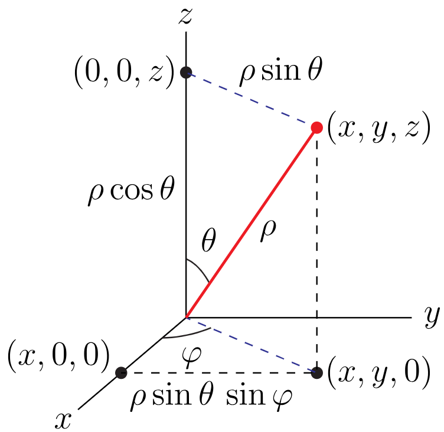

\twocolumn[{\textline[t]{PHOT~301}{\textbf{Formula sheet}}{Version: \today}\vspace{-0.5\baselineskip}\textline[t]{Michaël~Barbier}{}{}\vspace{-0.5\baselineskip}\noindent\rule{\textwidth}{1pt}}]

In the following formulas parameters $n$, $m$ are integers, and $0 < a \in \mathbb{R}$ and $b \in \mathbb{R}_0$:\

\begin{flalign*}
&\textrm{\large{\textbf{Trigonometric identities}}}&&\\
&\textrm{Here $\alpha$ and $\beta$ are real numbers.}&&\\
&&&\\
&\sin 30^\circ = \frac{1}{2},\quad \sin 45^\circ = \frac{\sqrt{2}}{2},\quad \sin 60^\circ = \frac{\sqrt{3}}{2} &&\\
&\sin^2(\alpha) + \cos^2(\alpha) = 1&&\\
&\sin(\alpha \pm \beta) = \sin(\alpha)\cos(\beta) \pm \cos(\alpha)\sin(\beta)&&\\
&\cos(\alpha \pm \beta) = \cos(\alpha)\cos(\beta) \mp \sin(\alpha)\sin(\beta)&&\\
&\sin(2\alpha) = 2\sin(\alpha)\cos(\alpha)&&\\
&\cos(2\alpha) = \cos^2(\alpha) - \sin^2(\alpha) &&\\
&&&\\
&\tan(\alpha) = \frac{\sin(\alpha)}{\cos(\alpha)}, \qquad \cot(\alpha) = \frac{\cos(\alpha)}{\sin(\alpha)} &&\\
&\sec(\alpha) = \frac{1}{\cos(\alpha)},\qquad \csc(\alpha) = \frac{1}{\sin(\alpha)}&&
\end{flalign*}

\begin{flalign*}
&\textrm{\large{\textbf{Complex numbers}}}&&\\
&\textrm{Assume}\,\,z = x+iy \in \mathbb{C}:&&\\
&&&\\
&i = \sqrt{-1}, \quad i^2 = -1&&\\
&|z|^2 = z^* \, z = x^2 + y^2 = \Re\{z\}^2 + \Im\{z\}^2&&\\
&z = x + i \, y = r e^{i \theta} = r \left(\cos\theta + i\,\sin\theta\right)&&\\
&z^* = x - i \, y = r e^{-i \theta} = r \left(\cos\theta - i\,\sin\theta\right)&&\\
&|z|^2 = z^* \, z = x^2 + y^2 = \Re\{z\}^2 + \Im\{z\}^2&&\\ 
&\theta = -i\ln(z/|z|) = \arctan(y/x)&&\\
&\textrm{Operations:}\\ 
&z_1 + z_2 = (x_1 + x_2) + i\,(y_1 + y_2)\\
&z_1 \, z_2 = r_1 r_2 e^{i (\theta_1 + \theta_2)}&& 
\end{flalign*}

\begin{flalign*}
& \cos(\theta) + i\sin(\theta) = e^{i\theta}&&\\
&&\\
& \cos(\theta) = \frac{e^{i\theta} + e^{-i\theta}}{2}, \qquad
\sin(\theta) = \frac{e^{i\theta} - e^{-i\theta}}{2i}&&\\
& \cosh(\theta) = \frac{e^{\theta} + e^{-\theta}}{2}, \qquad
\sinh(\theta) = \frac{e^{\theta} - e^{-\theta}}{2}
\end{flalign*}

\begin{flalign*}
&\textrm{\large{\textbf{Derivative: rules}}}&&\\
&&&\\
&\textrm{Sum rule}\quad &\left(f + g\right)'&= f' + g'&&\\
&\textrm{Scalar mult.}\quad &\left(a f\right)'&= a f'&&\\
&\textrm{Product rule}\quad &\left(f g\right)'&= f'g + fg'&&\\
&\textrm{Quotient rule}\quad &\left(\frac{f}{g}\right)'&= \frac{f'g - fg'}{g^2}&&\\
&\textrm{Chain rule}\quad &\left(f(g(x))\right)'&= f'(g(x))\cdot g'(x)&&\\
\end{flalign*}

\begin{flalign*}
&\textrm{\large{\textbf{Standard derivatives}}}&&\\
&\textrm{Right-hand-side is the derivative of the left-hand-side}&&\\
&&&\\
&x^b = b x^{b-1}&&\\
&\ln|x|  = \frac{1}{x}&&\\
&e^x  = e^x&&\\
&a^x  = a^x\cdot\ln a&&\\
&\log_b x  = \frac{1}{x \cdot \ln b}&&\\
&\sin x = \cos x&&\\
&\cos x  = − \sin x&&\\
&\tan x  = \sec^2 x&&\\
&\sec x  = \sec x\cdot\tan x&&\\
&\csc x  = -\csc x\cdot\cot x&&\\
&\sinh x  = \cosh x&&\\
&\cosh x = \sinh x&&\\
&\tanh x = (\textrm{sech}\,x)^2&&\\
&\arcsin x = \frac{1}{\sqrt{1 − x^2}}&&\\
&\arccos x = -\frac{1}{\sqrt{1 − x^2}}&&\\
&\arctan x = \frac{1}{1 + x^2}&&\\
\end{flalign*}

\begin{flalign*}
&\textrm{\large{\textbf{Anti-derivatives: rules}}}&&\\
&&&\\
&\textrm{Fund. law} \quad f(x) = \left(\int^x_b f(t)\, dt\right)'&&\\
&\textrm{Partial int.} \quad \int f\,dg = f\,g - \int g\,df&&\\
&\,\, \int f(x)g'(x)\,dx = f(x)\,g(x) - \int g(x)f'(x)\,dx&&\\
&\textrm{Leibniz} \quad \frac{d}{d\nu}\left[\int f(x;\nu)\,dx\right] = \int \frac{\partial f(x;\nu)}{\partial\nu} \,dx&&\\
\end{flalign*}

\begin{flalign*}
&\textrm{\large{\textbf{Standard anti-derivatives}}}&&\\
&&&\\
&\textrm{Rational functions:}&&\\
&\int x^n\, dx = \frac{x^{n+1}}{n+1}&&\\
&\int \frac{1}{x}\, dx = \ln |x|&&\\
&\int (x+b)^n\, dx = \frac{(x+b)^{n+1}}{n+1}&&\\
&\int x\,(x+b)^n\, dx = \frac{(x+b)^{n+1}}{n+1}\frac{x(n+1)-b}{n+2}&&
\end{flalign*}
\begin{flalign*}
&\int \frac{1}{x^2 + a^2}\, dx = \frac{1}{a}\,\arctan(x/a)&&\\
&\int \frac{x}{x^2 + a^2}\, dx = \frac{1}{2}\ln(x^2 + a^2)&&\\
&\int \frac{x^2}{x^2 + a^2}\, dx = x - a\,\arctan(x/a)&&\\
&\int \frac{x^3}{x^2 + a^2}\, dx = \frac{1}{2}\left[x^2 - a^2\ln(x^2 + a^2)\right]&&
\end{flalign*}
\begin{flalign*}
&\int \frac{1}{(x^2 + 1)^2}\, dx = \frac{1}{2} \left( \arctan(x) + \frac{x}{x^2+1} \right)&&\\
&\int \frac{x}{(x^2 + 1)^2}\, dx = - \frac{1}{2} \frac{1}{x^2+1}&&\\
&\int \frac{x^2}{(x^2 + 1)^2}\, dx = \frac{1}{2} \left( \arctan(x) - \frac{x}{x^2+1} \right)&&\\
&\int \frac{x^3}{(x^2 + 1)^2}\, dx = \frac{1}{2} \left(\frac{1}{x^2+1} + \ln(x^2 + 1)\right)&&\\
&&&\\
\end{flalign*}

\begin{flalign*}
&\int \frac{1}{(x+a)(x+b)}\, dx = \frac{1}{b-a} \left[\ln(x+a) - \ln(x+b) \right]&&\\
&\int \frac{x}{(x + a)^2}\, dx = \frac{a}{x+a} + \ln(x+a)&&\\
\end{flalign*}

\begin{flalign*}
&\textrm{Trigonometric:}&&\\
&\int \cos(x) \,dx = \sin(x)&&\\
&\int \sin x  \,dx = -\cos x&&\\ 
&\int \sin^2 x \,dx = \frac{x}{2} - \frac{1}{4}\sin 2x&&\\
&\int \sin^3 x \,dx = -\frac{3}{4}\cos x + \frac{1}{12}\cos 3x&&\\
&\int \cos^2 x \,dx = \frac{x}{2} + \frac{1}{4}\sin 2x&&\\
&\int \cos^3 x \,dx = \frac{3}{4}\sin x + \frac{1}{12}\sin 3x&&\\
&\int \sin x \cos x \,dx = -\frac{1}{2} \cos^2 x&&\\ 
&\int \cos^2(x) \sin^2(x) \,dx = \frac{x}{8} - \frac{1}{32}\, \sin 4x&&\\ 
&\int \cos^n(a x) \sin(a x) \,dx = -\frac{1}{a (n+1)}\, \cos^{n+1}(ax)&&\\ 
&\int \cos(a x) \sin^n(a x) \,dx = \frac{1}{a (n+1)}\, \sin^{n+1}(ax)&&\\ 
&\int x\,\sin(a x)\,dx = \frac{1}{a^2}\,\sin(ax) - \frac{x}{a}\,\cos(ax)&&\\ 
&\int x\,\cos(a x)\,dx = \frac{1}{a^2}\,\cos(ax) + \frac{x}{a}\,\sin(ax)&&\\ 
\end{flalign*}

\begin{flalign*}
&\textrm{Exponentials:}&&\\
&\int e^{bx}\, dx = \frac{1}{b}\,e^{bx}&&\\
&\int x e^{bx}\, dx = \left(\frac{x}{b} - \frac{x}{b^2}\right)\,e^{bx}&&\\
&\int x^2 e^{bx}\, dx = \left(\frac{x^2}{b} - \frac{2x}{b^2}+\frac{2}{b^3}\right)\,e^{bx}&&\\
&\int x^3 e^{x}\, dx = \left(x^3-3x^2+6x-6\right)\,e^{x}&&\\
\end{flalign*}

\begin{flalign*}
&\textrm{\large{\textbf{Definite integrals}}}&&\\
&\int_0^1 (1-x)^m x^n \,dx = \frac{n! \, m!}{(n + m + 1)!} &&\\
&\int_0^1 \sin(m \pi x) \sin(n \pi x)\,dx = \frac{1}{2} \delta_{mn}&&\\
&\int_0^1 x \sin^2(m \pi x) \,dx = \frac{1}{4}&&\\
&\int_0^1 x \sin(m \pi x) \,dx = -\frac{(-1)^m}{\pi m}&&\\
&\int_0^1 x^2 \sin(m \pi x) \,dx = \frac{(-1)^{m} (2 - \pi^2 m^2) - 2}{\pi^3 m^3}&&\\
&\int_0^1 x^2 \sin^2(m \pi x) \,dx = \frac{1}{6} - \frac{1}{4\pi^2m^2}&&\\
&\int_0^1 x \sin(\pi x) \sin(3\pi x)\,dx = 0&&\\
&\int_0^1 x^2 \sin(\pi x) \sin(3\pi x)\,dx = \frac{3}{16\pi^2}&&\\
&\int_0^1 x^3 \sin(\pi x) \sin(3\pi x)\,dx = \frac{9}{32\pi^2}&&
\end{flalign*}

\begin{flalign*}
&\textrm{Exponentials } x\in [0,+\infty[&&\\
&\int_{0}^{\infty} x^n e^{-ax}\,dx = \frac{n!}{a^{n+1}}&&\\ 
&\int_{0}^{\infty} e^{-ax^2}\,dx = \frac{\sqrt{\pi}}{2\sqrt{a}}&&\\ 
&\int_{0}^{\infty} x e^{-ax^2}\,dx = \frac{1}{2a}&&\\ 
&\int_{0}^{\infty} x^2 e^{-ax^2}\,dx = \frac{\sqrt{\pi}}{4 a^{3/2}}&&\\ 
&\int_{0}^{\infty} x^3 e^{-ax^2}\,dx = \frac{1}{2a^2}&&\\ 
&\int_{0}^{\infty} x^4 e^{-ax^2}\,dx = \frac{3\sqrt{\pi}}{8 a^{5/2}}&&
\end{flalign*}

\begin{flalign*}
&\textrm{Exponentials }  x\in ]-\infty,+\infty[&&\\
&\int_{-\infty}^{\infty} e^{-ax^2}\,dx        = \frac{\sqrt{\pi}}{\sqrt{a}}&&\\
&\int_{-\infty}^{\infty} x^2 e^{-ax^2}\,dx    = \frac{\sqrt{\pi}}{2 a^{3/2}}&&\\ 
&\int_{-\infty}^{\infty} x^4 e^{-ax^2}\,dx    = \frac{3\sqrt{\pi}}{4 a^{5/2}}&&
\end{flalign*}

\begin{flalign*}
&\int_{-\infty}^{\infty} x^{n} e^{-ax^2}\,dx  = 0 \quad \textrm{for n odd}&&\\
\end{flalign*}

\begin{flalign*}
&\textrm{\large{\textbf{Integration in spherical coordinates}}}&&\\
&&&\\
&\int_{-\infty}^{\infty}dx\int_{-\infty}^{\infty}dy\int_{-\infty}^{\infty} \, dz \, f(x,y,z) = &&\\
& \qquad \qquad \int_{0}^{\infty} d\rho \int_{0}^{\pi} d\theta \int_{0}^{2\pi} d\phi \,\rho^2 \sin\theta \,\,F(\rho,\theta,\phi)&&\\ 
&&&\\
&\textrm{where volume element } \,\,dx\, dy\, dz = \rho^2 \sin\theta\, d\theta\, d\phi\, d\rho&&\\
&&&\\
&x = \rho \sin(\theta) \cos(\phi),\,\, y = \rho \sin(\theta) \sin(\phi),\,\,z = \rho \cos(\theta)&&\\
\end{flalign*}

