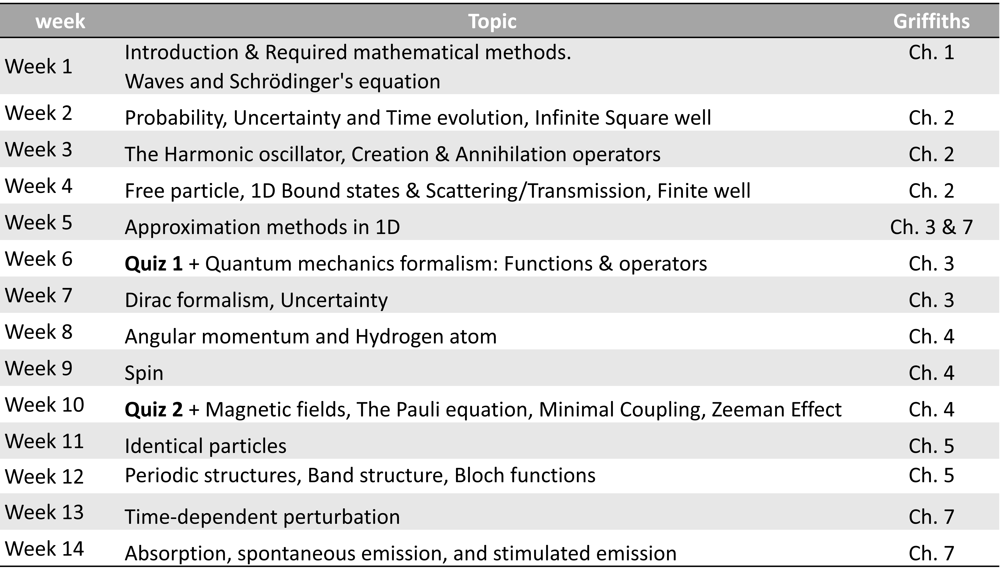
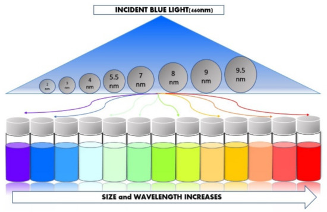
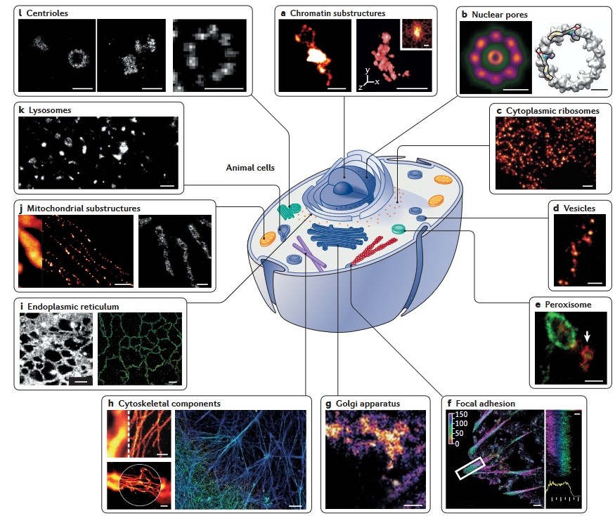
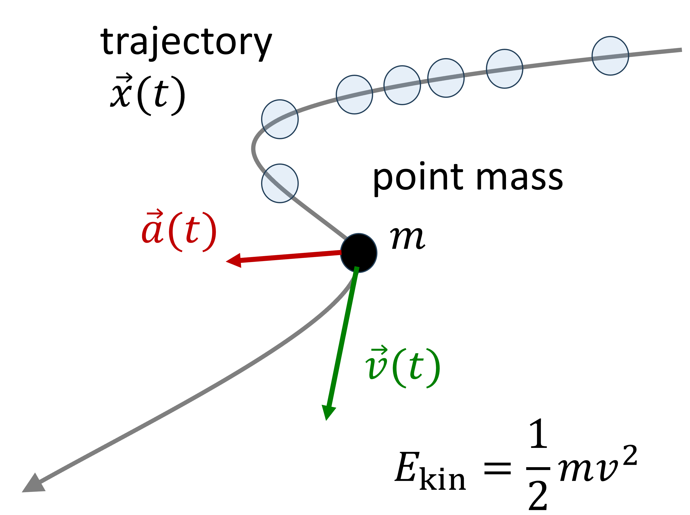
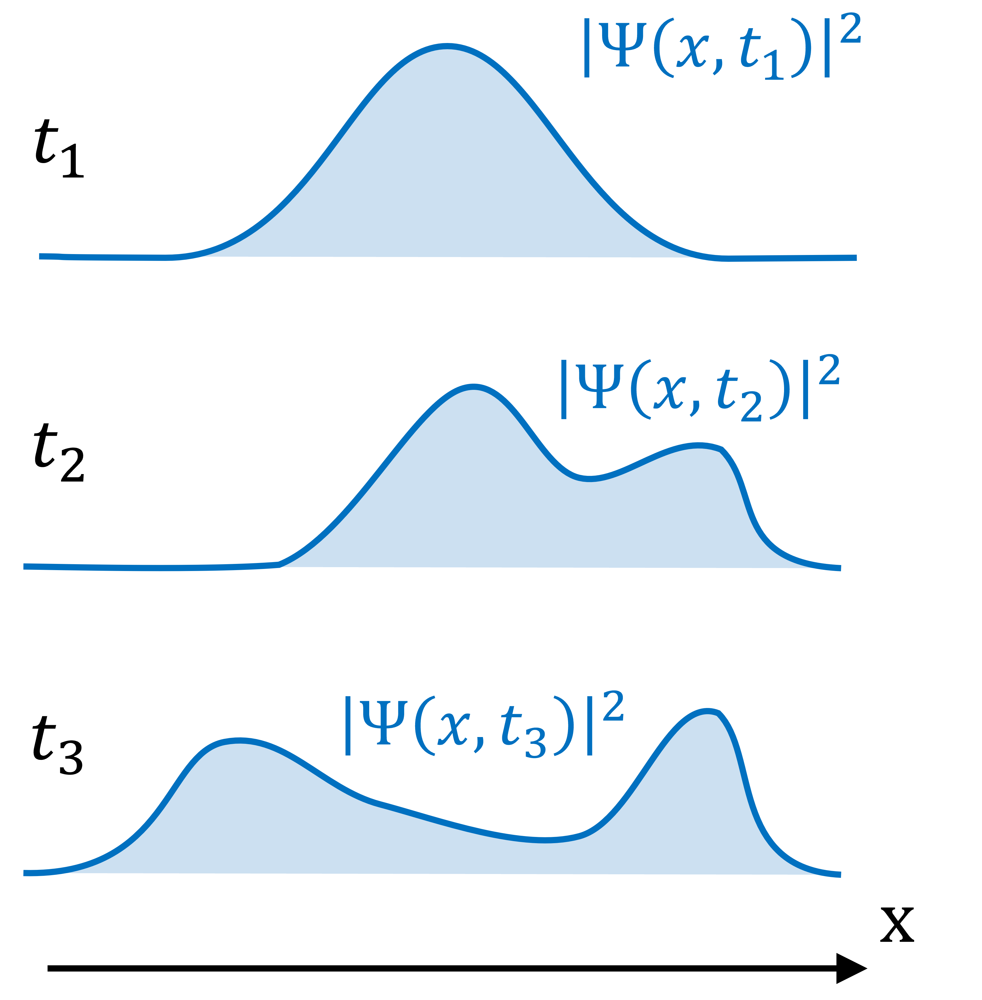
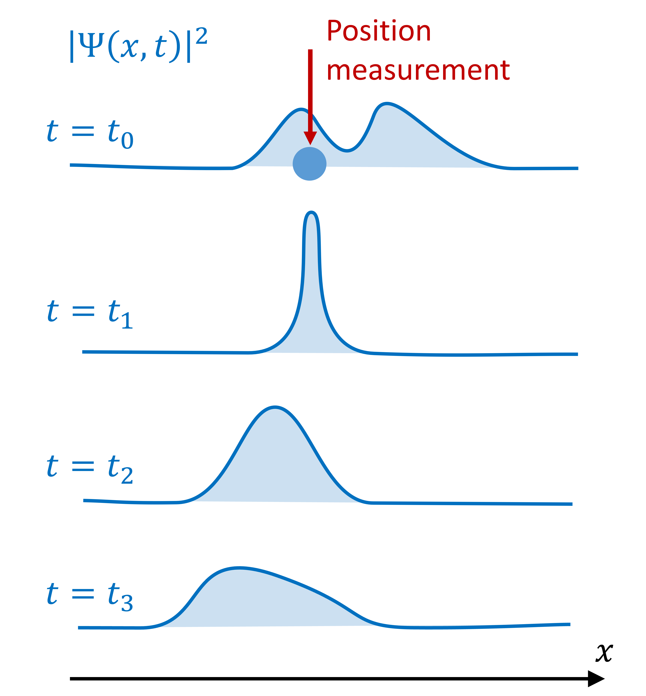
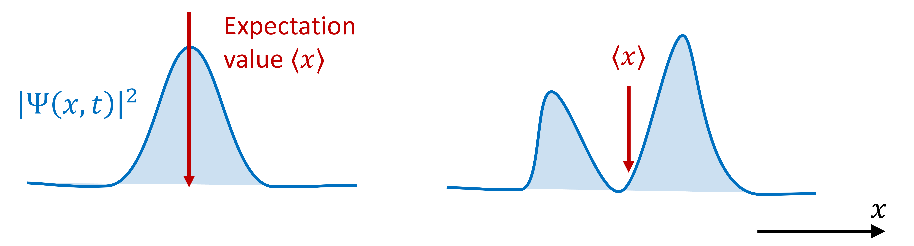

# Introduction

## Overview



## For next week

- Textbook Chapter 1:   1.1, 1.2, 1.3, 1.5, 1.8

- Homework documents:
  - phot301_homework_integration.pdf

## Why quantum photonics



Materials 2022, 15(22), 7888; https://doi.org/10.3390/ma15227888

## Why quantum photonics



Steffen J. Sahl et al. Fluorescence nanoscopy in cell biology


## Classical view

:::: {.columns}
::: {.column width=50%}

- Matter is described with **particles**
- Newton's equation:

$$
\vec{F} = m \, \vec{a}
= m \, \frac{\partial^2 \vec{r}}{{\partial t}^2}
$$

- Forces act on **point** masses 
- Force: gradient of **potential** energy:
$$
\vec{F} = - \nabla V
$$
- Conservation of energy $E = E_{kin} + E_{pot} = T + V$

:::
::: {.column width=50%}



:::
::::

## Classical view

- Light is described by **waves**
- Maxwell's equations

$$
\left\{\begin{aligned}
\nabla \cdot \vec{E} &= \frac{\rho}{\epsilon_0}\\
\nabla \cdot \vec{B} &= 0\\
\nabla \times \vec{E} &= - \frac{\partial \vec{B}}{\partial t}\\
c^2 \, \nabla \times \vec{B} &= \frac{\vec{J}}{\epsilon_0} + \frac{\partial \vec{E}}{\partial t}\\
\end{aligned}\right .
$$

## Classical view

- Light is described by **waves**
- Maxwell's equations
- If there are no charges or currents then $\rho = 0$ and $\vec{J} = 0$ then:


$$
\left\{\begin{aligned}
\nabla^2 \vec{E} -  \frac{1}{c^2}\frac{\partial^2 \vec{E}}{\partial t^2} &= 0 \\
\nabla^2 \vec{B} -  \frac{1}{c^2}\frac{\partial^2 \vec{B}}{\partial t^2} &= 0 \\
\end{aligned}\right .
$$

::: fragment 

Vector components $u := E_i,\, B_i$ obey the wave equation: 

$$
\nabla^2 u -  \frac{1}{c^2}\frac{\partial u}{\partial t^2} = 0
$$

:::

## Classical view

Light and matter are treated different

  - Light has wave-like behavior
  - Matter exists of particles

Problems:

- Hydrogen atom: Electron should fall on nuclues
- Specific energy bands of atomic spectra?
- Electrons can tunnel **through** potential energy barriers

::: {.fragment .highlight-red}

Quantum mechanics combines both\
And solves everything?

:::


## The Schrödinger equation


$$
i \hbar \frac{\partial \Psi}{\partial t} = -\frac{\hbar^2}{2m} \nabla^2 \Psi + V \Psi
$$

where 

- Complex wave function: $\Psi \rightarrow \Psi(x, y, z, t)$
- Laplacian $\nabla^2 = \nabla\cdot\nabla = \frac{\partial^2}{\partial^2 x^2} + \frac{\partial^2}{\partial y^2} + \frac{\partial^2}{\partial z^2}$
- potential energy: $V \rightarrow V(x,y,z,t)$
- $\hbar = \frac{h}{2\pi} = 1.055 \times 10^{-34}$ J s

## The Schrödinger equation

We will first consider 1D problems:

$$
i \hbar \frac{\partial \Psi(x,t)}{\partial t} = -\frac{\hbar^2}{2m} \frac{\partial^2 \Psi(x,t)}{\partial x^2} + V(x,t) \Psi(x,t)
$$

::: fragment

- The complex wave function $\Psi(x, t)$ is not observable
- Probability to find particle in $x$ at time $t$ given by $|\Psi(x, t)|^2$:

$$
P(x \in [a,b]) = \int_a^b |\Psi(x, t)|^2 dx
$$

:::

## Probabilistic view

$$
P(x \in [a,b]) = \int_a^b |\Psi(x, t)|^2 dx
$$

```{python}
#| echo: false
import numpy as np
import matplotlib.pyplot as plt

x = np.linspace(-10, 10, 400)
dx = 20.0/400.0
ys = 0.4*np.abs(np.exp(-(x - 3)**2 / 2) + 0.5 * np.exp(-(x - 1)**2 / 1) + 1.2 * np.exp(-(x + 4)**2 / 10)) ** 2
ys_norm = ys / np.sum(ys * dx)
fig, ax = plt.subplots()
ax.plot(x, ys_norm)

#Fill under the curve
ax.fill_between(
        x= x, 
        y1= ys_norm, 
        where= (1 < x) & (x < 3),
        color= "b",
        alpha= 0.2)
for item in ([ax.title, ax.xaxis.label, ax.yaxis.label] +
             ax.get_xticklabels() + ax.get_yticklabels()):
    item.set_fontsize(20)
ax.set_ylabel(r"$P( x\in [1,3])$")
ax.set_xlabel(r"$x$")
plt.show()
```

## Probability in time

:::: columns
::: column

$$
P(x \in [a,b]) = \int_a^b |\Psi(x, t)|^2 dx
$$

- Wave function evolves in time
- Probability to find particle = 1

:::
::: column



:::
::::

## Probabilistic view: Measerement problem

:::: columns

::: column

Copenhagen interpretation:

- Before measurement: probability according to $|\Psi(x, t)|^2$
- Measurement: Wave function collapses to a single state $\longrightarrow$ $\delta$-function
- After measurement: $\delta$-function spreads out again over time.

:::
::: column



:::
::::

## Double slit experiments:

Typical thought-experiment

- What happens if electron "particles" are fired through a double slit?
- What happens if light at low intensity (single photons) is used?


## Double slit experiments:

- Electrons arrive one by one
- probability to find an electron at coordinates $(x,y,z) \propto|\Psi(x,y,z)|^2$
- Higher electron densities            diffraction pattern: $\propto|\Psi(x,y,z)|^2$
- *Similar* to the intensity of electric waves: $I\propto E^2$


## {background-video="figures/video_diffraction.mp4" background-size="contain"}

## Probability and Expectation values

\

Probability density function $\rho(x)$:

$$
\begin{aligned}
\textrm{Expectation value of }x \qquad & \langle x \rangle = \int_{-\infty}^\infty x \,\rho(x)\,dx\\
\textrm{Expectation value of }f(x) \qquad & \langle f(x) \rangle = \int_{-\infty}^\infty f(x) \,\rho(x)\,dx\\
\end{aligned}
$$





## Probability and Expectation values

\

Probability density function $\rho(x)$:

$$
\begin{aligned}
\textrm{Expectation value of }x \qquad & \langle x \rangle = \int_{-\infty}^\infty x \,\rho(x)\,dx\\
\textrm{Expectation value of }f(x) \qquad & \langle f(x) \rangle = \int_{-\infty}^\infty f(x) \,\rho(x)\,dx\\
\textrm{Variance }\sigma^2 \qquad & \langle (\Delta x)^2 \rangle = \int_{-\infty}^\infty (x - \langle x \rangle)^2 \,\rho(x)\,dx\\
 \qquad & \qquad\quad = \langle x^2 \rangle - \langle x \rangle^2\\
\textrm{Standard deviation } \qquad & \sigma =  \sqrt{\langle x^2 \rangle - \langle x \rangle^2}\\
\end{aligned}
$$ 


## Normalization of the wave function

- $|\Psi(x, t)|^2$ is like the probability density $\rho(x)$
- The total probability to find a particle **somewhere** must be **one**:

$$
\int_{-\infty}^\infty |\Psi(x, t)|^2 dx = 1
$$

::: fragment

So wave function $\Psi(x, t)$: 

- Is a solution of the Schrodinger equation
- Must be normalizable

$$
\Longleftrightarrow \int_{-\infty}^\infty |\Psi(x, t)|^2 dx \textrm{ exists and is finite}
$$

:::

## Normalization of the wave function

\

If $\Psi(x, t)$ is normalized at $t = 0$ then it is always normalized.

::: fragment

Follows from the Schrodinger equation (see Griffiths page 15):
$$
\frac{d}{dt} \int_{-\infty}^\infty |\Psi(x,t)|^2 dx = 0
$$

:::

## Expectation values

\

What are the particle's:

- position $x$?
- velocity $v$ ? or
- momentum $p = mv$ ?

::: fragment

Calculate the expectation (average) values:

:::

::: fragment

$$
\textrm{Expectation value of }x \qquad \langle x \rangle = \int_{-\infty}^\infty x \, |\Psi(x,t)|^2 \, dx
$$

:::

::: fragment

$$
\textrm{Expectation value of }p = mv \qquad m\frac{d \langle x \rangle}{dt} = -i\hbar \int_{-\infty}^\infty \, \Psi^* \frac{\partial \Psi}{\partial x} \, dx
$$

:::


## Position and Momentum operators {style="font-size:0.95em;"}

\


Expectation values are calculated as

::: fragment

$$
\textrm{Position }x \qquad \langle x \rangle = \int_{-\infty}^\infty x \, |\Psi(x,t)|^2 \, dx = \int_{-\infty}^\infty \, \Psi^* \, [x] \, \Psi \, dx
$$

:::

::: fragment

$$
\textrm{Momentum }p \quad m\frac{d \langle x \rangle}{dt} = -i\hbar \int_{-\infty}^\infty \, \Psi^* \frac{\partial \Psi}{\partial x} \, dx
= \int_{-\infty}^\infty \, \Psi^*  [-i\hbar\frac{\partial }{\partial x}]\,\Psi \, dx
$$

:::

::: fragment

$$
\textrm{Position operator} \qquad \hat{x} = x
$$
$$
\textrm{Momentum operator} \qquad \hat{p} = -i\hbar\frac{\partial }{\partial x}
$$

:::

## Schrodinger equation with operators

$$
i \hbar \frac{\partial \Psi}{\partial t} = -\frac{\hbar^2}{2m} \frac{\partial^2}{\partial x} \Psi + V \Psi
$$

We have the operators:

$$
\textrm{Position operator} \qquad \hat{x} = x
$$
$$
\textrm{Momentum operator} \qquad \hat{p} = -i\hbar\frac{\partial }{\partial x}
$$


::: fragment

Using operators in the Schrodinger equation:

$$
i \hbar \frac{\partial }{\partial t} \Psi =  \frac{1}{2m}[-i\hbar\frac{\partial }{\partial x}]^2 \Psi + V \Psi =  \frac{\hat{p}^2}{2m} \Psi + V \Psi = (\hat{T} + \hat{V}) \Psi = \hat{\mathcal{H}} \Psi
$$

:::


## Correspondence principle

- Large systems: **Quantum mechanics** $\longrightarrow$ **classical physics**
- Ehrenfest's theorem:

$$
m \frac{d}{dt}\langle x \rangle, \qquad \frac{d}{dt}\langle p \rangle = - \langle\frac{\partial V(x)}{\partial x}\rangle
$$


## Uncertainty relation: position vs. momentum

- de Broglie relation 

$$
p = \frac{h}{\lambda} = \frac{2\pi\hbar}{\lambda} \quad (= \hbar k)
$$

- Think about a Gaussian wave pulse in Fourier analysis
  - Sharp pulses in space are spread out in (momentum) k-space
  - Sharp pulses in k-space are spread out in space
- Uncertainty of position vs. momentum

$$
\sigma_x \sigma_p \ge \frac{\hbar}{2}
$$


## Summary

- Quantum mechanics is governed by the Schrodinger equation

$$
i \hbar \frac{\partial \Psi}{\partial t} = -\frac{\hbar^2}{2m} \nabla^2 \Psi + V \Psi
$$

::: fragment 
- Similar to our standard wave equation
:::

::: fragment 
- But the wave function $\Psi(x,y,z,t)$ is complex-valued
:::

::: fragment 
- Probability density to find a particle $|\Psi(x,t)|^2 = \Psi^*(x,t)\, \Psi(x,t)$
:::

::: fragment 
- "Real" quantities and measurements represented by operators acting on the wave function
:::
