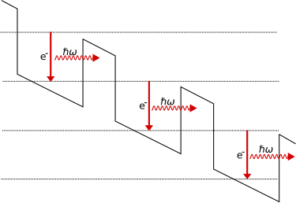

## Overview


## For next week

- Textbook Chapter 2:   2.1(c), 2.3, 2.4, 2.5, 2.7

- Homework documents:
  - phot301_homework_solving_equations.pdf

# Stationary Solutions & Energy levels

## Solving the 1D Schrodinger equation

The Schrodinger equation was given by:

$$
i \hbar \frac{\partial \Psi(x,t)}{\partial t} = -\frac{\hbar^2}{2m} \frac{\partial^2 \Psi(x,t)}{\partial x^2} + V(x,t) \Psi(x,t)
$$

::: fragment

- The complex wave function $\Psi(x, t)$ is not observable
- Potential energy: $V \rightarrow V(x,y,z,t)$
- $\hbar = \frac{h}{2\pi} = 1.055 \times 10^{-34}$ J s
- Probability to find particle in $x$ at time $t$ given by $|\Psi(x, t)|^2$:

$$
P(x \in [a,b]) = \int_a^b |\Psi(x, t)|^2 dx
$$

:::

## Solving the 1D Schrodinger equation

:::: {.columns}

::: {.column width="60%"}

- Wave function $\Psi(x, t)$ defines $|\Psi(x, t)|^2$
- How to calculate $\Psi(x, t=0)$?
- Evolution in time of $\Psi(x, t)$?

$$
\begin{aligned}
i \hbar \frac{\partial \Psi(x,t)}{\partial t} = -\frac{\hbar^2}{2m} \frac{\partial^2 \Psi(x,t)}{\partial x^2}\\
\\
\quad + V(x,t) \Psi(x,t)\quad\\
\end{aligned}
$$

How do we solve for given $V(x,t)$ ?

:::

::: {.column width="40%"}


:::

::::

## Solving the 1D Schrodinger equation

$$
i \hbar \frac{\partial \Psi(x,t)}{\partial t} = -\frac{\hbar^2}{2m} \frac{\partial^2 \Psi(x,t)}{\partial x^2} + V(x,t) \Psi(x,t)
$$

How do we solve this equation for given $V(x,t)$ ?

::: fragment

- Assume $V(x, t)$ independent of time: $V(x) \leftarrow V(x, t)$
- Solve by separation of the variables $\Psi(x,t) = \psi(x) \phi(t)$

:::

::: fragment

$$
i \hbar \frac{\partial (\psi(x)\phi(t))}{\partial t} = -\frac{\hbar^2}{2m} \frac{\partial^2( \psi(x)\phi(t))}{\partial x^2} + V(x) \psi(x)\phi(t)
$$

:::


## Solving the 1D Schrodinger equation

$$
i \hbar \frac{\partial (\psi(x)\phi(t))}{\partial t} = -\frac{\hbar^2}{2m} \frac{\partial^2( \psi(x)\phi(t))}{\partial x^2} + V(x) \psi(x)\phi(t)
$$

::: fragment

$$
\Rightarrow i \hbar \psi(x) \frac{\partial \phi(t)}{\partial t} = -\phi(t)\frac{\hbar^2}{2m} \frac{\partial^2\psi(x)}{\partial x^2} + V(x) \psi(x)\phi(t)
$$

:::

::: fragment

Divide the equation by $\Psi(x, t) = \psi(x) \phi(t)$

$$
\Rightarrow i \hbar \frac{1}{\phi(t)} \frac{\partial \phi(t)}{\partial t} = -\frac{\hbar^2}{2m}\frac{1}{\psi(x)} \frac{\partial^2\psi(x)}{\partial x^2} + V(x)
$$

:::

::: fragment

$\longrightarrow$ the left hand side depends only on $x$ and the right hand side only on $t$.

:::

::: fragment

$$
\Rightarrow i \hbar \frac{1}{\phi(t)} \frac{\partial \phi(t)}{\partial t} = -\frac{\hbar^2}{2m}\frac{1}{\psi(x)} \frac{\partial^2\psi(x)}{\partial x^2} + V(x) = \textrm{constant } E
$$

:::

## Time-dependence & Stationary equation

$$
i \hbar \frac{1}{\phi(t)} \frac{\partial \phi(t)}{\partial t} = -\frac{\hbar^2}{2m}\frac{1}{\psi(x)} \frac{\partial^2\psi(x)}{\partial x^2} + V(x) = E
$$

::: fragment

$\longrightarrow$ System of 2 ordinary differential equations:

$$
\left\{
\begin{aligned}
{\color{blue}{-\frac{\hbar^2}{2m} \frac{1}{\psi(x)}\frac{d^2\psi(x)}{d x^2} + V(x) }}  &{\color{blue}{= E}}\\
{\color{red}{i\hbar\frac{1}{\phi(t)}\frac{d \phi(t)}{d t}}} &{\color{red}{= E}}\\
\end{aligned}
\right.
$$

:::

\

::: fragment

**IF** we can solve both equations $\Longrightarrow$ $\Psi(x,t) = \color{blue}{\psi(x)} \color{red}{\phi(t)}$ is a solution

:::

## Time evolution

- Solving the equation for $\phi(t)$

$$
{\color{red}{i\hbar\frac{1}{\phi(t)}\frac{d \phi(t)}{d t}}} {\color{red}{= E}} \quad\Rightarrow\quad
\frac{d \phi(t)}{d t}=-\frac{i}{\hbar}E \phi(t)
$$

::: fragment

1st order differential equation with general solution:

$$
\phi(t) = C \exp(- i E t /\hbar)
$$

:::

::: fragment

Full solution of the form (C is absorbed):

$$
\Psi(x,t) = \psi(x) \phi(t) = \psi(x) \exp(- i E t /\hbar)
$$

:::

::: fragment

Notice that the probability $|\Psi(x, t)|^2 = |\psi(x)|^2$ is independent of $t$

:::

## Time-independent equation

Time-independent Schrodinger equation (TISE):

$$
\color{blue}{-\frac{\hbar^2}{2m} \frac{d^2\psi(x)}{d x^2} + V(x) \psi(x) = E \psi(x)}
$$

::: fragment

Or we can write

$$
\hat{H} \psi = E \psi \quad \textrm{with Hamiltonian }\,\, \hat{H} = -\frac{\hbar^2}{2m} \frac{d^2}{d x^2} + V(x)
$$

:::

::: fragment

The expectation value of $\hat{H}$ is:

$$
\langle \hat{H} \rangle = \int \Psi^* \hat{H} \Psi dx = \int \Psi^* E \Psi dx = E \int |\Psi|^2 dx = E \int |\psi|^2 dx = E
$$

:::

## General Solution of the TDSE

- From the theory of differential equations:
  - The general solution is a **linear superposition** of solutions
  $\{\psi_n(x)\} = \psi_1(x), \psi_2(x), \psi_3(x), \dots$
  - Independent solutions
  - Separate energies $\{E_n\}$ for corresponding $\{\psi_n(x)\}$
  - Solutions form an **infinite** and **complete basis**

$$
\Psi(x, t) = \sum_{n = 1}^\infty c_n \psi_n(x) \, e^{-iE_n t/\hbar}
$$

Notice: General probability $|\Psi(x, t)|^2$ does depend on time

## General Solution of the TDSE

$$
\Psi(x, t) = \sum_{n = 1}^\infty c_n \psi_n(x) \, e^{-iE_n t/\hbar}
$$

One can proof that $|c_n|^2$ is the probability to measure energy as $E_n$  (Griffith's Chapter 3):


$$
\langle \hat{H} \rangle = \int \Psi^* \hat{H} \Psi dx = \sum_{n = 1}^\infty |c_n|^2 E_n \quad \textrm{ and } \quad \sum_{n = 1}^\infty |c_n|^2 = 1
$$


## Potential energy function V(x)


$$
\hat{H}\psi(x) = -\frac{\hbar^2}{2m} \frac{d^2\psi(x)}{d x^2} + V(x) \psi(x) = E \psi(x)
$$

- Potential energy $V(x)$ is linked to force $F = - \frac{\partial V}{\partial x}$ 

::: {.incremental}

$\Longrightarrow$ if $V(x)$ is a constant corresponds to zero force

$\Longrightarrow$ A linear $V(x)$ corresponds to a constant force

$\Longrightarrow$ A parabolic $V(x)$ corresponds to a linear force (like a spring)

:::


# Square potential energy well

## Infinite well

:::: {.columns}

::: {.column width="60%"}

::: {.incremental}

- Inside the well a particle can exist
- Outside the well the potential is infinite

:::

::: fragment

$$
\left\{
\begin{aligned}
V(x < 0) & = \infty \\
V(0 < x < L) & = 0 \\
V(x > L) & = \infty \\
\end{aligned}
\right.
$$

:::

::: fragment

- Task: solve the stationary Schrodinger equation for $V(x)$

$$
-\frac{\hbar^2}{2m} \frac{d^2\psi(x)}{d x^2} + V(x) \psi(x) = E \psi(x)
$$

:::

:::

::: {.column width="40%"}

``` {python}
#| echo: false
import matplotlib.pyplot as plt
import numpy as np
from numpy import pi, sin, linspace, sqrt

# Parameters
#
# Width of the well
a = 1.0
# Largest eigenstate energy-level
N = 3

# Plot eigenfunctions
fig, ax = plt.subplots(1, 1, figsize=(3, 6))
ax.set_xlabel("x")
ax.set_ylim([0,12])
ax.set_xlim([-0.1, 1.1])
ax.vlines([0, 1], 0, 12, color="blue")
ax.hlines(0, 0, 1, color="blue") 
ax.spines['top'].set_visible(False)
ax.spines['right'].set_visible(False)
ax.spines['bottom'].set_visible(False)
ax.spines['left'].set_visible(False)
ax.set_xlabel(r"$x$ (in $L$)")
ax.set_ylabel(r"$V(x)$ (in $2m/\hbar^2$)")
ax.set_xticks([0, 1], ["0", "L"])
plt.show()
```

:::

::::


## Infinite well: Solution in the well

:::: {.columns}

::: {.column width="60%"}

::: {.incremental}

- Particles outside would have infinite energy
- Wave function $\psi(x)$ should be zero outside
- Assume $\psi(0) = \psi(L) = 0$ $\longleftarrow$ $\psi(x)$ ctu
- Inside the well $V(x) = 0$:

:::

::: fragment

$$
-\frac{\hbar^2}{2m} \frac{d^2 \psi(x)}{d x^2} = E \psi(x)
$$

:::

::: fragment

General solution:

$$
\psi(x) = A \cos(k x) + B \sin(k x)
$$

:::

:::

::: {.column width="40%"}

``` {python}
#| echo: false
import matplotlib.pyplot as plt
import numpy as np
from numpy import pi, sin, linspace, sqrt

# Parameters
#
# Width of the well
a = 1.0
# Largest eigenstate energy-level
N = 3

# Plot eigenfunctions
fig, ax = plt.subplots(1, 1, figsize=(3, 6))
ax.set_xlabel("x")
ax.set_ylim([0,12])
ax.set_xlim([-0.1, 1.1])
ax.vlines([0, 1], 0, 12, color="blue")
ax.hlines(0, 0, 1, color="blue") 
ax.spines['top'].set_visible(False)
ax.spines['right'].set_visible(False)
ax.spines['bottom'].set_visible(False)
ax.spines['left'].set_visible(False)
ax.set_xlabel(r"$x$ (in $L$)")
ax.set_ylabel(r"$V(x)$ (in $2m/\hbar^2$)")
ax.set_xticks([0, 1], ["0", "L"])
plt.show()
```

:::

::::


## Infinite well: Solution in the well

:::: {.columns}

::: {.column width="60%"}

$$
-\frac{\hbar^2}{2m} \frac{d^2 \psi(x)}{d x^2} = E \psi(x)
$$

$$
\psi(x) = A \cos(k x) + B \sin(k x)
$$

::: fragment

- with $A$ and $B$ complex numbers 
- $k = \sqrt{2mE / \hbar^2}$ a complex number

:::

::: fragment

Apply BC's $\psi(0) = \psi(L) = 0$:

$$
\psi(0) = 0 \quad\Rightarrow\quad A = 0 \\
$$

$$
\psi(x) = B \sin(k\,x) \\
$$


:::

:::

::: {.column width="40%"}

``` {python}
#| echo: false
import matplotlib.pyplot as plt
import numpy as np
from numpy import pi, sin, linspace, sqrt

# Parameters
#
# Width of the well
a = 1.0
# Largest eigenstate energy-level
N = 3

# Plot eigenfunctions
fig, ax = plt.subplots(1, 1, figsize=(3, 6))
ax.set_xlabel("x")
ax.set_ylim([0,12])
ax.set_xlim([-0.1, 1.1])
ax.vlines([0, 1], 0, 12, color="blue")
ax.hlines(0, 0, 1, color="blue") 
ax.spines['top'].set_visible(False)
ax.spines['right'].set_visible(False)
ax.spines['bottom'].set_visible(False)
ax.spines['left'].set_visible(False)
ax.set_xlabel(r"$x$ (in $L$)")
ax.set_ylabel(r"$V(x)$ (in $2m/\hbar^2$)")
ax.set_xticks([0, 1], ["0", "L"])
plt.show()
```

:::

::::


## Infinite well: Energies

:::: {.columns}

::: {.column width="60%"}


$$
\psi(x) = B \sin(k\,x) \\
$$

::: fragment

Apply the other BC: $\quad\psi(L) = 0$:

$$
k_n = \sqrt{2mE_n/\hbar^2} = n \pi / L \\
$$

:::

::: fragment

$$
\Longrightarrow \left\{
\begin{aligned}
\psi_n(x) &= A_n \sin\left(\frac{n\pi x}{L}\right)\\
E_n &= \frac{\hbar^2 k_n^2}{2m} = \frac{\hbar^2}{2m} \left( \frac{n\pi}{L} \right)^2
\end{aligned}
\right.
$$

:::

:::

::: {.column width="40%"}

``` {python}
#| echo: false
import matplotlib.pyplot as plt
import numpy as np
from numpy import pi, sin, linspace, sqrt

# Parameters
#
# Width of the well
a = 1.0
# Largest eigenstate energy-level
N = 3

# Plot eigenfunctions
fig, ax = plt.subplots(1, 1, figsize=(3, 6))
ax.set_xlabel("x")
ax.set_ylim([0,12])
ax.set_xlim([-0.1, 1.1])
ax.vlines([0, 1], 0, 12, color="blue")
ax.hlines(0, 0, 1, color="blue") 
ax.spines['top'].set_visible(False)
ax.spines['right'].set_visible(False)
ax.spines['bottom'].set_visible(False)
ax.spines['left'].set_visible(False)
ax.set_xlabel(r"$x$ (in $L$)")
ax.set_ylabel(r"$V(x)$ (in $2m/\hbar^2$)")
ax.set_xticks([0, 1], ["0", "L"])
plt.show()
```

:::

::::


## Infinite well

:::: {.columns}

::: {.column width="60%"}


$$
\psi(x) = B \sin(k\,x) \\
$$


Apply the other BC: $\quad\psi(L) = 0$:

$$
k_n = \sqrt{2mE_n/\hbar^2} = n \pi / L \\
$$


$$
\Longrightarrow \left\{
\begin{aligned}
\psi_n(x) &= A_n \sin\left(\frac{n\pi x}{L}\right)\\
E_n &= \frac{\hbar^2 k_n^2}{2m} = \frac{\hbar^2}{2m} \left( \frac{n\pi}{L} \right)^2
\end{aligned}
\right.
$$

:::


::: {.column width="40%"}

``` {python}
#| echo: false
import matplotlib.pyplot as plt
import numpy as np
from numpy import pi, sin, linspace, sqrt

# Parameters
#
# Width of the well
a = 1.0
# Largest eigenstate energy-level
N = 3

# Compute the eigenfunctions
x = linspace(0, a, 400)
psi_n = [ sqrt(2/a) * sin(n * pi / a * x) for n in range(1, N+1)]
E_n = [ n ** 2 for n in range(1, N+1)]

# Plot eigenfunctions
fig, ax = plt.subplots(1, 1, figsize=(3, 6))
for n in range(N):
    ax.plot(x, E_n[n] + psi_n[n])
    ax.hlines(E_n[n], 0, 1, linestyle='dashed', color="gray")
ax.set_xlabel("x")
ax.set_ylim([0,12])
ax.set_xlim([-0.1, 1.1])
ax.hlines([0], 0, 1, color="gray")
ax.vlines([0, 1], 0, 12, color="gray")
ax.spines['top'].set_visible(False)
ax.spines['right'].set_visible(False)
ax.spines['bottom'].set_visible(False)
ax.spines['left'].set_visible(False)
ax.set_xlabel(r"$x$ (in $L$)")
ax.set_ylabel(r"$V(x)$ (in $2m/\hbar^2$)")
ax.set_xticks([0, 1], ["0", "L"])
plt.show()
```

:::

::::


## Infinite well: Normalization

:::: {.columns}

::: {.column width="60%"}

$$
\begin{aligned}
\psi_n(x) &= A_n \sin\left(\frac{n\pi x}{L}\right)\\
\end{aligned}
$$

::: fragment

- Obtain $A_n$ from normalization $\int|\psi|^2 = 1$

$$
1 = \int_0^L |A_n|^2 \left|\sin\left(\frac{n\pi x}{L}\right)\right|^2 dx = \frac{|A_n|^2 L}{2}
$$

$$
\Longrightarrow \quad |A_n|^2 = \frac{2}{L} \Rightarrow |A_n| = \sqrt{\frac{2}{L}}
$$

:::

::: fragment

$$
\psi_n(x) = \sqrt{\frac{2}{L}} \sin\left(\frac{n\pi x}{L}\right)
$$

:::

:::

::: {.column width="40%"}

``` {python}
#| echo: false
import matplotlib.pyplot as plt
import numpy as np
from numpy import pi, sin, linspace, sqrt

# Parameters
#
# Width of the well
a = 1.0
# Largest eigenstate energy-level
N = 3

# Compute the eigenfunctions
x = linspace(0, a, 400)
psi_n = [ sqrt(2/a) * sin(n * pi / a * x) for n in range(1, N+1)]
E_n = [ n ** 2 for n in range(1, N+1)]

# Plot eigenfunctions
fig, ax = plt.subplots(1, 1, figsize=(3, 6))
for n in range(N):
    ax.plot(x, E_n[n] + psi_n[n], color="gray", linewidth=0.5)
    ax.hlines(E_n[n], 0, 1, linestyle='dashed', color="gray")
    ax.plot(x, E_n[n] + psi_n[n]**2)
ax.set_xlabel("x")
ax.set_ylim([0,12])
ax.set_xlim([-0.1, 1.1])
ax.hlines([0], 0, 1, color="gray")
ax.vlines([0, 1], 0, 12, color="gray")
ax.spines['top'].set_visible(False)
ax.spines['right'].set_visible(False)
ax.spines['bottom'].set_visible(False)
ax.spines['left'].set_visible(False)
ax.set_xlabel(r"$x$ (in $L$)")
ax.set_ylabel(r"$V(x)$ (in $2m/\hbar^2$)")
ax.set_xticks([0, 1], ["0", "L"])
plt.show()
```

:::

::::


## Infinite well: summary

:::: {.columns}

::: {.column width="50%"}

$$
 \left\{
\begin{aligned}
\psi_n(x) &= \sqrt{\frac{2}{L}} \sin\left(\frac{n\pi x}{L}\right)\\
&\\
E_n &= \frac{\hbar^2 k_n^2}{2m} = \frac{\hbar^2}{2m} \left( \frac{n\pi}{L} \right)^2\\
&\\
n &= 1, 2, 3, 4, \dots\\
\end{aligned}
\right.
$$

\

*Plot shows the wave function ($\psi$, grey), probability ($|\psi|^2$, color) for first 3 eigenstates*

:::

::: {.column width="50%"}

``` {python}
#| echo: false
import matplotlib.pyplot as plt
import numpy as np
from numpy import pi, sin, linspace, sqrt

# Parameters
#
# Width of the well
a = 1.0
# Largest eigenstate energy-level
N = 3

# Compute the eigenfunctions
x = linspace(0, a, 400)
psi_n = [ sqrt(2/a) * sin(n * pi / a * x) for n in range(1, N+1)]
E_n = [ n ** 2 for n in range(1, N+1)]

# Plot eigenfunctions
fig, ax = plt.subplots(1, 1, figsize=(5, 6))
for n in range(N):
    ax.plot(x, E_n[n] + psi_n[n], color="gray", linewidth=0.5)
    ax.hlines(E_n[n], 0, 1, linestyle='dashed', color="gray")
    ax.plot(x, E_n[n] + psi_n[n]**2)
ax.set_xlabel("x")
ax.set_ylim([0,12])
ax.set_xlim([-0.1, 1.1])
ax.hlines([0], 0, 1, color="gray")
ax.vlines([0, 1], 0, 12, color="gray")
ax.spines['top'].set_visible(False)
ax.spines['right'].set_visible(False)
ax.spines['bottom'].set_visible(False)
ax.spines['left'].set_visible(False)
ax.set_xlabel(r"$x$")
ax.set_ylabel(r"$V(x)$ (in $2m L^2/\hbar^2\pi^2$)")
ax.set_xticks([0, 1], ["0", "L"])
#ax.legend()
plt.show()
```

:::

::::


## Eigenenergies and eigenstates  

$$
\begin{aligned}
\textrm{Eigenstates} \quad &\psi_n(x) = \sqrt{\frac{2}{L}} \sin\left(\frac{n\pi x}{L}\right)\\
&\\
\textrm{Eigenenergies} \quad  &E_n = \frac{\hbar^2 k_n^2}{2m} = \frac{\hbar^2}{2m} \left( \frac{n\pi}{L} \right)^2\\
&\\
n &= 1, 2, 3, 4, \dots\\
\end{aligned}
$$

::: {.incremental}

- Lowest state $n = 1$ we call ground state 
- Higher states $n > 1$ are excited states
- Parity of wave functions is either:
  - Even ($n = 1, 3, 5, \dots$)
  - Odd ($n = 2, 4, 6, \dots$)


:::


## Properties 

$$
\begin{aligned}
\textrm{Eigenstates} \quad &\psi_n(x) = \sqrt{\frac{2}{L}} \sin\left(\frac{n\pi x}{L}\right)\\
\end{aligned}
$$

::: fragment

The eigenstates are orthonormal:

$$
\int \psi_m(x)^*\, \psi_n(x) dx = \delta_{nm}
$$

:::

::: fragment

Eigenstates form a complete basis\
Every $f(x)$ we can expand as a series:

$$
f(x) = \sum_{n=1}^\infty c_n \psi_n(x) = \sqrt{\frac{2}{L}} \sum_{n=1}^\infty  c_n \sin\left(\frac{n\pi x}{L}\right)
$$

:::


## Properties of stationary eigenstates

$$
\begin{aligned}
\psi_n \textrm{ are orthonormal}\quad & \int \psi_m(x)^* \, \psi_n(x) \, dx = \delta_{mn}\\
\psi_n \textrm{ form a complete basis}\quad & f(x) = \sum_{n = 1}^\infty c_n \psi_n(x) \qquad \forall f(x)\\
\textrm{Coefficients $c_n$ are given by}\quad & c_n = \int \psi_n(x)^* \, f(x) \, dx\\
\end{aligned}
$$

Proof of last property:

$$
\begin{aligned}
\int \psi_m(x)^* \, f(x) \, dx & = \int \psi_n(x)^* \, \sum_{n = 1}^\infty c_n \psi_n(x) \, dx\\
& = \sum_{n = 1}^\infty c_n \int \psi_m(x)^* \, \psi_n(x) \, dx = \sum_{n = 1}^\infty c_n \delta_{mn} = c_m
\end{aligned}
$$

## Stationary solution of the TISE

:::: {.columns}

::: {.column width="55%"}

For the infinite well

$$
\psi(x) = \sqrt{\frac{2}{L}} \sum_{n = 1}^\infty c_n \sin\left(\frac{n\pi}{L} x\right)
$$

Example state: 
$$
\left\{
\begin{aligned}
& c_1 = 4/5,\\
& c_2 = \sqrt{1 - c_1^2} = 3/5,\\
& n > 2 \longrightarrow c_n = 0\\
\end{aligned}
\right.
$$

- How does the wave function ($\psi$, color) and the probability ($|\psi|^2$, gray) look?
- What if we let time evolve?

:::

::: {.column width=45%}

``` {python}
#| echo: false
import matplotlib.pyplot as plt
import numpy as np
from numpy import pi, sin, linspace, sqrt

# Parameters
#
# Width of the well
a = 1.0
# Largest eigenstate energy-level
N = 2

# Compute the eigenfunctions
x = linspace(0, a, 400)
psi_n = [ sqrt(2/a) * sin(n * pi / a * x) for n in range(1, N+1)]
E_n = [ n ** 2 for n in range(1, N+1)]
c_n = [4/5, 3/5]

# Plot eigenfunctions
fig, ax = plt.subplots(2, 1, figsize=(5, 7))
for n in range(N):
    ax[1].plot(x, E_n[n] + c_n[n]*psi_n[n], color="gray", linewidth=0.5)
    ax[1].hlines(E_n[n], 0, 1, linestyle='dashed', color="gray")
    ax[1].plot(x, E_n[n] + c_n[n]**2*psi_n[n]**2)

ax[1].set_ylim([0,7])
ax[1].set_xlim([-0.1, 1.1])
ax[1].hlines([0], 0, 1, color="gray")
ax[1].vlines([0, 1], 0, 7, color="gray")
ax[1].spines['top'].set_visible(False)
ax[1].spines['right'].set_visible(False)
ax[1].spines['bottom'].set_visible(False)
ax[1].spines['left'].set_visible(False)
ax[1].set_xlabel(r"$x$")
ax[1].set_ylabel(r"$V(x)$")
ax[1].set_xticks([0, 1], ["0", "L"])

ax[0].plot(x, (c_n[0]*psi_n[0] + c_n[1]*psi_n[1]), color="gray", linewidth=0.5)
ax[0].plot(x, (c_n[0]*psi_n[0] + c_n[1]*psi_n[1])**2)

ax[0].set_ylim([-0.5,3])
ax[0].set_xlim([-0.1, 1.1])
ax[0].hlines([0], 0, 1, color="gray")
ax[0].vlines([0, 1], 0, 12, color="gray")
ax[0].spines['top'].set_visible(False)
ax[0].spines['right'].set_visible(False)
ax[0].spines['bottom'].set_visible(False)
ax[0].spines['left'].set_visible(False)
ax[0].set_ylabel(r"$V(x)$")
ax[0].set_xticks([])

plt.show()
```

:::

::::

## Infinite well: solution of the TDSE

:::: {.columns}

::: {.column width=50%}

Adding time evolution

$$
\begin{aligned}
\Psi(x, t) & = \sum_{n = 1}^\infty c_n \psi_n(x) \, e^{-iE_n t/\hbar}\\
& \textrm{with }\sum_{n = 1}^\infty |c_n|^2 = 1\\
\end{aligned}
$$

::: fragment

Coefficients $|c_n|^2$ give the probability to measure energy as $E_n$:

$$
\langle \hat{H} \rangle = \int \Psi^* \hat{H} \Psi dx = \sum_{n = 1}^\infty |c_n|^2 E_n
$$

:::

::: fragment

But $\langle \hat{x} \rangle = \int x \Psi^* \Psi \, dx$ is not constant!

:::

:::

::: {.column width=50%}

```{python}
#| echo: False
import matplotlib.pyplot as plt
from matplotlib.animation import FuncAnimation
import numpy as np
from numpy import sqrt, sin, linspace, pi
from IPython.display import HTML

fig, ax = plt.subplots(1, 1, figsize=(5, 4.5))

t_res = 200
x_res = 50
N = 2
L = 1.0
x = linspace(0, L, x_res)
psi_n = [sqrt(2/L) * sin(n * pi / L * x) for n in range(1, N+1)]
E_n = [n ** 2 for n in range(1, N+1)]
c_n = [4/5, 3/5]
w_n = E_n

xdata, ydata_real, ydata_image, ydata_prob = [], [], [], []
ln_real, = ax.plot([], [], color="red", linewidth=0.5)
ln_imag, = ax.plot([], [], color="blue", linewidth=0.5)
ln_prob, = ax.plot([], [], color="black")

def init():
    ax.set_ylim([-2,3])
    ax.set_xlim([-0.1, 1.1])
    ax.hlines([0], 0, 1, color="gray")
    ax.vlines([0, 1], 0, 3, color="gray")
    ax.spines['top'].set_visible(False)
    ax.spines['bottom'].set_visible(False)
    ax.spines['left'].set_visible(False)
    ax.spines['right'].set_visible(False)
    ax.set_ylabel(r"$V(x)$")
    ax.set_xlabel(r"$x$")
    ax.set_xticks([0, 0.5, 1.0], ["0", "L/2", "L"])
    ax.legend([r"Re($\Psi$)", r"Im($\Psi$)", r"$|\Psi)|^2$"], loc="lower right")
    return ln_real, ln_imag, ln_prob

def update(frame):
    te0 = np.exp(-1j*w_n[0]*frame)
    te1 = np.exp(-1j*w_n[1]*frame)
    y = c_n[0]*psi_n[0]*te0 + c_n[1]*psi_n[1]*te1
    xdata = x
    ydata_real = np.real(y)
    ydata_imag = np.imag(y)
    ydata_prob = np.real(y)**2 + np.imag(y)**2
    ln_real.set_data(xdata, ydata_real)
    ln_imag.set_data(xdata, ydata_imag)
    ln_prob.set_data(xdata, ydata_prob)
    return ln_real, ln_imag, ln_prob

ani = FuncAnimation(fig, update, frames=np.linspace(0, 2*pi, t_res), init_func=init, blit=True)
plt.close()
HTML(ani.to_jshtml())
#ani.save('movie.webp')
```

:::

::::

## QuVis examples

[QuVis simulation of particle in a box: different modes](https://www.st-andrews.ac.uk/physics/quvis/simulations_html5/sims/SuperpositionStates/SuperpositionStates.html)

[QuVis simulation of particle in a box: time evolution](https://www.st-andrews.ac.uk/physics/quvis/simulations_html5/sims/TimeDevelopment/TimeDevelopment.html)


[Falstad simulation of particle in a box](https://www.falstad.com/qm1d/)


## Expand a function in eigenstates

:::: {.columns}

::: {.column width=65%}

- Suppose we have a certain wave function 

$$
f(x) = A\,((L/2)^4 - (x-L/2)^4), \,\, \textrm{with } x \in [0, L]
$$

- Normalization constant $A = \sqrt{\frac{64}{45} \left(\frac{L}{2}\right)^9}$
- Since $f(0) = f(L) = 0$ we can expand $f(x)$ in eigenstates of the infinite well

$$
\begin{aligned}
f(x) &= \sqrt{\frac{2}{L}} \sum_{n = 1}^\infty c_n \sin\left(\frac{n\pi}{L} x\right)\\ 
&\textrm{with} \quad c_n = \int_0^L \psi_n(x)^* \, f(x) \, dx\\
\end{aligned}
$$

:::

::: {.column width=35%}

``` {python}
#| echo: false
import matplotlib.pyplot as plt
from matplotlib import cm
import numpy as np
from numpy import pi, sin, linspace, sqrt

# Parameters
#
# Width of the well
a = 1.0
# Largest eigenstate energy-level
N = 6

# Compute the eigenfunctions
x_res = 4001
x = linspace(0, a, x_res)
psi_n = [ sqrt(2/a) * sin(n * pi / a * x) for n in range(1, N+1)]

E_n = [ n ** 2 for n in range(1, N+1)]
m = 4
A = 1 / sqrt(64/45*(a/2)**9)
f = A * ((a/2)**m - (x - (a/2))**m)
# f = f / sqrt(np.trapezoid(x=x, y=f**2))
c_n = [np.trapz(x=x, y=f * psi_n[n]) for n in range(N)]

# Plot eigenfunctions
fig, ax = plt.subplots(1, 1, figsize=(4, 6))
cmap = plt.get_cmap('gnuplot')
colors = [cmap(i) for i in np.linspace(0, 1, N)]
ax.plot(x, f, color="black", linewidth=1, label=r"$f(x)$")
for n in range(N):
    ax.plot(x, c_n[n]*psi_n[n], color=colors[n], linewidth=0.5, label=f"$c_{n+1} = $" + str(np.round(c_n[n], decimals=3)))
ax.set_xlabel(r"$x$")
ax.set_ylabel(r"$f(x), \quad \psi_n(x)$")
ax.set_ylim([-0.3, 2.5])
ax.legend(loc="upper right")
plt.show()
#print(1/sqrt(2*(L/2)**9))
#print(sqrt(np.trapezoid(x=x, y=f**2)))
```

:::

::::

## Applications of quantum wells

Quantum Cascade lasers



