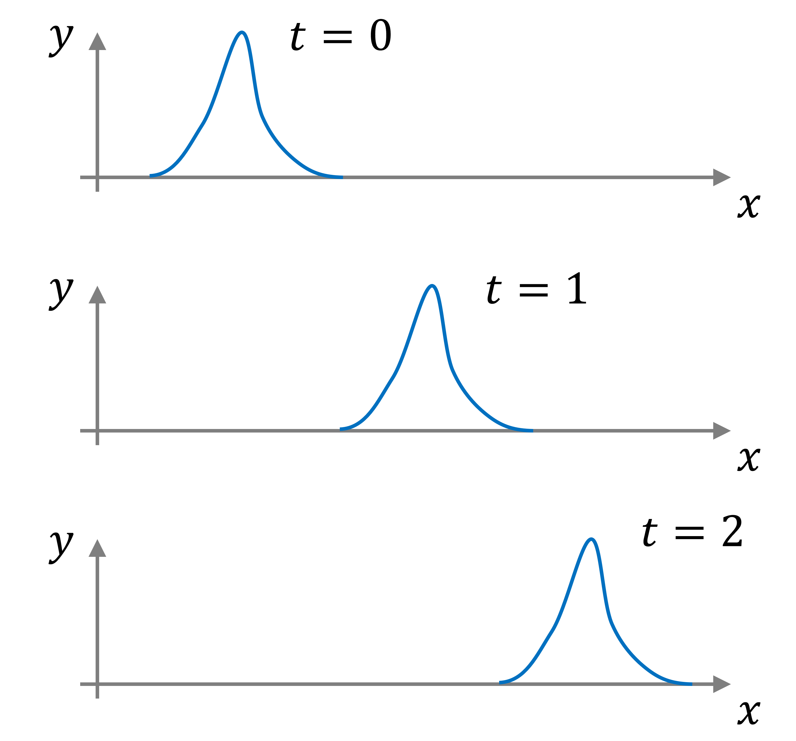
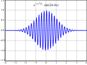
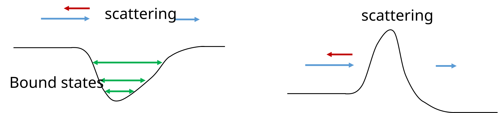
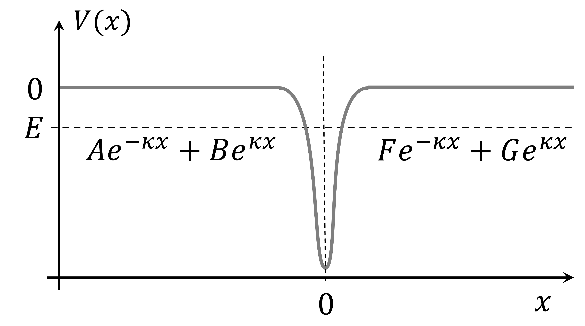
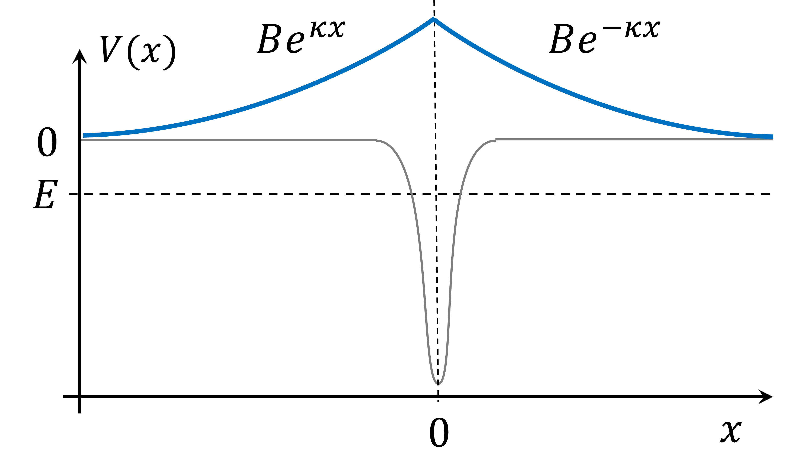

## Overview


## For next week

- Textbook Chapter 2:   2.11, 2.13, 2.14, 2.17, 2.18, 2.25, 2.31, 2.34, 2.41, 2.53

- Homework documents:
  - phot301_homework_matrices.pdf
  - phot301_homework_system_of_equations.pdf
  - phot301_homework_eigenvalue_equations.pdf


## Summary

So far we looked at bound states

- Infinite well
- Linear potential well (Electrical field, not seen yet)
- Harmonic oscillator

Different well potentials lead to different allowed energy levels\

Narrower wells $\longrightarrow$ less energy levels (more spread)\

Discrete spectrum of energy-levels

# Free particles

## Free particle: propagating waves

$$
-\frac{\hbar^2}{2m} \frac{d^2 \psi(x)}{dx^2} = E \psi(x), \quad \textrm{ as } V(x) = 0 
$$

$$
\Rightarrow \quad \frac{d^2 \psi(x)}{dx^2} = - k^2 \psi(x), \quad \textrm{ with } k = \frac{\sqrt{2 m E}}{\hbar} 
$$

- Solutions are unconstrained: all energy values
- Similar to a very wide well (with infinite walls)

$$
\psi(x) = A e^{ikx} + B e^{-ikx}
$$

## Free particle solutions

$$
\psi(x) = A e^{ikx} + B e^{-ikx}
$$

- Problem 1: Not normalizable 
- Problem 2: Velocity is half of classical velocity

## Problem 1: Not normalizable 

$$
\psi(x) = A e^{ikx} + B e^{-ikx}
$$

$$
\begin{aligned}
|\psi(x)|^2 &= \psi(x)^* \, \psi(x)\\
&= (A^* e^{-ikx} + B^* e^{ikx}) (A e^{ikx} + B e^{-ikx})\\
&= |A|^2 + |B|^2 + (A B^* e^{i2kx} + A^* B e^{-i2kx})\\
&= |A|^2 + |B|^2 + \Re\left(A B^* e^{i2kx}\right)\\
\Rightarrow \int_{-\infty}^{+\infty} |\psi(x)|^2 dx &= (|A|^2 + |B|^2) \, \infty + \int_{-\infty}^{+\infty} \Re\left(A B^* e^{i2kx}\right) dx\\
\end{aligned}
$$

The last integral is bounded (oscillating between finite values)\

The total integral $\int |\psi|^2 dx \longrightarrow +\infty$, and therefore doesn't exist.

## Problem 2: Velocity too slow 

:::: {.columns}

::: {.column width=50%}

We can rewrite $\Psi(x, t) = \psi(x) e^{-iEt/\hbar}$ with $E = \frac{\hbar^2 k^2}{2m}$: 

$$
\begin{aligned}
\Psi(x, t) &= A e^{ikx - iEt/\hbar} + B e^{-ikx - iEt/\hbar}\\
&= A e^{ikx - i\hbar k^2 t/2m} + B e^{-ikx - i\hbar k^2 t/2m}\\
&= A e^{ik(x - \frac{\hbar k}{2m}t)} + B e^{-ik(x  - \frac{\hbar k}{2m}t)}\\
\end{aligned}
$$

- Both exponentials are a function of $x \pm v t$, a "wave" moving with velocity $v$

:::

::: {.column width=50%}



:::

::::

## Problem 2: Velocity too slow 

:::: {.columns}

::: {.column width=50%}

We can rewrite $\Psi(x, t) = \psi(x) e^{-iEt/\hbar}$ with $E = \frac{\hbar^2 k^2}{2m}$: 

$$
\begin{aligned}
\Psi(x, t) &= A e^{ikx - iEt/\hbar} + B e^{-ikx - iEt/\hbar}\\
&= A e^{ikx - i\hbar k^2 t/2m} + B e^{-ikx - i\hbar k^2 t/2m}\\
&= A e^{ik(x - \frac{\hbar k}{2m}t)} + B e^{-ik(x  - \frac{\hbar k}{2m}t)}\\
\end{aligned}
$$

- Both exponentials are a function of $x \pm v t$, a "wave" moving with velocity $v$

:::

::: {.column width=50%}


:::

::::


## Problem 2: Velocity too slow 

We can rewrite $\Psi(x, t) = \psi(x) e^{-iEt/\hbar}$ with $E = \frac{\hbar^2 k^2}{2m}$: 

$$
\begin{aligned}
\Psi(x, t) &= A e^{ikx - iEt/\hbar} + B e^{-ikx - iEt/\hbar}\\
&= A e^{ik(x - \frac{\hbar k}{2m}t)} + B e^{-ik(x  - \frac{\hbar k}{2m}t)}\\
\end{aligned}
$$

\

- This is a function of $x \pm v t$, a "wave" moving with velocity $v$
- The velocity is $v_\textrm{quantum} = \frac{\hbar k}{2m} = \sqrt{\frac{E}{2m}}$
- Classically the velocity $v_\textrm{classical} = \sqrt{\frac{2 E}{m}}$ because $E = \frac{1}{2}m v^2$
- The classical velocity is twice the one according to quantum mechanics!


## Wave packets

:::: {.columns}
::: {.column width=50%}

- Superposition of propagating waves is normalizable
- Solves the velocity problem as well!
- Is consistent with uncertainty principle
- Fourier's trick to find coefficients

:::
::: {.column width=50%}



:::
::::

## Localized waves using more k-values

:::: {.columns}

::: {.column width=35%}

- Superposition of waves
- Momentum around main $\sum_{n=-N}^N k_0 \pm n\delta k$
- Plots from top to bottom $N = 1, 2, 4, 8$

$$
\psi(x) = \sum_{n=-N}^N e^{i (k_0 + n\delta k) x}
$$

:::

::: {.column width=65%}

``` {python}
#| echo: false
import matplotlib.pyplot as plt
import numpy as np
from numpy import pi, sin, linspace, sqrt

# Parameters
a = 100.0
s = 1.0
k0 = 2.0
dk = 0.1 #/ np.sqrt(n)

# Compute the eigenfunctions
xs = linspace(-a, a, 1000)
nn = np.array([1, 2, 4, 8])
psi = np.zeros_like(xs, np.complex128)
psin = []
for n in nn:
    ks = dk*np.arange(-n, n+1)
    if n == 1:
      psi = psi + np.exp(1J*(k0-dk)*xs) + np.exp(1J*(k0+dk)*xs)
    else:
      for k in ks:
        psi = psi + np.exp(1J*(k0+k)*xs)
    psin.append(psi/np.sqrt(2*n))

fig, axs = plt.subplots(len(nn), 1, figsize=(7, 7))
for n in range(len(nn)):
    ax = axs[n]
    ax.set_xticks([],[])
    ax.plot(xs, np.real(psin[n]), linewidth=1)

    ax.set_xlim([-100, 100])
    ax.set_ylabel(r"$\psi(x)$")

ax.set_xlabel(r"$x$")
ax.set_xticks([-a, -a/2, 0, a/2, a], [str(-a), str(-a/2), "0", str(a/2), str(a)])

plt.show()
```

:::

::::

## Group velocity of the wave packet

:::: {.columns}

::: {.column width=35%}

Phase velocity $v$

$$
v = \frac{\omega}{k}
$$

Group velocity: 

$$
v_g = \frac{d\omega}{dk}
$$

$$
\Psi(x, t) = \sum_{n=-N}^N e^{i (k_0 + n\delta k) x}
$$

:::

::: {.column width=65%}

``` {python}
#| echo: False
import matplotlib.pyplot as plt
from matplotlib.animation import FuncAnimation
import numpy as np
from numpy import sqrt, sin, linspace, pi
from IPython.display import HTML

fig, ax = plt.subplots(2, 1, figsize=(9, 6))

t_res = 100
x_res = 600
k0 = 2.0
dk = 0.1
a = 30
x = linspace(-a, a, x_res)
dks = np.array([-dk, dk])
ks = k0 + dks
psi_n = [np.exp(1J*(k0+k)*x) for k in ks]
w_n = ks ** 2

xdata, ydata_real, ydata_prob = [], [], []
ln_real, = ax[0].plot([], [], color="red", linewidth=0.5)
ln_prob, = ax[1].plot([], [], color="black")

def init():
    #a = 100
    ax[0].set_ylim([-1.5,1.5])
    ax[0].set_xlim([-a, a])
    ax[0].set_ylabel(r"$\Psi(x,t)$")
    ax[0].set_xticks([])

    ax[1].set_ylim([-0.1,2.1])
    ax[1].set_xlim([-a, a])
    ax[1].set_xlabel(r"$x$")
    ax[1].set_xticks([-a, -a/2, 0, a/2, a], [str(-a), str(-a/2), "0", str(a/2), str(a)])
    ax[1].set_ylabel(r"$|\Psi(x,t)|^2$")
    
    return ln_real, ln_prob


def update(frame):
    te0 = np.exp(-1j*w_n[0]*frame)
    te1 = np.exp(-1j*w_n[1]*frame)
    y = (psi_n[0]*te0 + psi_n[1]*te1) / np.sqrt(2)
    xdata = x
    ydata_real = np.real(y)
    ydata_prob = np.real(y)**2 + np.imag(y)**2
    ln_real.set_data(xdata, ydata_real)
    ln_prob.set_data(xdata, ydata_prob)
    return ln_real, ln_prob


ani = FuncAnimation(fig, update, frames=np.linspace(0, 4*pi, t_res), init_func=init, blit=True)
plt.close()
HTML(ani.to_jshtml())

```

:::

::::

## Phase and group velocity

$$
\begin{aligned}
\Psi(x, t) &= \frac{1}{\sqrt{2\pi}}\int \phi(k) e^{i (k x - \omega t)}\\
\end{aligned}
$$

Assume $\phi(k)$ around $k_0$

$$
\begin{aligned}
\Psi(x, t) &\approx \frac{1}{\sqrt{2\pi}}\int \phi(k_0 + s) e^{i ((k_0 +s) x - (\omega_0 + s\omega_0') t)}\\
&\approx \frac{1}{\sqrt{2\pi}} e^{i (k_0 x - \omega_0 t)} \int \phi(k_0 + s) e^{i s(x - \omega_0' t)}\\
\end{aligned}
$$

## General wave packets: Fourier transforms

- Wave packets of **any shape**
- Includes all possible k-values (energies)

$$
\Psi(x, t) = \frac{1}{\sqrt{2\pi}} \int_{-\infty}^{\infty} \phi(k) e^{i(kx - \frac{\hbar k^2}{2m} t)}\, dk
$$

- Time-independent $\Psi(x, 0) = \psi(x)$:

$$
\Psi(x, 0) = \frac{1}{\sqrt{2\pi}} \int_{-\infty}^{\infty} \phi(k) e^{ikx}\, dk
$$

$$
\begin{aligned}
\textrm{Fourier transform}\qquad\qquad \textrm{Inverse Fourier transform}\\
\phi(k) = \frac{1}{\sqrt{2\pi}} \int_{-\infty}^{\infty} \psi(x) e^{-ikx}\, dx, \qquad \psi(x) = \frac{1}{\sqrt{2\pi}} \int_{-\infty}^{\infty} \phi(k) e^{ikx}\, dk
\end{aligned}
$$


## Wave packet time evolution

:::: {.columns}

::: {.column width=55%}

- We know $\Psi(x, 0)$ and 

$$
\begin{aligned}
\Psi(x, t) &= \frac{1}{\sqrt{2\pi}} \int_{-\infty}^{\infty} \phi(k) e^{i(kx - \omega(k) t)}\, dk,\\ 
&\\
\omega(k) &= \frac{\hbar k^2}{2m}
\end{aligned}
$$

- Phase velocity of $k < \langle k \rangle$ slower
- Phase velocity of $k > \langle k \rangle$ faster

--> Wave packets broadens in time


:::

::: {.column width=45%}


:::

::::


# Bound states and scattering

## Bound states and free particles



- Bound states have a bounded domain
- Particle is stuck in a potential valley
- Free particles can go everywhere
- **Scattering** of particles with $E > V_\infty$
- Scattering also called **Tunneling** when $E < V_\textrm{max}$


## Intermezzo: The Dirac Delta function

:::: {.columns}

::: {.column}

Dirac delta distribution:  

$$
\left\{
\begin{aligned}
\delta(x \neq 0) &= 0\\
\delta(x = 0) &= +\infty
\end{aligned}
\right.
$$

$$
\int_{-\infty}^{+\infty} \delta(x) = 1
$$

Limit of series of functions:

- peaked such as sinc(x) or Gaussian
- limit to infinitely *thin* and *high*
- Area kept normalized

**Filters** out single point: $f(a) = \int_{-\infty}^{+\infty} f(x) \, \delta(x-a) \, dx$

:::

::: column

``` {python}
#| echo: false
import matplotlib.pyplot as plt
import numpy as np

aa = np.array([1, 2, 5])
colors = ["blue", "blue", "black"]
x = np.linspace(-4, 4, 1000)

fig, axs = plt.subplots(2, 1, figsize=(6,7) )
ax = axs[0]
for i, a in enumerate(aa):
    ax.plot(x, a*np.sinc(a*x), color=colors[i], linewidth=(i+1)/3)

ax = axs[1]
for i, a in enumerate(aa):
    g = 1/a**2/(4*np.pi)
    ax.plot(x, 1/np.sqrt(4*np.pi*g) * np.exp(-x**2/4/g), color=colors[i], linewidth=(i+1)/3)

plt.show()

```

:::

::::


## Delta function potential well

:::: {.columns}

::: {.column}

The potential energy function:

$$
V(x) = -\alpha\delta(x \neq 0)
$$

$$
\left\{
\begin{aligned}
V(x \neq 0) = -\alpha\delta(x \neq 0) &= 0\\
V(x \neq 0) = -\alpha\delta(x \neq 0) &= -\alpha\infty
\end{aligned}
\right.
$$


$$
\begin{aligned}
-\frac{\hbar^2}{2m} \frac{d^2\psi(x)}{dx^2} -\alpha \delta(x)\psi &= E \psi\\
\end{aligned}
$$

Bound states have $E < 0$. Outside the well:

$$
\begin{aligned}
-\frac{\hbar^2}{2m} \frac{d^2\psi(x)}{dx^2} &= E \psi\\
\end{aligned}
$$

where $E < 0$ and thus exponential solutions

:::
::: {.column}





:::
::::


## Delta function potential well

:::: {.columns}

::: {.column}

Bound states have $E < 0$. Outside the well:

$$
\begin{aligned}
-\frac{\hbar^2}{2m} \frac{d^2\psi(x)}{dx^2} &= E \psi\\
\end{aligned}
$$

Exponential solutions:

$$
\psi(x) \propto e^{\pm \kappa x}, \qquad \textrm{with}\quad \kappa = \frac{\sqrt{-2mE}}{\hbar}
$$

Wave function must be continuous:

$$
\psi(x < 0) = \psi(x > 0)
$$


:::
::: {.column}


:::
::::

## Delta function potential well

Discontinuity: integrate the Schrodinger equation

$$
\begin{aligned}
-\frac{\hbar^2}{2m} \int_{-\epsilon}^{+\epsilon} \frac{d^2\psi(x)}{dx^2} \,dx -\alpha \int_{-\epsilon}^{+\epsilon} \delta(x)\psi \, dx &= E \int_{-\epsilon}^{+\epsilon}\psi \,dx\\
&\\
-\frac{\hbar^2}{2m}  \frac{d\psi(x)}{dx}\Big|_{-\epsilon}^{+\epsilon} - \alpha\psi(0) &= 0\\
\end{aligned}
$$

Then take the limit for $\epsilon \longrightarrow 0$

$$
\Delta \left(\frac{d\psi(x)}{dx}\right) = -\frac{2m}{\hbar^2}\alpha\psi(0)
$$

We know the derivatives in $x = \pm 0$:

$$
-B\kappa - (B\kappa) \quad\Rightarrow\quad \Delta \left(\frac{d\psi(x)}{dx}\right) = -2\kappa B
$$


## Delta function potential well


$$
\left\{
\begin{aligned}
\Delta \left(\frac{d\psi(x)}{dx}\right) &= -\frac{2m}{\hbar^2}\alpha\psi(0)\\
\Delta \left(\frac{d\psi(x)}{dx}\right) &= -2\kappa B
\end{aligned}
\right.
$$

Make use of $\psi(0) = B$

$$
\begin{aligned}
-\frac{2m}{\hbar^2}\alpha B = -2\kappa B\\
\Rightarrow\quad \kappa = \frac{m\alpha}{\hbar^2}\\
\Rightarrow\quad E = -\frac{\hbar^2\kappa^2}{2m} = -\frac{m\alpha^2}{2\hbar^2}\\
\end{aligned}
$$

The eigenstate with energy $E$ becomes after normalization: 

$$
\psi = B e^{-\kappa |x|} = \sqrt{\kappa} e^{-\kappa |x|}
$$

# Finite potential barriers/steps/wells


## Finite square well

``` {python}
#| echo: false
import matplotlib.pyplot as plt
import numpy as np
font_size = 20
mfont_size = 20

a = 0.5
x = [-3*a, -a, -a, a, a, 3*a]
y = [1, 1, 0, 0, 1, 1]
fig, ax = plt.subplots(1,1, figsize=(9, 3))
ax.plot(x, y)
ax.text(-2.9*a, 1.2, r"$\frac{d^2 \psi}{dx^2} = \frac{2m}{\hbar^2}(V_0-E)\psi$", fontsize=mfont_size)
ax.text(1.1*a, 1.2, r"$\frac{d^2 \psi}{dx^2} = \frac{2m}{\hbar^2}(V_0-E)\psi$", fontsize=mfont_size)
ax.text(-0.8*a, 0.3, r"$\frac{d^2 \psi}{dx^2} = -\frac{2m}{\hbar^2}E\psi$", fontsize=mfont_size)
ax.set_ylim([-0.1, 1.5])
ax.set_yticks([0, 1], ["0", r"$V_0$"], fontsize=font_size)
ax.set_xticks([-0.5, 0, 0.5], [r"$-a$", "0", r"$a$"], fontsize=font_size)
ax.spines.right.set_visible(False)
ax.spines.top.set_visible(False)
plt.show()
```

:::: {.columns}

::: {.column}

- Finite square potential well

- Bound states $0 < E < V_0$
- Scattering states $E > V_0$

:::

::: {.column}

Schrodinger equation:

$$
- \frac{\hbar^2}{2m} \frac{d^2 \psi(x)}{dx^2}  = \left(E - V(x)\right) \, \psi(x)
$$

:::

::::

## Finite well: bound states


``` {python}
#| echo: false
import matplotlib.pyplot as plt
import numpy as np
font_size = 20
mfont_size = 20

a = 0.5
x = [-3*a, -a, -a, a, a, 3*a]
y = [1, 1, 0, 0, 1, 1]
fig, ax = plt.subplots(1,1, figsize=(9, 3))
ax.plot(x, y)
ax.text(-2.9*a, 1.2, r"$\frac{d^2 \psi}{dx^2} = \frac{2m}{\hbar^2}(V_0-E)\psi$", fontsize=mfont_size)
ax.text(1.1*a, 1.2, r"$\frac{d^2 \psi}{dx^2} = \frac{2m}{\hbar^2}(V_0-E)\psi$", fontsize=mfont_size)
ax.text(-0.8*a, 0.3, r"$\frac{d^2 \psi}{dx^2} = -\frac{2m}{\hbar^2}E\psi$", fontsize=mfont_size)
ax.set_ylim([-0.1, 1.5])
ax.set_yticks([0, 1], ["0", r"$V_0$"], fontsize=font_size)
ax.set_xticks([-0.5, 0, 0.5], [r"$-a$", "0", r"$a$"], fontsize=font_size)
ax.spines.right.set_visible(False)
ax.spines.top.set_visible(False)
plt.show()
```

For **bound states** $0 < E < V_0$ \

::: fragment

$$
\textrm{inside: }\quad \psi(-a < x < a) = C \sin(\lambda x) + D \cos(\lambda x) \qquad \lambda = \frac{\sqrt{2 m E}}{\hbar}
$$

:::

::: fragment

$$
\textrm{outside:} \quad
\begin{aligned}
\psi(x < -a) &= A e^{-\kappa x} + B e^{\kappa x} = B e^{\kappa x}\\
\psi(x > a) &= F e^{-\kappa x} + G e^{\kappa x} = F e^{-\kappa x}
\end{aligned}
\qquad \kappa = \frac{\sqrt{2 m (V_0 - E)}}{\hbar}
$$

:::

## Finite well: bound states

``` {python}
#| echo: false
import matplotlib.pyplot as plt
import numpy as np
font_size = 20
mfont_size = 20

a = 0.5
x = [-3*a, -a, -a, a, a, 3*a]
y = [1, 1, 0, 0, 1, 1]
fig, ax = plt.subplots(1,1, figsize=(9, 3))
ax.plot(x, y)
ax.text(-2.9*a, 1.2, r"$\frac{d^2 \psi}{dx^2} = \frac{2m}{\hbar^2}(V_0-E)\psi$", fontsize=mfont_size)
ax.text(1.1*a, 1.2, r"$\frac{d^2 \psi}{dx^2} = \frac{2m}{\hbar^2}(V_0-E)\psi$", fontsize=mfont_size)
ax.text(-0.8*a, 0.3, r"$\frac{d^2 \psi}{dx^2} = -\frac{2m}{\hbar^2}E\psi$", fontsize=mfont_size)
ax.set_ylim([-0.1, 1.5])
ax.set_yticks([0, 1], ["0", r"$V_0$"], fontsize=font_size)
ax.set_xticks([-0.5, 0, 0.5], [r"$-a$", "0", r"$a$"], fontsize=font_size)
ax.spines.right.set_visible(False)
ax.spines.top.set_visible(False)
plt.show()
```

Since $\psi(x)$ is continuous in $x = -a$ and $x = a$:

$$
\begin{aligned}
B e^{-\kappa a} &= -C \sin(\lambda a) + D \cos(\lambda a)\\
F e^{-\kappa a} &= C \sin(\lambda a) + D \cos(\lambda a)\\
\end{aligned} \qquad \psi(x) \textrm{ continuous in } x = -a, a 
$$

$$
\begin{aligned}
B \kappa e^{-\kappa a} &= \lambda C \cos(\lambda a) + D \sin(\lambda a)\\
-F \kappa e^{-\kappa a} &= \lambda C \cos(\lambda a) - \lambda D \sin(\lambda a)\\
\end{aligned} \qquad \frac{d\psi(x)}{dx} \textrm{ continuous in } x = -a, a
$$


## Finite well: bound states


$$
\begin{aligned}
B e^{-\kappa a} &= -C \sin(\lambda a) + D \cos(\lambda a)\\
F e^{-\kappa a} &= C \sin(\lambda a) + D \cos(\lambda a)\\
\end{aligned} \qquad \psi(x) \textrm{ continuous in } x = -a, a 
$$

$$
\begin{aligned}
B \kappa e^{-\kappa a} &= \lambda C \cos(\lambda a) + \lambda D \sin(\lambda a)\\
-F \kappa e^{-\kappa a} &= \lambda C \cos(\lambda a) - \lambda D \sin(\lambda a)\\
\end{aligned} \qquad \frac{d\psi(x)}{dx} \textrm{ continuous in } x = -a, a
$$

Add the first two equations and subtract the others:

$$
\begin{aligned}
(B + F) e^{-\kappa a} &= 2 D \cos{\lambda a}\\
(B + F) \frac{\kappa}{\lambda} e^{-\kappa a} &= 2 D \sin{\lambda a}\\
\end{aligned}
$$

And divide them $\Leftrightarrow B \neq -F$ 

$$
\begin{aligned}
\frac{\kappa}{\lambda} &= \tan{\lambda a}\\
\end{aligned}
$$


## Finite well: bound states


$$
\begin{aligned}
B e^{-\kappa a} &= -C \sin(\lambda a) + D \cos(\lambda a)\\
F e^{-\kappa a} &= C \sin(\lambda a) + D \cos(\lambda a)\\
\end{aligned} \qquad \psi(x) \textrm{ continuous in } x = -a, a 
$$

$$
\begin{aligned}
B \kappa e^{-\kappa a} &= \lambda C \cos(\lambda a) + \lambda D \sin(\lambda a)\\
-F \kappa e^{-\kappa a} &= \lambda C \cos(\lambda a) - \lambda D \sin(\lambda a)\\
\end{aligned} \qquad \frac{d\psi(x)}{dx} \textrm{ continuous in } x = -a, a
$$

Now subtract the first two equations and add the others:

$$
\begin{aligned}
(B - F) e^{-\kappa a} &= -2 C \sin{\lambda a}\\
(B - F) \frac{\kappa}{\lambda} e^{-\kappa a} &= 2 C \cos{\lambda a}\\
\end{aligned}
$$

And divide them $\Leftrightarrow B \neq F$ 

$$
\begin{aligned}
\frac{\kappa}{\lambda} &= -\cot{\lambda a} \qquad \textrm{ if } B \neq F\\
\frac{\kappa}{\lambda} &= \tan{\lambda a} \qquad \textrm{ if } B \neq -F \textrm{ from before} \\
\end{aligned}
$$

## Finite well: bound states


$$
\begin{aligned}
\frac{\kappa}{\lambda} &= -\cot{\lambda a} \qquad \textrm{ if } B \neq F\\
\frac{\kappa}{\lambda} &= \tan{\lambda a} \qquad \textrm{ if } B \neq -F \textrm{ from before} \\
\end{aligned}
$$

- The relations are inconsistent! 
- Only possible if one of them is invalid: $B = F$ or $B = -F$

::: fragment

$$
B = F \quad \Rightarrow \quad
\begin{aligned}
(B - F) e^{-\kappa a} &= -2 C \sin{\lambda a}\\
(B - F) \frac{\kappa}{\lambda} e^{-\kappa a} &= 2 C \cos{\lambda a}\\
\end{aligned} \quad \Rightarrow C = 0, \psi(x) = D \cos(\lambda x)
$$

:::

::: fragment

$$
B = -F \quad \Rightarrow \quad
\begin{aligned}
(B + F) e^{-\kappa a} &= 2 D \cos{\lambda a}\\
(B + F) \frac{\kappa}{\lambda} e^{-\kappa a} &= 2 D \sin{\lambda a}\\
\end{aligned}
\quad  \Rightarrow D = 0, \psi(x) = C \sin(\lambda x)
$$

:::

## Finite well: bound states (wave function)

:::: {.columns}

::: {.column}

**Symmetric solutions**

$$
\left\{
\begin{aligned}
\psi(x < -a) &= B e^{\kappa x}\\
\psi(-a < x < a) &= D \cos(\lambda x)\\
\psi(x > a) &= B e^{-\kappa x}\\
\end{aligned} 
\right.
$$

with $F = B \quad \& \quad \kappa = \lambda \tan \lambda a$


``` {python}
#| echo: false
import matplotlib.pyplot as plt
import numpy as np
font_size = 20
mfont_size = 20

a = 0.5
x = [-3*a, -a, -a, a, a, 3*a]
y = [1, 1, 0, 0, 1, 1]
z0 = 8
v0 = z0/a
E1 = 1.3961397
E2 = 2.7862787
k1 = np.sqrt(E1)
k2 = np.sqrt(E2)
kappa1 = np.sqrt(v0-E1)
kappa2 = np.sqrt(v0-E2)
xb = np.linspace(a, 3*a, 1000)
yb1 = np.exp(-kappa1*xb)
yb2 = np.exp(-kappa2*xb)
xw = np.linspace(-a, a, 1000)
yw1 = 0.33*np.cos(0.6*np.pi*k1*xw)
yw2 = -0.21*np.sin(0.87*np.pi*k2*xw)
fig, ax = plt.subplots(1,1, figsize=(6, 3))
ax.plot(x, y)
ax.plot([-3*a, 3*a], [E1/v0, E1/v0], color="gray", linewidth=0.5)
#ax.plot([-3*a, 3*a], [E2/v0, E2/v0], color="gray", linewidth=0.5)
ax.plot(-xb, E1/v0 + yb1, color="blue", linewidth=2)
ax.plot(xw, E1/v0 + yw1, color="blue", linewidth=2)
ax.plot(xb, E1/v0 + yb1, color="blue", linewidth=2)
#ax.plot(-xb, E2/v0 + yb2, color="green", linewidth=2)
#ax.plot(xw, E2/v0 + yw2, color="green", linewidth=2)
#ax.plot(xb, E2/v0 - yb2, color="green", linewidth=2)
#ax.set_ylim([-0.1, 1.5])
ax.set_yticks([0, 1], ["0", r"$V_0$"], fontsize=font_size)
ax.set_xticks([-0.5, 0, 0.5], [r"$-a$", "0", r"$a$"], fontsize=font_size)
ax.spines.right.set_visible(False)
ax.spines.top.set_visible(False)
plt.show()
```


:::

::: {.column}

**Asymmetric solutions** 


$$
\left\{
\begin{aligned}
\psi(x < -a) &= B e^{\kappa x}\\
\psi(-a < x < a) &= C \sin(\lambda x)\\
\psi(x > a) &= -B e^{-\kappa x}\\
\end{aligned} 
\right.
$$

with $F = -B \quad \& \quad \kappa = -\lambda \cot \lambda a$


``` {python}
#| echo: false
import matplotlib.pyplot as plt
import numpy as np
font_size = 20
mfont_size = 20

a = 0.5
x = [-3*a, -a, -a, a, a, 3*a]
y = [1, 1, 0, 0, 1, 1]
z0 = 8
v0 = z0/a
E1 = 1.3961397
E2 = 2.7862787
k1 = np.sqrt(E1)
k2 = np.sqrt(E2)
kappa1 = np.sqrt(v0-E1)
kappa2 = np.sqrt(v0-E2)
xb = np.linspace(a, 3*a, 1000)
yb1 = np.exp(-kappa1*xb)
yb2 = np.exp(-kappa2*xb)
xw = np.linspace(-a, a, 1000)
yw1 = 0.33*np.cos(0.6*np.pi*k1*xw)
yw2 = -0.21*np.sin(0.87*np.pi*k2*xw)
fig, ax = plt.subplots(1,1, figsize=(6, 3))
ax.plot(x, y)
#ax.plot([-3*a, 3*a], [E1/v0, E1/v0], color="gray", linewidth=0.5)
ax.plot([-3*a, 3*a], [E2/v0, E2/v0], color="gray", linewidth=0.5)
#ax.plot(-xb, E1/v0 + yb1, color="blue", linewidth=2)
#ax.plot(xw, E1/v0 + yw1, color="blue", linewidth=2)
#ax.plot(xb, E1/v0 + yb1, color="blue", linewidth=2)
ax.plot(-xb, E2/v0 + yb2, color="green", linewidth=2)
ax.plot(xw, E2/v0 + yw2, color="green", linewidth=2)
ax.plot(xb, E2/v0 - yb2, color="green", linewidth=2)
#ax.set_ylim([-0.1, 1.5])
ax.set_yticks([0, 1], ["0", r"$V_0$"], fontsize=font_size)
ax.set_xticks([-0.5, 0, 0.5], [r"$-a$", "0", r"$a$"], fontsize=font_size)
ax.spines.right.set_visible(False)
ax.spines.top.set_visible(False)
plt.show()
```


:::

::::


## Finite well: bound states

:::: {.columns}

::: {.column}

**Symmetric solutions**

$$
\left\{
\begin{aligned}
\psi(x < -a) &= B e^{\kappa x}\\
\psi(-a < x < a) &= D \cos(\lambda x)\\
\psi(x > a) &= B e^{-\kappa x}\\
\end{aligned} 
\right.
$$

with $F = B \quad \& \quad \kappa = \lambda \tan \lambda a$


:::

::: {.column}

**Asymmetric solutions** 


$$
\left\{
\begin{aligned}
\psi(x < -a) &= B e^{\kappa x}\\
\psi(-a < x < a) &= C \sin(\lambda x)\\
\psi(x > a) &= -B e^{-\kappa x}\\
\end{aligned} 
\right.
$$

with $F = -B \quad \& \quad \kappa = -\lambda \cot \lambda a$

:::

::::

Let's first obtain the energy from $\kappa$ and $\lambda$:

$$
\kappa^2 = \frac{2m}{\hbar^2}(V_0 - E), \qquad \lambda^2 = \frac{2m}{\hbar^2}(E)
$$

::: fragment

Define $z = \lambda \, a$ and $z_0 = a\, \frac{\sqrt{2mV_0}}{\hbar}$

$$
\Longrightarrow \quad \kappa^2 + \lambda^2 = \frac{2m}{\hbar^2}(V_0) = z_0^2/a^2 \quad \Longrightarrow \quad \kappa^2 a^2 = z_0^2 - z^2
$$

:::


## Finite well: bound states

:::: {.columns}

::: {.column}

**Symmetric solutions**

$$
\left\{
\begin{aligned}
\psi(x < -a) &= B e^{\kappa x}\\
\psi(-a < x < a) &= D \cos(\lambda x)\\
\psi(x > a) &= B e^{-\kappa x}\\
\end{aligned} 
\right.
$$

with $F = B \quad \& \quad \kappa = \lambda \tan \lambda a$

$$
\Longrightarrow \tan z = \sqrt{\frac{z_0^2}{z^2} - 1}
$$

:::

::: {.column}

**Asymmetric solutions** 


$$
\left\{
\begin{aligned}
\psi(x < -a) &= B e^{\kappa x}\\
\psi(-a < x < a) &= C \sin(\lambda x)\\
\psi(x > a) &= -B e^{-\kappa x}\\
\end{aligned} 
\right.
$$

with $F = -B \quad \& \quad \kappa = -\lambda \cot \lambda a$

$$
\Longrightarrow -\cot z = \sqrt{\frac{z_0^2}{z^2} - 1}
$$


:::

::::

::: fragment

where we made use of:

$$
\kappa^2 a^2 = z_0^2 - z^2 \Longrightarrow \kappa/\lambda = \sqrt{z_0^2/z^2 - 1}
$$

:::


## Finite well: E for symmetric bound states

:::: {.columns}

::: {.column}

**Symmetric solutions**

$$
\left\{
\begin{aligned}
\psi(x < -a) &= B e^{\kappa x}\\
\psi(-a < x < a) &= D \cos(\lambda x)\\
\psi(x > a) &= B e^{-\kappa x}\\
\end{aligned} 
\right.
$$

with $F = B \quad \& \quad \kappa = \lambda \tan \lambda a$

$$
\Longrightarrow \tan z = \sqrt{\frac{z_0^2}{z^2} - 1}
$$

:::

::: {.column}

``` {python}
#| echo: false
import matplotlib.pyplot as plt
import numpy as np

z0 = 8

z1 = np.linspace(-0.999*np.pi/2, 0.999*np.pi/2, 1000)
y1 = np.tan(z1)
z2 = np.linspace(0.0001, 3*np.pi, 1000)
y2 = np.real(np.sqrt(z0**2/z2**2 - 1 - 0.000001J))

fig, ax = plt.subplots(1, 1, figsize=(6, 6))
ax.plot(z2, y2, color="red")
ax.plot(z1, y1, color="blue")
ax.plot(z1 + np.pi, y1, color="blue")
ax.plot(z1 + 2*np.pi, y1, color="blue")
ax.plot(z1 + 3*np.pi, y1, color="blue")
ax.set_xlim([0, 3*np.pi])
ax.set_ylim([0, 10])
ax.set_xticks(np.pi/2 * np.array([0, 1, 2, 3, 4, 5]), ["0", r"$\pi/2$", r"$\pi$", r"$3\pi/2$", r"$2\pi$", r"$5\pi/2$"], fontsize=mfont_size)
ax.set_yticks([])
ax.set_xlabel(r"$z$", fontsize=mfont_size)
ax.legend([r"$\sqrt{z^2_0/z^2 - 1}$", r"$\tan(z)$"], fontsize=font_size)
plt.show()

```

:::

::::


## Finite well: E for asymmetric bound states

:::: {.columns}

::: {.column}

**Asymmetric solutions**

$$
\left\{
\begin{aligned}
\psi(x < -a) &= B e^{\kappa x}\\
\psi(-a < x < a) &= C \sin(\lambda x)\\
\psi(x > a) &= -B e^{-\kappa x}\\
\end{aligned} 
\right.
$$

with $F = -B \quad \& \quad \kappa = -\lambda \cot \lambda a$

$$
\Longrightarrow -\cot z = \sqrt{\frac{z_0^2}{z^2} - 1}
$$

Asymmetric energies approximately "shifted" to the right

:::

::: {.column}

``` {python}
#| echo: false
import matplotlib.pyplot as plt
import numpy as np

z0 = 8

z1 = np.linspace(-0.999*np.pi/2, 0.999*np.pi/2, 1000)
y1 = np.tan(z1)
z2 = np.linspace(0.0001, 3*np.pi, 1000)
y2 = np.real(np.sqrt(z0**2/z2**2 - 1 - 0.000001J))
z3 = np.linspace(0.001, 0.999*np.pi, 1000)
y3 = -1/np.tan(z3)

fig, ax = plt.subplots(1, 1, figsize=(6, 6))
ax.plot(z2, y2, color="red")
ax.plot(z3, y3, color="green")
ax.plot(z3 + np.pi, y3, color="green")
ax.plot(z3 + 2*np.pi, y3, color="green")
ax.plot(z3 + 3*np.pi, y3, color="green")
ax.set_xlim([0, 3*np.pi])
ax.set_ylim([0, 10])
ax.set_xticks(np.pi/2 * np.array([0, 1, 2, 3, 4, 5]), ["0", r"$\pi/2$", r"$\pi$", r"$3\pi/2$", r"$2\pi$", r"$5\pi/2$"], fontsize=mfont_size)
ax.set_yticks([])
ax.set_xlabel(r"$z$", fontsize=mfont_size)
ax.legend([r"$\sqrt{z^2_0/z^2 - 1}$", r"$-\cot(z)$"], fontsize=font_size)
plt.show()

```

:::

::::


## Finite well: graphical energy-levels

:::: {.columns}

::: {.column}

- Symmetric and asymmetric solutions
- Energy levels at intersections of red curve with blue/green curves.
- Energies close to infinite well energies (vertical asymptotes):

$$
E_n = \frac{\hbar^2 z^2}{2m a^2} \lessapprox E^\infty_n = \frac{\hbar^2}{2m}\frac{n^2\pi^2}{(2a)^2}
$$

- $z_0$ is intersection of red curve with x-axis 
- Increasing $z_0 \, \Longrightarrow \,$ more energy-levels
- Decreasing $z_0 \, \Longrightarrow \,$ less energy-levels
- $z_0 = \frac{\sqrt{2mV_0}}{\hbar} \, a \propto \sqrt{V_0} a$

:::

::: {.column}

``` {python}
#| echo: false
import matplotlib.pyplot as plt
import numpy as np
mfont_size = 18
font_size = 20

z0 = 8

z1 = np.linspace(-0.999*np.pi/2, 0.999*np.pi/2, 1000)
z3 = np.linspace(0.001, 0.999*np.pi, 1000)
y1 = np.tan(z1)
y3 = -1/np.tan(z3)
z2 = np.linspace(0.0001, 3*np.pi, 1000)
y2 = np.real(np.sqrt(z0**2/z2**2 - 1 - 0.000001J))

fig, ax = plt.subplots(1, 1, figsize=(6, 6))
ax.plot(z2, y2, color="red")
ax.plot(z1, y1, color="blue")
ax.plot(z3, y3, color="green")
ax.plot(z1 + np.pi, y1, color="blue")
ax.plot(z1 + 2*np.pi, y1, color="blue")
ax.plot(z1 + 3*np.pi, y1, color="blue")
ax.plot(z3 + np.pi, y3, color="green")
ax.plot(z3 + 2*np.pi, y3, color="green")
ax.plot(z3 + 3*np.pi, y3, color="green")
ax.set_xlim([0, 3*np.pi])
ax.set_ylim([0, 10])
ax.vlines(x=np.pi/2 * np.array([0, 1, 2, 3, 4, 5]), ymin=0, ymax=10, color="gray", linewidth=0.5)
ax.set_xticks(np.pi/2 * np.array([0, 1, 2, 3, 4, 5]), ["0", r"$\pi/2$", r"$\pi$", r"$3\pi/2$", r"$2\pi$", r"$5\pi/2$"], fontsize=mfont_size)
ax.set_yticks([])
ax.set_xlabel(r"$z$", fontsize=mfont_size)
ax.legend([r"$\sqrt{z^2_0/z^2 - 1}$", r"$\tan(z)$", r"$-\cot(z)$"], fontsize=font_size)
plt.show()

```

:::

::::


## Finite well: numerical solutions

:::: {.columns}

::: {.column}

Numerically solving for $z$:   

$$
\begin{aligned}
\tan z &= \sqrt{z_0^2/z^2 - 1},\\
-\cot z &= \sqrt{z_0^2/z^2 - 1}\\
\end{aligned}
$$

Gives us:

- Energy levels $E_n = \frac{\hbar^2\lambda^2}{2m} = \frac{\hbar^2 z^2}{2m a^2}$
- Values for $C$ or $D$ as function of $B$: 

$$
\begin{aligned}
B &= D \cos(\lambda a) e^{\kappa a}\\
B &= -C \sin(\lambda a) e^{\kappa a}\\
\end{aligned}
$$

- Normalization $\longrightarrow$ final unknown $B$

:::

::: {.column}

``` {python}
#| echo: false
import matplotlib.pyplot as plt
import numpy as np
import scipy as sp
from numpy import sqrt, pi, sin, cos, exp, tan
from scipy.optimize import fsolve

font_size = 20
mfont_size = 20
a = 0.5
z0 = 8
x = [-3*a, -a, -a, a, a, 3*a]
y = z0**2 * np.array([1, 1, 0, 0, 1, 1])
z0s = np.array([z0])
z = np.linspace(0.000001, 10, 10000)
sf = 1  # scaling factor for wave function in plot

def func_sym(z, z0):
    rhs = np.real(np.sqrt(z0**2/z**2 - 1 + 0.0000001*1J))
    rhs[rhs < 0.0001] = np.nan
    return (np.tan(z) - rhs)


def func_asym(z, z0):
    rhs = np.real(np.sqrt(z0**2/z**2 - 1 + 0.0000001*1J))
    rhs[rhs < 0.0001] = np.nan
    return (-1/np.tan(z) - rhs)


# Find the solutions for the energies
zroots = []
for z0 in z0s:
  for func in [func_sym, func_asym]:
    f = func(z, z0)
    s = np.sign(f)
    u = (np.diff(s) != 0) * (np.abs(np.diff(f)) < 1)
    zr = z[1:]
    zroots.append(zr[u])

# Calculate the wave vectors
z_sym = zroots[0]/(np.pi/2)
Es_sym = z_sym**2
ks_sym = np.sqrt((np.pi/2)**2 * Es_sym/a**2)
kappas_sym = np.sqrt((z0**2-np.pi**2/4*Es_sym)/a**2)

z_asym = zroots[1]/(np.pi/2)
Es_asym = z_asym**2
ks_asym = np.sqrt((np.pi/2)**2 * Es_asym/a**2)
kappas_asym = np.sqrt((z0**2-np.pi**2/4*Es_asym)/a**2)

xb = np.linspace(a, 3*a, 1000)
xw = np.linspace(-a, a, 1000)

B = 1.0
fig, ax = plt.subplots(1,1, figsize=(6, 7))

for i in range(len(Es_sym)):
  kappa = kappas_sym[i]
  k = ks_sym[i]
  E = Es_sym[i]
  yb = np.exp(-kappa*xb)
  D = B / np.cos(k*a) * np.exp(-kappa*a) 
  yw = D*np.cos(k*xw)

  norm = np.trapz(y=yw**2, x=xw) + 2*np.trapz(y=yb**2, x=xb)
  yw = sf*yw / np.sqrt(norm)
  yb = sf*yb / np.sqrt(norm)

  ax.plot(-xb, E + yb, color="blue", linewidth=2)
  ax.plot(xw, E + yw, color="blue", linewidth=2)
  ax.plot(xb, E + yb, color="blue", linewidth=2)
  ax.plot([-3*a, 3*a], [E, E], color="gray", linewidth=0.5)

for i in range(len(Es_asym)):
  kappa = kappas_asym[i]
  k = ks_asym[i]
  E = Es_asym[i]
  yb = np.exp(-kappa*xb)
  C = -B / np.sin(k*a) * np.exp(-kappa*a) 
  yw = C*np.sin(k*xw)

  norm = np.trapz(y=yw**2, x=xw) + 2*np.trapz(y=yb**2, x=xb)
  yw = sf*yw / np.sqrt(norm)
  yb = sf*yb / np.sqrt(norm)

  ax.plot(-xb, E + yb, color="green", linewidth=2)
  ax.plot(xw, E + yw, color="green", linewidth=2)
  ax.plot(xb, E - yb, color="green", linewidth=2)
  ax.plot([-3*a, 3*a], [E, E], color="gray", linewidth=0.5)

  ax.plot(x, y/pi**2*4, color="black")

ax.set_yticks([0, z0**2/pi**2*4], ["0", r"$V_0$"], fontsize=font_size)
ax.set_xticks([-0.5, 0, 0.5], [r"$-a$", "0", r"$a$"], fontsize=font_size)
ax.spines.right.set_visible(False)
ax.spines.top.set_visible(False)
plt.show()

```

:::

::::
