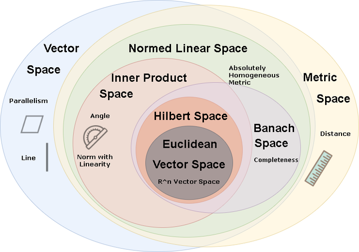
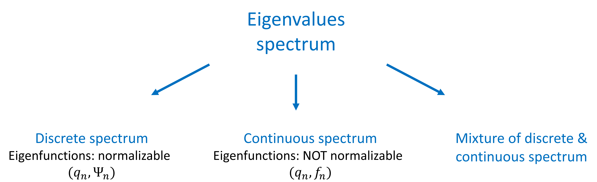
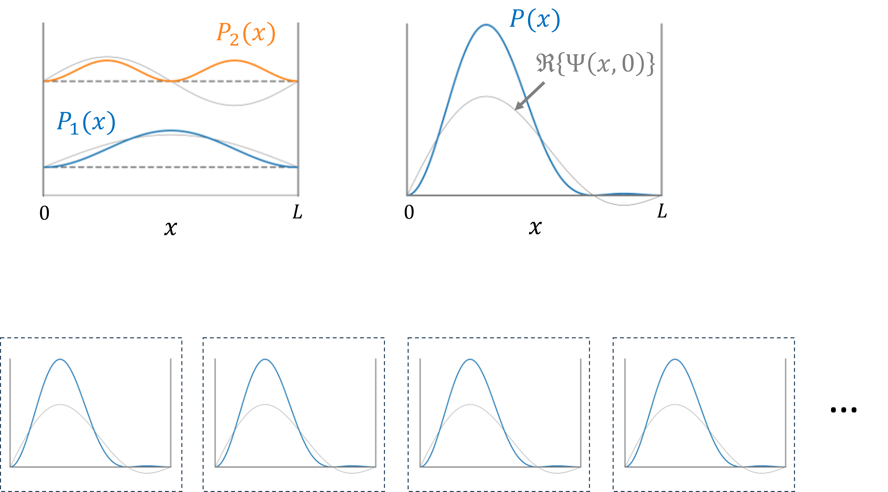
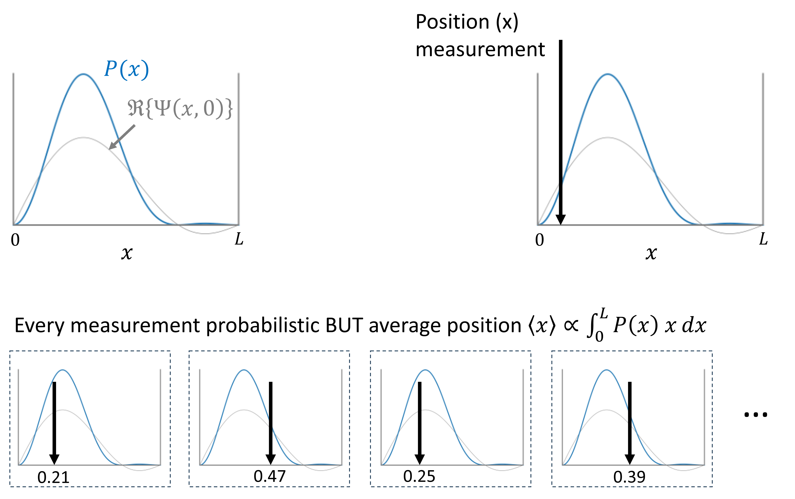
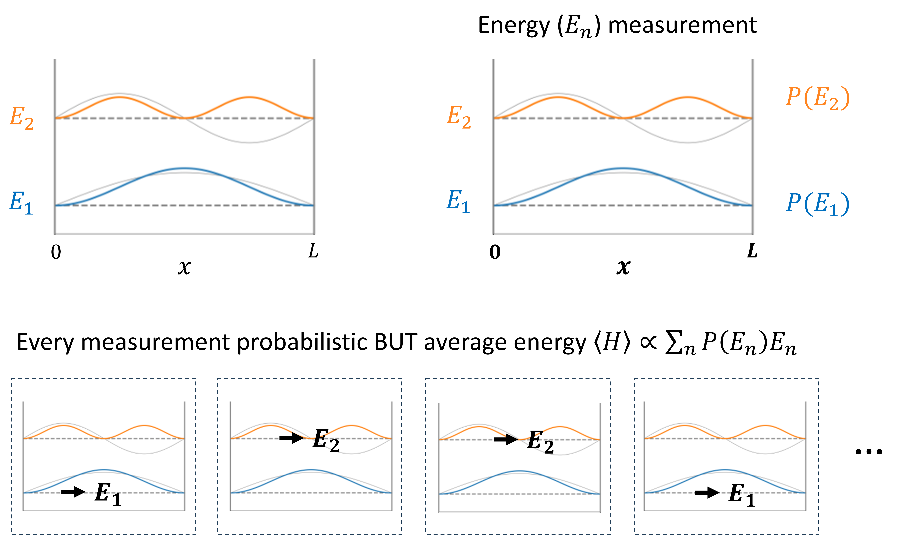
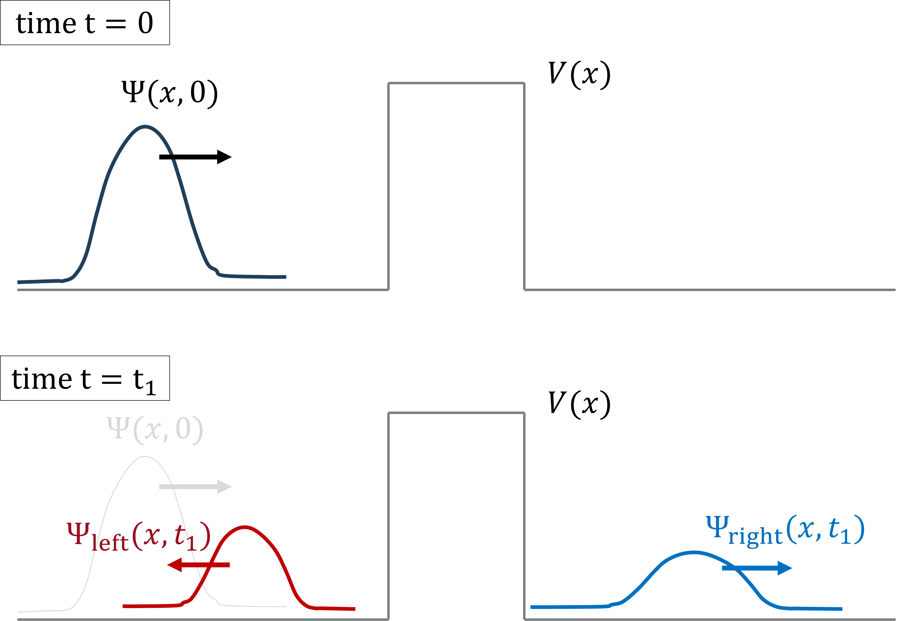
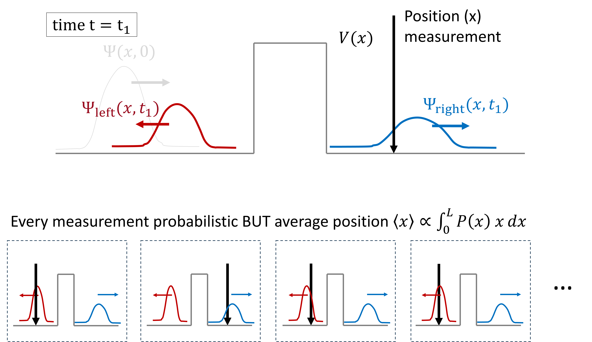

## Overview


## For next week

- Textbook Chapter 3: 3.1, 3.4, 3.7, 3.10, 3.12, 3.14, 3.19, 3.25, 3.26, 3.33, 3.44

- Homework documents:
  - phot301_homework_braket.pdf

## Summary of what we know

- Time-independent Schrodinger equation
- Find eigenstates and eigenenergies: 
  - **complete basis**: Solution is superposition of eigenstates
  - **orthonormal**: Solution is superposition of eigenstates
- Special case(?) of free particles:
  - Propagating waves $\Psi(x, t) \propto e^{i (k x -\omega t)}$
  - **All energies** can be reached
  - Real solutions are given by **wave packets**  
  - **Uncertainty** between position and momentum

## Summary of what we know

- Evolution in time
  - Phase factor depending on energy: $e^{i E_n t/\hbar}$
  - Higher energies change faster
  - Superposition of bound states deform
  - Free particles: **wave packets** have faster and slower components (dispersion)


## Mathematics of wave functions & observables?

**Wave functions**

- **Complete basis** of **orthonormal** eigenstates
- Superposition is solution of **linear** Schrodinger equation

::: fragment

**Observables**

- Observables are **linear operators**
- Applying an **operator** to a wave function gives another wave function

:::

::: fragment

--> Quantum mechanics can be described with linear algebra

:::

# linear algebra

## Field of Complex numbers

- The sets of rational ($\mathbb{Q}$), real ($\mathbb{R}$), and complex numbers ($\mathbb{C}$) are **fields**:
  - 2 operations: addition and multiplication
  - identity elements: addition (0), multiplication (1)
  - Inverse elements: addition (-x), multiplication ($x^{-1}$)
  - Commutativity, associativity, distributivity

Complex numbers $z \in \mathbb{C}$:

- Imaginary identity $\quad i = \sqrt{-1}, \qquad i^2 = -1$
- Complex conjugate $z^*$: $\quad z = x + i\, y \longrightarrow z^* = x - i \, y$

## Field of Complex numbers: properties

Assume $\,\,z = x+iy \in \mathbb{C}$:

$$
\begin{aligned}
\textrm{Representation} \qquad & z = x + i \, y = r e^{i \theta} = r \left(\cos\theta + i\,\sin\theta\right)\\
\textrm{Complex conjugate} \qquad & z^* = x - i \, y = r e^{-i \theta} = r \left(\cos\theta - i\,\sin\theta\right)\\
\textrm{Magnitude} \qquad & |z|^2 = z^* \, z = x^2 + y^2 = \Re\{z\}^2 + \Im\{z\}^2\\ 
\textrm{Phase}  \qquad & \theta = -i\ln(z/|z|) = \arctan(y/x)\\
\textrm{Trigoniometry}  \qquad & \cos\theta = \frac{e^{i\theta} + e^{-i \theta}}{2}, \qquad \sin\theta = \frac{e^{i\theta} - e^{-i \theta}}{2i}\\
\end{aligned}
$$

**Operations:**

$$
\begin{aligned}
\textrm{Addition}  \qquad & z_1 + z_2 = (x_1 + x_2) + i\,(y_1 + y_2)\\
\textrm{Multiplication} \qquad & z_1 \, z_2 = r_1 r_2 e^{i (\theta_1 + \theta_2)}\\ 
\end{aligned}
$$


## vector spaces

A vector space $\mathcal{V} = \left\{ | \alpha \rangle, | \beta \rangle, | \gamma \rangle, \dots\right\}$ over field $F = \mathbb{C}$:

- Addition of vectors $| \alpha \rangle + | \beta \rangle \in \mathcal{V}$
- Scalar multiplication $c | \alpha \rangle \in \mathcal{V}$

| Property name | rule |
|:----|:-----:|
| (Addition) Commutative      | $| \alpha \rangle + | \beta \rangle = | \beta \rangle + | \alpha \rangle$                         |
| (Addition) Associative      | $| \alpha \rangle + (| \beta \rangle + |\gamma\rangle) = (| \alpha \rangle + | \beta \rangle) + |\gamma \rangle$ |
| (Addition) Identity         | ${\bf 0} + | \beta \rangle = | \beta \rangle \quad$ for all $| \beta \rangle$                   |
| (Addition) Inverse element  | for all $| \beta \rangle$, exists $\,\,-| \beta \rangle: \quad -| \beta \rangle + | \beta \rangle = {\bf 0}$ |
(Scalar) Compatible product | $c \, (d \, | \alpha \rangle) = (c\, d)\, | \alpha \rangle$            |
(Scalar) Identity           | $1 \, | \alpha \rangle = | \alpha \rangle$                             |
(Scalar) Distributivity     | $c(| \alpha \rangle + | \beta \rangle) = c \, | \beta \rangle + c \, | \alpha \rangle$ |
(Scalar) Distributivity     | $(c + d) | \alpha \rangle =  c \, | \alpha \rangle + d \, | \alpha \rangle$     |

## Basis vectors

**Linear independence**

A vector $| \xi \rangle$ is linearly independent of $\left\{ |\alpha \rangle, |\beta \rangle, |\gamma \rangle, \dots \right\}$\ 

$\Leftrightarrow$ no linear combination: $|\xi \rangle = a |\alpha \rangle + b |\beta \rangle + c |\gamma \rangle + \dots$\

::: fragment 

Example: in 3D vector space: 

- Vector $(x, y, z) = (0, 1, 1)$ is linearly independent from $\left\{(1, 1, 0),\, (1, 0, 0)\right\}$
- BUT .. $(0, 1, 1)$ is dependent to $\left\{(-1, 1, 0),\, (1, 0, 1)\right\}$

:::

::: fragment 

**Basis vectors:**

- A vector set is linear independent if each of them is independent from the others.
- The span of a vector set is the subset of vectors formed by linear combinations
- A linear independent vector set is a basis if it spans the whole space

:::

## Basis vectors

Suppose a finite set of $n$ basis vectors:

$$
\left\{ |e_1\rangle, \, |e_2\rangle, \dots , \, |e_n\rangle \, \right\}
$$

Each vector $|\alpha \rangle$ can be written as superposition:

$$
|\alpha \rangle = a_1 |e_1\rangle + a_2 |e_2\rangle +  \dots + a_n |e_n \rangle
$$

In component notation for **specific basis**:

$$
|\alpha \rangle = ( a_1, a_2, \dots, a_n)
$$

::: fragment

$\longrightarrow$ Simplifies understanding the properties:

$$
\begin{aligned}
|0 \rangle + |\alpha \rangle = |\alpha\rangle \quad & \Longrightarrow |0 \rangle = ( 0, 0, \dots, 0)\\
|\alpha \rangle + |-\alpha \rangle = |0\rangle \quad & \Longrightarrow |-\alpha \rangle = ( -a_1, -a_2, \dots, -a_n)\\
|\alpha \rangle + c|\beta \rangle \quad & \Longrightarrow |\alpha \rangle + c|\beta \rangle = ( a_1 + c\, b_1, a_2 + c\, b_2, \dots, a_n+ c \,b_n)\\
\end{aligned}
$$

:::

## Normed vector space

- There exists a norm or length of a vector $|\beta\rangle$ given by $\| \beta \| \equiv \| \, |\beta \rangle \|$

| Property name | rule |
|:----|:-----:|
| Non-negative          | $\| \beta \| \geq 0$                          |
| Positive definite     | $\| \beta \| = 0 \Leftrightarrow | \beta \rangle = | 0 \rangle$
| Absolute homogeneity  | $\|c \, \beta \| = |c| \, \| \beta \|$      |
| Triangle inequality   | $\| | \alpha \rangle + | \beta \rangle \| \leq \| \alpha \| + \| \beta \|$   |

- Distance corresponding to norm:

$$
d(| \beta \rangle, | \alpha \rangle) = \| | \alpha \rangle - | \beta \rangle \|
$$

- Example distance: $\quad d\left( (x_1, y_1), \, (x_2, y_2)\right) = \sqrt{(x_2-x_1)^2 + (y_2-y_1)^2}$
- Example norm: $\quad \| (3, 4) \| = \sqrt{3^2 + 4^2} = \sqrt{25} = 5$

## Inner product vector space

- An inner product of a vector space:

$$
\langle \, \langle \alpha | \, , \, | \beta \rangle \, \rangle = \langle \alpha | \beta \rangle \longrightarrow c \in \mathbb{C}
$$


| Property name | rule  |
|:----|:-----:|
| conjugate symmetry      | ${\langle \beta | \alpha \rangle}^*  = \langle \alpha | \beta \rangle$ |
| linearity 2nd argument  | $\langle \alpha \, | \left( \, c\, | \beta \rangle \, + \, d \, | \gamma \rangle \right) \rangle \, = \, c \, \langle \alpha | \beta\rangle \, + \, d \, \langle \alpha | \gamma \rangle$ |
| $\Rightarrow$ conjugate linear 1st  | $\langle \, \left(c \, | \alpha \rangle \, + \, d \, |\beta\rangle \, \right) \, | \, \gamma \rangle \, = \, {c}^* \, \langle \alpha | \gamma \rangle \, + \, {d}^* \, \langle \beta | \gamma \rangle$ |
| positive definite    | $\langle \beta | \beta \rangle > 0$ |

- The norm is defined by 

$$
\| \beta \| = \sqrt{\langle \beta | \beta \rangle}
$$

## Orthonormal basis vectors

- A vector $| \beta \rangle$ is normalized $\quad \Leftrightarrow \quad \| \beta \| = 1$
- A vector $| \beta \rangle \perp | \alpha \rangle \quad \Leftrightarrow \quad \langle \alpha | \beta \rangle = 0$
- Orthonormal set of vectors: $\langle \alpha_i | \alpha_j \rangle = \delta_{ij}$
- Always possible to find an orthonormal basis!

$\longrightarrow$ In component notation: $\langle \alpha | \beta \rangle = a_1^* b_1 + \dots + a_n^* b_n \qquad \textrm{with} \quad a_i = \langle e_i | \alpha \rangle$

The norm is given by:

$$
\| \alpha \|^2 = \langle \alpha | \alpha \rangle = a_1^* b_1 + \dots + a_n^* b_n \qquad \textrm{with} \quad a_i = |a_1|^2 + \dots + |a_n|^2
$$

In $\mathbb{R}^n$ the angle between two vectors is ${\bf a} \cdot {\bf b} = \|{\bf a}\| \|{\bf b}\| \cos(\theta)$: 

$$
\cos \theta = \frac{\sqrt{\langle \alpha | \beta \rangle \, \langle \beta | \alpha \rangle}}{\| \alpha \| \| \beta \|} 
$$

## Important theorems

- The dimension $n$ (= number of basis vectors) is constant for a vector space.
- Gram-Schmidt procedure: **any** basis $\longrightarrow$ **orthonormal** basis.
- Schwartz inequality:

$$
|\langle \alpha | \beta \rangle|^2 \leq \langle \alpha | \alpha \rangle \, \langle \beta | \beta \rangle
$$

- Triangle inequality:

$$
\| \, |\alpha\rangle + |\beta\rangle \, \| \leq \| \alpha \|^2  + \| \beta \|^2
$$

## Operators: linear transformations

- linear transformations $\hat{T}$: 

$$
|\alpha'\rangle = \hat{T} \, |\alpha\rangle \qquad \textrm{linearity: }\quad \hat{T}(c|\alpha\rangle + d|\beta\rangle) = a\,\hat{T}|\alpha\rangle + b\, \hat{T}|\beta\rangle
$$

- If we know the basis vectors $|e_1\rangle, \dots, |e_n\rangle$:

$$
\begin{aligned}
|\alpha'\rangle & = \hat{T} \, |\alpha\rangle\\
& = \hat{T} \, \left( a_1|e_1\rangle + \dots + a_n|e_n\rangle \right)\\
& = \hat{T} \, a_1|e_1\rangle + \dots + \hat{T} \, a_n|e_n\rangle\\
& = a_1 \, \hat{T} \, |e_1\rangle + \dots + a_n \, \hat{T} \, |e_n\rangle\\
& = \sum_{i=1}^n a_i \, \hat{T} \, |e_i\rangle\\
\end{aligned}
$$

## Operators: matrix notation

- If we know the basis vectors $|e_1\rangle, \dots, |e_n\rangle$:

$$
\hat{T} \, |\alpha\rangle = \sum_{j=1}^n a_j \, \hat{T} \, |e_j\rangle\\
$$

The $\hat{T} \, |e_i\rangle$ can be written as superposition:

$$
\begin{aligned}
\hat{T} \, |e_1\rangle & = T_{11}|e_1\rangle + T_{21}|e_2\rangle + \dots + T_{n1}|e_n\rangle \\
\hat{T} \, |e_2\rangle & = T_{12}|e_1\rangle + T_{22}|e_2\rangle + \dots + T_{n2}|e_n\rangle \\
& \dots \\
\hat{T} \, |e_n\rangle & = T_{1n}|e_1\rangle + T_{2n}|e_2\rangle + \dots + T_{nn}|e_n\rangle \\
\end{aligned}
$$

$$
\Rightarrow \hat{T} \, |\alpha\rangle = \sum_{j=1}^n a_j \,  \hat{T} \, |e_j\rangle = \sum_{j=1}^{n}\sum_{i=1}^{n} a_j T_{ij} | e_i \rangle = \sum_{i=1}^{n} \left(\sum_{j=1}^{n} T_{ij} a_j\right) | e_i \rangle \\
$$

## Operators: matrix notation

$$
\Rightarrow \hat{T} \, |\alpha\rangle = \sum_{j=1}^n a_j \,  \hat{T} \, |e_j\rangle = \sum_{j=1}^{n}\sum_{i=1}^{n} a_j T_{ij} | e_i \rangle = \sum_{i=1}^{n} \left(\sum_{j=1}^{n} T_{ij} a_j\right) | e_i \rangle \\
$$

Operator $\hat{T}$ as a matrix $T_{ij}$ for basis $\left\{|e_1\rangle\, ,\, \dots\, , \, |e_n\rangle\right\}$

$$
a'_i = \sum_{j=1}^{n} T_{ij} a_j
$$

And the matrix:

$$
T_{ij} = 
\begin{pmatrix}
T_{11} & T_{12} & \cdots & T_{1n}\\
T_{21} & T_{22} & \cdots & T_{2n}\\
\vdots & \vdots & \ddots & \vdots\\
T_{n1} & T_{n2} & \cdots & T_{nn}\\
\end{pmatrix}\qquad
\textrm{with } \quad T_{ij} = \langle e_i | \hat{T} | e_j \rangle
$$

## Matrices and vectors

If we have a basis basis $\left\{|e_1\rangle \, , \dots \, , \,| e_n \rangle \right\}$

$$
|\alpha\rangle = 
\begin{pmatrix}
a_1\\
a_2\\
\vdots\\
a_n\\
\end{pmatrix}
$$

An operator acting on a vector $|\alpha\rangle$:
$$
\hat{T} |\alpha\rangle \longrightarrow \sum_{j=1}^n T_{ij} a_j = 
\begin{pmatrix}
T_{11} & T_{12} & \cdots & T_{1n}\\
T_{21} & T_{22} & \cdots & T_{2n}\\
\vdots & \vdots & \ddots & \vdots\\
T_{n1} & T_{n2} & \cdots & T_{nn}\\
\end{pmatrix}\,
\begin{pmatrix}
a_1\\
a_2\\
\vdots\\
a_n\\
\end{pmatrix}
$$

## Operators and matrix properties

- Adding two operators:

$$
\hat{U} = \hat{S} + \hat{T} \longrightarrow U_{ij} = S_{ij} + T_{ij}
$$

- Performing multiple operators $\hat{U} = \hat{S} \hat{T}$:

$$
\hat{U} |\alpha\rangle = \hat{S} \hat{T} |\alpha\rangle \longrightarrow U_{ij} = \sum_k S_{ik} T_{kj}
$$

## Intermezzo: Matrix products

The matrix product between matrices $A$ and $B$ is defined as

$$
\begin{aligned}
A \cdot B & = \pmatrix{
  a_{11} & a_{12} & a_{13}\\
  a_{21} & a_{22} & a_{23}\\
}
\pmatrix{
  b_{11} & b_{12} & b_{13}\\
  b_{21} & b_{22} & b_{23}\\
  b_{31} & b_{32} & b_{33}\\
}\\
&\\
  & = \sum_{j} a_{ij} b_{jk}\\
\end{aligned}
$$

- Rows of $A$ are multiplied by columns of $B$.
- $A_{MN} \cdot B_{NK} \leftarrow$ No. columns of $A$ must equal No. rows of $B$ 


## Operators and matrix properties

- Transpose of a matrix $\quad \tilde{T} = T_{ji}$ 
  - **symmetric**: $\qquad\,\,\tilde{T} = T$
  - **antisymmetric**: $\quad\tilde{T} = -T$
- Complex conjugate of a matrix $\quad T^* = T_{ij}^*$ 
  - **real**: $\qquad\quad\,\, T^* = T$ 
  - **imaginary**: $\quad T^* = -T$
- Hermitian conjugate of a square matrix $\quad T^\dagger = \tilde{T}^* = T_{ji}^*$ 
  - **Hermitian**: $\qquad\quad T^\dagger = T \qquad$ 
  - **skew hermitian**: $\quad T^\dagger = -T$

## Bra-ket notation and inner products

- The inner product for orthonormal basis $\left\{|e_1\rangle \, , \dots \, , \,| e_n \rangle \right\}$

$$
\langle \alpha | \beta \rangle = a_1^* b_1 + a_2^* b_2 + \dots + a_n^* b_n = {\bf a}^\dagger {\bf b}
$$

- ket $| \beta \rangle$ is a column vector
- bra $\langle \alpha |$ is a complex conjugate row vector 

In vector notation:
$$
\langle \alpha | \longrightarrow \vec{a} = \pmatrix{a^*_1 & a^*_2 & \dots & a^*_N} \qquad |\beta\rangle \longrightarrow \vec{b} = \pmatrix{b_1 \\ b_2 \\ \vdots \\ b_N}
$$

## Operators and matrix properties

- Transpose of a matrix product $\tilde{S\,T} = \tilde{T}\tilde{S}$ 
- Hermitian of a matrix product $\left(S\,T\right)^\dagger = T^\dagger S^\dagger$ 
- **Inverse matrix** $T^{-1} T = T\, T^{-1} = \mathbb{1} = \delta_{ij}$
- Inverse of a matrix product $\left( S\, T\right)^{-1} = T^{-1} S^{-1}$
- **Unitary matrix** $U^\dagger = U^{-1}$
- Unitary operators preserve inner product:

$$
\langle \alpha' | \beta' \rangle = {\bf a'}^\dagger {\bf b'} = (U{\bf a})^\dagger ({U \bf b}) = {\bf a}^\dagger U^\dagger U {\bf b} = {\bf a}^\dagger {\bf b} = \langle \alpha | \beta \rangle
$$

## Change of basis

- Unitary matrices $\,U (\longleftarrow U^\dagger = U^{-1})$ preserve inner product
  - Norm doesn't change
  - Angles between vectors don't change

$\longrightarrow$ Apply unitary transformation to orthonormal basis is again orthonormal basis

$$
\{ |e_1\rangle, |e_2\rangle, \dots , |e_n\rangle \} \qquad | e'_i \rangle = U | e_i \rangle \quad\textrm{ is orthonormal}
$$

If $T$ transforms a basis: $a_i \rangle = T | e_i \rangle$ to another orthonormal one: $\langle a_j | a_i \rangle = \delta_{ij}$ $\Longrightarrow T$ is unitary:

$$
\begin{aligned}
\delta_{ij} & = \langle a_j | a_i \rangle\\
& = \langle a_j | T | e_i \rangle\\
& = \langle e_j | T^\dagger T | e_i \rangle \\
\end{aligned} \quad\Rightarrow\quad T^\dagger T = \mathbb{1} \quad\Rightarrow\quad T^\dagger = T^{-1}
$$

## Commutators

- Matrix-multiplication not commutative $\longleftrightarrow$ Order of operators! 
- Commutator of two operators/matrices

$$
[\hat{S}, \hat{T}] = \hat{S}\hat{T} - \hat{T}\hat{S} \longleftrightarrow [S, T] = S\,T - T\,S
$$

- Anti-commutator of two operators/matrices

$$
\{\hat{S}, \hat{T}\} = \hat{S}\hat{T} + \hat{T}\hat{S} \longleftrightarrow \{S, T\} = S\,T + T\,S
$$

## Eigenvalue problems

Eigenvector ${\bf x} \neq {\bf 0}$ and eigenvalues $\lambda$ of matrix $A$:

$$
A {\bf x} = \lambda {\bf x} \Leftrightarrow (\lambda \mathbb{1} - A) {\bf x} = {\bf 0}\\
$$

Because ${\bf x} \neq {\bf 0}$ the inverse of $\lambda \mathbb{1} - A$ cannot exist, because if it would:

$$
\begin{aligned}
(\lambda \mathbb{1} - A) {\bf x} & = {\bf 0}\\
\Longrightarrow (\lambda \mathbb{1} - A)^{-1}(\lambda \mathbb{1} - A) {\bf x} & = (\lambda \mathbb{1} - A)^{-1} {\bf 0}\\
\Longrightarrow (\lambda \mathbb{1} - A)^{-1}(\lambda \mathbb{1} - A) {\bf x} & =  {\bf 0}\\
\Longrightarrow {\bf x} & = {\bf 0}
\end{aligned}
$$


## Eigenvalue problems

- Matrix $(\lambda \mathbb{1} - A)$ not invertible 
$\longrightarrow$ the determinant has to be zero
- Solve characteristic equation:

$$
\det(\lambda \mathbb{1} - A) = 0
$$

- Determinant is a "characteristic" polynomial in $\lambda$
- Highest order of $\lambda$ is the dimension $N$ of the $N\times N$ matrix
- Solving it means finding $\lambda$ values

## Example eigenvalue problem


$$
A = \pmatrix{
  -5 & 2\\
  -7 & 4\\
}
$$

This gives for the characteristic equation: $\quad\det(\lambda \mathbb{1} − A) = 0$:

$$
\begin{aligned}
\det\left[ 
\lambda
\pmatrix{
  1 & 0\\
  0 & 1\\
} - 
\pmatrix{
  -5 & 2\\
  -7 & 4\\
}
\right] = 0\\
\\
\Longrightarrow
\det\left[ 
\pmatrix{
  \lambda+5 & -2\\
  7 & \lambda-4\\
}
\right] = 0\\
\end{aligned}
$$

The determinant is:

$$
\lambda^2 + \lambda − 6 = 0 \longrightarrow (\lambda - 2)(\lambda + 3) = 0
$$

## Example eigenvalue problem CTU'd

- Find eigenvalues $\lambda_i$
- Eigenvectors by filling in a specific eigenvalue $\lambda_i$

$$
A {\bf x} = \pmatrix{
  -5 & 2\\
  -7 & 4\\
}
\qquad \lambda_1 = 2, \quad\lambda_2 = -3
$$

Eigenvector $\,{\bf x}_1 = (x, y)\,\,$ for $\,\,\lambda_1 = 2$ 

$$
\begin{aligned}
A = \pmatrix{
  \lambda_1+5 & -2\\
  7 & \lambda_1-4\\
} 
\pmatrix{
  x\\
  y\\
}
= 
\pmatrix{
  7 & -2\\
  7 & -2\\
} 
\pmatrix{
  x\\
  y\\
} 
= 0\\
\Longrightarrow {\bf x} = c \pmatrix{
  2\\
  7\\
}\\
\end{aligned}
$$


## Eigenvalue problems: large matrices

- Inverse exists $\Leftrightarrow$ determinant is nonzero
- Determinants of $3\times 3$ or higher order matrices $A$:
$$
\begin{aligned}
\det(A) & = \det\pmatrix{
  a_{11} & a_{12} & a_{13}\\
  a_{21} & a_{22} & a_{23} \\
  a_{31} & a_{32} & a_{33} \\} \\
  & \\
  & = \begin{vmatrix}
  a_{22} &   a_{23}\\
  a_{32} &   a_{33}\\
  \end{vmatrix} a_{11} - 
  \begin{vmatrix}
  a_{21} &   a_{23}\\
  a_{31} &   a_{33}\\
  \end{vmatrix} a_{12} + 
  \begin{vmatrix}
  a_{21} &   a_{22}\\
  a_{31} &   a_{32}\\
  \end{vmatrix} a_{13} \\ 
  &\\
  & = (a_{22} a_{33} - a_{23} a_{32}) a_{11} - \dots
\\
\end{aligned}
$$

Characteristic polynomial in $\lambda$ of order $N$ for $N\times N$ matrix

## Eigenvalue problems: simplify

- Reduce matrix $A$ to simpler matrix $B$
- Transform matrix $A$ by invertible matrix $T$:

$$
B = T^{-1} A T \qquad \Longrightarrow \qquad \{\lambda_i\} \quad\textrm{the same}
$$

- Characteristic equation of upper (or lower) triangle matrices $B$:

$$
(\lambda - b_{11})(\lambda - b_{22}) \,\dots\, (\lambda - b_{nn}) = 0
$$

- Derive eigenvalues and eigenvectors for $B$:

$$
\Longrightarrow 
\quad
\left\{
\begin{aligned}
&\textrm{Eigenvalues}\qquad \lambda_i = b_{ii}\\
&\textrm{Eigenvectors}\quad {\bf x'}_i\,\,\textrm{of}\,\,B = T {\bf x}_i\\
\end{aligned}
\right.
$$  


# Quantum mechanics & Hilbert space

## Matrix-formalism of quantum mechanics

- Works if only a **finite** sum of basis functions is used
- Approximations possible ?

**! General case is PROBLEMATIC !**

- Often: infinite number of basis functions
- Inner products might not be finite $\longrightarrow$ not normalizable
- Operators can have infinite expectation values ? Undefined ?

## General Quantum mechanical formalism

Mathematical correspondence:

- States: vectors in **Hilbert** space: $\qquad\qquad\qquad\quad L^2$ square integrable functions
- Observables: **Hermitian** operators: $\qquad\qquad\qquad T^\dagger = T$
- Measurements: Orthogonal **projections**
- Symmetries of the system: **unitary operators**: $\qquad U^\dagger = U^{-1}$ 

Dirac "bra-ket" notation: $\qquad \langle \textrm{bra} |, \quad| \textrm{ket}\rangle$

- A convenient way of writing
- Implicitly expresses the mathematical properties.

## Pre-Hilbert spaces or Banach spaces 

A **Cauchy series**:

- an (infinite) sequence of vectors $v_n \in \mathcal{V}: v_1, v_2, v_3, \dots$
- has property: for every small value $\epsilon$ we can find a finite $N$:    

$$
\forall\,\, m,\, n > N: \quad \| v_n - v_m \| < \varepsilon \quad\textrm{ with } v_n, v_m \in \mathcal{V}
$$

- A Cauchy series converges to a certain "vector" $v$ that can be outside $\mathcal{V}$.

A **Banach space**:

- Is a *normed vector space*
- *Every Cauchy series converges* to an element $v$ of the vector space: $v \in \mathcal{V}$.
  - Example: any Cauchy series of real numbers $x_n \in \mathbb{R}$ converges in $\mathbb{R}$
  - Example: Cauchy series of rational numbers $x_n = \frac{1}{2^n} \in \mathbb{Q}$ doesn't converge in $\mathbb{Q}$

## Hilbert spaces

A **Hilbert space**

- Has an *inner product*
- Has its norm derived from the inner product: $\| \alpha \| = \sqrt{\langle \alpha | \alpha \rangle }$
- Is a Banach space

::: fragment

Vectors in Hilbert space are **well-behaved**

- Similar to vectors in $\mathbb{R}^N$
- Existance of complete orthonormal basis
- Applying **most** linear operators gives again a vector in the same space
- Definition Hermitian conjugate of an operator: 

$$
\langle \hat{T}^\dagger \alpha | \beta \rangle = \langle \alpha | \hat{T} \beta \rangle 
$$

:::

## Summary of vector spaces/properties

:::: {.columns}

::: {.column width=40%}

- Vector space: 
  - Addition: $|\alpha\rangle + |\beta\rangle$
  - Scalar multiplication: c |\beta\rangle
- Inner product: $\langle \alpha| \beta \rangle$
- Norm: $\| \alpha \| = \langle \alpha| \alpha \rangle$
- Banach space: Cauchy complete
- Hilbert space:
  - Cauchy complete
  - Inner product with norm

:::

::: {.column width=60%}



:::

::::

## Wave functions in Hilbert space

Quantum mechanics $\longrightarrow$ specific Hilbert space: $L^2(a, b)$

- functions $f(x)$ square integrable over interval $[a, b]$

$$
\|f \|^2 = \int_a^b |f(x)|^2 dx < \infty\\
\Longrightarrow f(x) \quad\textrm{normalizable}
$$

::: fragment

- Inner product $\langle f | g \rangle$ given by:

$$
\langle f | g \rangle = \int_a^b f(x)^* g(x) dx \leq 1 \qquad \textrm{norm: }\| f \| = \sqrt{\langle f | f \rangle}
$$

The last inequality requires normalized $f(x)$ and $g(x)$

:::

## Wave functions in Hilbert space

- Schwartz inequality $\Longrightarrow$ inner product is finite

$$
|\langle f | g \rangle| \leq \sqrt{\langle f | f \rangle \langle g | g \rangle}
$$

- Orthonormal complete set of basis vectors $\{ |f_n\rangle\}$

$$
\langle f_m| f_n \rangle = \int_a^b f_m(x)^*f_n(x) dx = \delta_{mn}
$$

$$
| f \rangle = \sum_n c_n \, | f_n \rangle, \qquad c_n = \langle f_n| f \rangle = \int_a^b f_n(x)^* f(x) dx
$$

$\longrightarrow$ We will use sometimes $f$, $g$ instead of $|\psi\rangle$, $|\psi_n\rangle$, etc. for (wave) functions 

## Observables 

- Observables are represented by measurement operators

$$
\langle Q \rangle = \int \Psi^* \hat{Q} \Psi \, dx = \langle \Psi | \hat{Q}\Psi\rangle
$$

Since measurements need to be real: $\langle Q \rangle = \langle Q \rangle^*$

$$
\langle \Psi | \hat{Q}\Psi\rangle = \langle \hat{Q}\Psi | \Psi\rangle
$$

$\Longrightarrow$ The operator $\hat{Q} = \hat{Q}^\dagger$ is Hermitian

\

- In a finite basis: $\quad$ Hermitian operators $\,\,\Longleftrightarrow\,\,$ Hermitian matrices

## Which operators are Hermitian?

- Check this for $\,\,\hat{p} = -i \hbar \frac{d}{dx}$:

$$
\begin{aligned}
\langle f | \hat{p} g \rangle & = \langle f | -i\hbar \frac{d}{dx} g \rangle\\
& = - i\hbar \int f(x)^* \frac{d g(x)}{dx} dx\\
& = - f(x)^* g(x) \Big|^{+\infty}_{-\infty} + i\hbar \int \frac{d f(x)^*}{dx} \, g(x) dx\\
& = i\hbar \int \frac{d f(x)^*}{dx} \, g(x) dx\\
& = \langle -i\hbar \frac{d}{dx} f | g \rangle \\
& = \langle \hat{p} f | g \rangle \\
\end{aligned}
$$

$\longrightarrow$ Important that $f$ and $g$ become zero at $x = \pm \infty$

## Determinate states of observables

- Perform independent measurements $\longrightarrow$ different outcomes (probabilistic)
- A determinate state $\longrightarrow$ every time the same outcome
- For a determinate state $|\Psi\rangle$ for $Q$: $\quad Q \longrightarrow \langle Q \rangle = q$ is a constant

::: fragment

$$
\Longrightarrow \sigma^2 = \langle (Q - \langle Q \rangle)^2 \rangle = \langle\Psi | (Q - q)^2 \Psi\rangle = \langle (Q - q)\Psi | (Q - q) \Psi\rangle = 0
$$

:::

::: fragment

$$
\Longrightarrow (Q - q) | \Psi \rangle = | 0 \rangle  \quad \Longrightarrow \quad Q | \Psi \rangle = q | \Psi \rangle
$$

- Hermitian operator $\hat{Q}$ has eigenvalue $q$
- The determinate state is an eigenstate of $\hat{Q}$

:::

## Spectrum: eigenvalues of an operator

- Spectrum of an operator: all eigenvalues
- Multiplicity or degeneracy: same eigenvalue for 2 or more eigenstates
- Hamiltonian operator is the standard example

$$
\hat{H} |\psi \rangle = E |\psi \rangle
$$

- Two types of spectra:
  - **Discrete spectrum**: spaced eigenvalues, normalizable eigenstates (e.g. infinite well)
  - **Continuous spectrum**: Continuous range of eigenvalues, **non-normalizable eigenstates** (e.g. free particle)
  - Possible mixture of both (e.g. finite well) 

## Spectrum: eigenvalues of an operator



## Discrete spectrum

1. Eigenvalues of operator $\hat{Q}$ are real: 

$$
\textrm{Assume eigenvalue } q \quad \hat{Q} f = q f
$$

$$
\Longrightarrow q \langle f|f \rangle = \langle f|\hat{Q} f \rangle
= \langle \hat{Q} f | f \rangle = q^* \langle f|f \rangle 
$$

::: fragment

2. Eigenfunction of different eigenvalues are orthogonal

$$
\begin{aligned}
& \textrm{Assume: } \quad \hat{Q} f = q f \qquad \hat{Q} g = q' g\\
& \\
&\Longrightarrow q' \langle f | g \rangle = 
\langle f | \hat{Q} g \rangle = \langle \hat{Q} f | g \rangle
= q^* \langle f|g\rangle\\
& \Longrightarrow q' = q^* = q
\end{aligned}
$$

:::


## Discrete spectrum

**Properties**

1. Real eigenvalues 
1. Eigenfunction of different eigenvalues are orthogonal: $\quad \langle f_m | f_n \rangle = \delta_{mn}$
1. Degenerate eigenvalues can exist, but we can choose orthonormal basis of those eigenfunctions
1. Finite dimensional spaces are complete

**Axiom**: Any **observable operator** in Hilbert space has a complete basis of eigenfunctions

\

::: fragment

$$
\quad f(x) = \sum_n c_n f_n(x), \qquad \textrm{with}\quad c_n = \langle f_n | f \rangle = \int f_n(x)^* f(x) dx
$$

$\Longrightarrow$ Observable operators are **Hermitian** and have a **complete basis of eigenfunctions**

:::

## Discrete spectrum: statistical interpretation

- wave function $\Psi(x, t)$ and eigenfunctions $f_n: \quad \hat{Q} f_n = q_n f_n$
- Wave function can be expanded in $f_n$:

$$
\Psi(x, t) = \sum_n c_n(t) f_n(x), \qquad \textrm{with}\quad c_n(t) = \langle f_n | \Psi \rangle = \int f_n(x)^* \Psi(x, t) dx
$$

- Measure expectation with **observable** operator $\hat{Q}: \quad \langle \Psi | \hat{Q} \, \Psi\rangle$

$$
\begin{aligned}
\langle \hat{Q} \rangle = \langle \Psi | \hat{Q} \, \Psi \rangle & = {\LARGE\langle} \sum_m c_m(t) f_m(x) {\LARGE|} \hat{Q} \,\sum_n  c_n(t) f_n(x) {\LARGE\rangle}\\
& = \sum_m\sum_n c_m(t)^* c_n(t) q_n \langle f_m(x) | f_n(x)\rangle\\
& = \sum_m\sum_n c_m(t)^* c_n(t) q_n \delta_{mn} = \sum_n |c_n(t)|^2 q_n\\
\end{aligned}
$$

## Spectrum: eigenvalues of an operator


## Intermezzo: The Dirac Delta function

:::: {.columns}

::: {.column}

Dirac delta distribution:  

$$
\left\{
\begin{aligned}
\delta(x \neq 0) &= 0\\
\delta(x = 0) &= +\infty
\end{aligned}
\right.
$$

$$
\int_{-\infty}^{+\infty} \delta(x) = 1
$$

Limit of series of functions:

- peaked such as sinc(x) or Gaussian
- limit to infinitely *thin* and *high*
- Area kept normalized

**Filters** out single point: $f(a) = \int_{-\infty}^{+\infty} f(x) \, \delta(x-a) \, dx$

:::

::: column

``` {python}
#| echo: false
import matplotlib.pyplot as plt
import numpy as np

aa = np.array([1, 2, 5])
colors = ["blue", "blue", "black"]
x = np.linspace(-4, 4, 1000)

fig, axs = plt.subplots(2, 1, figsize=(6,7) )
ax = axs[0]
for i, a in enumerate(aa):
    ax.plot(x, a*np.sinc(a*x), color=colors[i], linewidth=(i+1)/3)

ax = axs[1]
for i, a in enumerate(aa):
    g = 1/a**2/(4*np.pi)
    ax.plot(x, 1/np.sqrt(4*np.pi*g) * np.exp(-x**2/4/g), color=colors[i], linewidth=(i+1)/3)

plt.show()

```

:::

::::

## Continuous spectra

- Eigenfunctions/values continuous variable $z \longrightarrow f_{z}$
- Eigenfunctions are **NOT** normalizable
- Solution: **Assume real eigenvalues**
- New definitions:

$$
\textrm{Orthonormality} \qquad \langle f_{z'}| f_{z}\rangle = \delta(z' - z)
$$

::: fragment

$$
\textrm{Completeness} \qquad f(x) = \int c(z) f_z dz \qquad \textrm{with} \quad c(z) = \langle f_z | f \rangle
$$

:::

::: fragment

$$
\langle f_{z'}| f \rangle = \int c(z) \langle f_{z'} | f_z \rangle dz = 
\int c(z)\delta(z' - z) dz = c(z')
$$

:::


## Continuous spectra: example 

**Momentum operator for a free particle**

Momentum eigenvalue equation:

$$
\hat{p} |\Psi\rangle = p |\Psi\rangle
$$

- Filling in momentum operator $\hat{p} = -i \hbar \frac{d}{dx}$:

$$
\frac{d \psi_p(x)}{dx} = \frac{i p}{\hbar} \psi_p(x)
$$

This differential equation has solution:

$$
\psi_p(x) = A e^{ipx/\hbar} = \frac{1}{\sqrt{2\pi}} e^{ipx/\hbar}
$$


## Continuous spectra: example 

**Momentum operator for a free particle**

Eigenvalues and eigenfunctions:

$$
-i \hbar \frac{d}{dx} f_p(x) = p f_p(x) \quad \textrm{with} \qquad f_p(x) = A e^{ipx/\hbar}
$$

If eigenvalues $\,\,p\in \mathbb{R}$ then $\{f_p\}$ is orthogonal:

$$
\langle f_{p'} | f_p\rangle = \int f_{p'}^* f_p dx = |A|^2 \int e^{i(p - p')x/\hbar} dx = |A|^2 2\pi \hbar \delta(p - p')
$$

::: fragment

Completeness follows from Fourier analysis:

$$
f(x) = \int c(p) f_p(x) dp = \frac{1}{\sqrt{2\pi\hbar}} \int c(p) e^{ipx/\hbar} dp
$$

:::

## Continuous spectra: example 

**Momentum operator for a free particle**

Completeness follows from Fourier analysis:

$$
f(x) = \int c(p) f_p(x) dp = \frac{1}{\sqrt{2\pi\hbar}} \int c(p) e^{ipx/\hbar} dp
$$

The coefficients $c(p)$ are as expected:

$$
\langle f_{p'} | f_p \rangle = \int c(p) f_{p'}^* \, f_p \, dp = \int c(p) \delta(p - p') dp = c(p')
$$

::: fragment

- Eigenfunctions $f_p$ NOT normalizable $\longrightarrow$ don't exist
- BUT: Dirac orthonormal ($\langle f_{p'} | f_p \rangle = \delta(p - p')$) + complete

$\longrightarrow$ Create normalized wave function from superposition

:::


# Quantum States

## Wave function versus state

**State of a system** at $t$ represented by vector in Hilbert space: $\quad |S(t)\rangle$

- Represented by the wave function $\Psi(x, t) = \langle x |S(t)\rangle$

- Represented by the wave function in momentum space $\Phi(p, t) = \langle p |S(t)\rangle$

- Represented in the basis of stationary eigenstates $c_n(t) = \langle n |S(t)\rangle$

We can write the state in any basis:

$$
\begin{aligned}
|S(t)\rangle \quad \longrightarrow \quad & \int \Psi(x,t) \delta(x-x')\, dx'\\ 
&= \int \Phi(p,t) \frac{1}{\sqrt{2\pi \hbar}}e^{ipx/\hbar}\, dp'\\
&= \sum_{n=1}^{+\infty} c_n(t) e^{-iE_n t/\hbar} \psi_n(x)
\end{aligned}
$$

## Eigenstates as basis in Hilbert space

- The wave function of a quantum state $|\Psi(t)\rangle$

$$
\Psi(x,t) = \langle x |\Psi(t)\rangle, \qquad \hat{x} | x \rangle =  x_0 | x \rangle
$$

$\longrightarrow \quad x_0$ are eigenvalues of position operator $\hat{x}$


$$
\langle x_0 |\Psi(t)\rangle = \int_{-\infty}^\infty \delta(x-x0) \psi(x) dx = \psi(x_0)
$$

## Momentum eigenvectors?

Momentum eigenvalue equation:

$$
\hat{p} |\Psi\rangle = p |\Psi\rangle
$$

- Filling in momentum operator $\hat{p} = -i \hbar \frac{d}{dx}$:

$$
\frac{d \psi_p(x)}{dx} = \frac{i p}{\hbar} \psi_p(x)
$$

This differential equation has solution:

$$
\psi_p(x) = A e^{ipx/\hbar} = \frac{1}{\sqrt{2\pi}} e^{ipx/\hbar}
$$

# Operators, Measurements, and collapse

## Observables, operators and collapse

- We can measure observables: 
    - position and momentum of a particle, 
    - energy of a particle in a potential, 
    - excitation-level of an electron in an atom
    - spin of an electron
    - ...

::: fragment

- Before measurement
  - superposition of eigenstates
  - Probability to find a particle in $x$: $|\Psi(x,t)|^2$
  - $\Psi(x,t) = \sum c_n(t) \psi_n(x) \longrightarrow P(n) = |c_n(t)|^2$

:::

::: fragment

- Measurement: system collapses to single eigenstate

:::

## Infinite well 



## infinite well: Observable position



## infinite well: energies


## infinite well: Observable energy



## wavepacket incident on barrier



## wavepacket: Observable position




## Observables, operators and collapse

- State of a quantum system: $| \Psi \rangle$
- Wave function represents state: $\langle x | \Psi(t) \rangle \longrightarrow \Psi(x, t)$
- Observable is something we can measure (a real number)
- Observable $Q$ corresponds to an Hermitian operator $\hat{Q}$
- Measuring NOT same as applying operator $\hat{Q} | \Psi \rangle$

::: fragment

- Measurement operators DON'T always commute (**incompatible** observables)
- Incompatible observables $\longrightarrow$ **NO common basis** of eigenfunctions

:::


## Uncertainty principle

- Heisenberg uncertainty principle

$$
\sigma_x \sigma_p \geq \frac{\hbar}{2}
$$

- Commutator is nonzero: 

$$
[\hat{x}, \hat{p}] = \hat{x}\hat{p} - \hat{p}\hat{x} = i\hbar
$$

- Can't measure position and momentum at the same time
- Measuring position *destroys* the momentum measurement

## Generalized Uncertainty principle

- **General** uncertainty principle is related to the commutator

$$
\boxed{\sigma_A^2\sigma_B^2 \geq \left( \frac{1}{2i} \left\langle \left[ \hat{A}, \hat{B} \right] \right\rangle\right)^2}
$$

- Number between brackets is real but can be negative
- We need the square at the right-hand-side
- Commutating operators $\longrightarrow$ no restriction on $\sigma_A$, $\sigma_B$

How to proof this?

## Example uncertainty principle

- General uncertainty principle for position/momentum
- The commutator for $\hat{x}$ and $\hat{p}$:

$$
[\hat{x}, \hat{p}] = i\hbar
$$

Fill in in general uncertainty formula:

$$
\begin{aligned}
\sigma_A^2\sigma_B^2 &\geq \left( \frac{1}{2i} \left\langle \left[ \hat{A}, \hat{B} \right] \right\rangle\right)^2\\
\Rightarrow\quad\sigma_x^2\sigma_p^2 &\geq \left( \frac{1}{2i} \langle \left[ \hat{x}, \hat{p} \right] \rangle\right)^2 = \left( \frac{1}{2i} \langle i\hbar \rangle\right)^2 = \frac{\hbar^2}{4}\\
\Rightarrow\quad\sigma_x\sigma_p &\geq \frac{\hbar}{2}\\
\end{aligned}
$$

$\longrightarrow$ Heisenberg uncertainty principle

## Commutators and uncertainty

$$
\boxed{\sigma_A^2\sigma_B^2 \geq \left( \frac{1}{2i} \left\langle \left[ \hat{A}, \hat{B} \right] \right\rangle\right)^2}
$$

- **Compatible observables**: Commutating observables $\quad [\hat{A}, \hat{B}] = 0$
  - Measurements independent, order doesn't matter
  - No restriction on the common **uncertainty** of the measurement
  - A common basis of eigenstates can be found

::: fragment

- **Incompatible observables**: Non-commutating observables $\quad [\hat{A}, \hat{B}] \neq 0$
  - **Order** of the measurement **matters** !
  - **Minimum uncertainty** on the measurements according to formula
  - **NO common basis** of eigenstates can be found

:::


# Dirac notation

## Brackets: Bra's and Kets

- Inner product in matrix notation (separate "vectors")

$$
\langle \alpha | \beta \rangle = \pmatrix{a^*_1 & a^*_2 & \dots & a^*_n} \pmatrix{b_1 \\ b_2 \\ \vdots \\ b_n} = a^*_1 b_1 + a^*_2 b_2 + \dots a^*_n b_n
$$

- "bra" acts on the ket by row vector multiplication  
- "bra" *vector* is separate from the "ket" vector: bra sits in a **dual vector space**
- Now with possible infinite basis:

$$
\langle\alpha| = \sum_j a_j^* (\dots)_j \quad\longrightarrow\quad \langle \alpha | = \int \alpha^* (\dots) dx
$$

## Brackets: Bra's and Kets

- Kets are vectors in vector space 
- Bra's are vectors in dual space
- In finite dimensions:
  - kets are column vectors
  - bra's are complex conjugate row vectors

$$
\begin{aligned}
\langle \textrm{bra} | &= \langle \alpha | = \pmatrix{a^*_1 & a^*_2 & \dots & a^*_n}\\
& \\
| \textrm{ket} \rangle &= | \beta \rangle = \pmatrix{b_1 \\ b_2 \\ \vdots \\ b_n} 
\end{aligned}
$$

## Dual space and Hermitian conjugates

- Converting a $|\textrm{ket}\rangle$ to a $\langle bra|$ and vice versa:

$$
\langle \alpha | = | \alpha \rangle^\dagger 
$$

- An operator acting on a $\langle bra|$:

$$
\langle \alpha | \hat{Q}^\dagger = \langle \hat{Q} \alpha | = \left(\hat{Q} | \alpha \rangle\right)^\dagger 
$$

$\longrightarrow$ operators can *act to the left* as this is allowed by associativity

- *Why is this?* See definition of Hermitian conjugate of operators:

$$
\langle \hat{Q}^\dagger \alpha | \beta \rangle = \langle \alpha | \hat{Q} \beta \rangle 
$$


## In finite dimensions: matrix-formalism

- Example in two dimensions, an operator acting on a $| \alpha \rangle = \pmatrix{a_1 \\ a_2}$:

$$
\hat{Q} | \alpha \rangle = Q {\bf a} = \pmatrix{Q_{11} & Q_{12} \\ Q_{21} & Q_{22}} \pmatrix{a_1 \\ a_2} = 
\pmatrix{Q_{11} a_1 + Q_{12} a_2 \\ Q_{21} a_1 + Q_{22} a_2}
$$

The Hermitian conjugate gives

$$
\langle \alpha | \hat{Q}^\dagger =  {\bf a}^\dagger Q^\dagger = \pmatrix{a^*_1 & a^*_2}
\pmatrix{Q^*_{11} & Q^*_{21} \\ Q^*_{12} & Q^*_{22}} =
\pmatrix{Q^*_{11} a^*_1 + Q^*_{12} a^*_2 & Q^*_{21} a^*_1 + Q^*_{22} a_2}
$$

For this example we indeed see that:

$$
\langle \alpha | \hat{Q}^\dagger = \left(\hat{Q} | \alpha \rangle\right)^\dagger 
$$

## The projection operator

- The projection operator defined for a normalized $|\alpha\rangle$: 

$$
\hat{P}_\alpha = | \alpha \rangle \langle \alpha | 
$$

$\longrightarrow$ Projects any other vector $|\beta\rangle$ onto the direction of $|\alpha\rangle$:

$$
\hat{P}_\alpha|\beta\rangle = (\langle \alpha | \beta \rangle) \, | \alpha \rangle  
$$

::: fragment

**Example**: projection in two dimensions 

$$
| \alpha \rangle = \frac{1}{\sqrt{5}}\pmatrix{1 \\ 2 i}, \quad | \beta\rangle = \pmatrix{2 \\ 1} 
$$

$$
\hat{P}_\alpha |\beta\rangle = | \alpha \rangle \langle \alpha | \beta \rangle = \frac{1}{5}\pmatrix{1 \\ 2i}\pmatrix{1 & -2i} \pmatrix{2 \\ 1} = \frac{2}{5} (1 - i) \pmatrix{1 \\ 2 i}
$$

:::

## The projection operator: example

**Example**: projection in two dimensions 

$$
| \alpha \rangle = \frac{1}{\sqrt{5}}\pmatrix{1 \\ 2 i}, \quad | \beta\rangle = \pmatrix{2 \\ 1} 
$$

$$
\hat{P}_\alpha |\beta\rangle = | \alpha \rangle \langle \alpha | \beta \rangle = \frac{1}{5}\pmatrix{1 \\ 2i}\pmatrix{1 & -2i} \pmatrix{2 \\ 1} = \frac{2}{5} (1 - i) \pmatrix{1 \\ 2 i}
$$

The operator itself is an **outer product**:

$$
\hat{P}_\alpha = | \alpha \rangle \langle \alpha | = \frac{1}{5}\pmatrix{1 \\ 2i}\pmatrix{1 & -2i} = \frac{1}{5}\pmatrix{1 & -2i \\ 2i & 4}
$$

Two-dimensional vector spaces are actually useful: Spin, the two-level atom approximation, etc.

## Identity operators

- If we have a complete basis $\{ \,|e_n\rangle \}$
- Projection operator:

$$
\hat{P}_n = | e_n \rangle \langle e_n |
$$

Then the identity operator can be written as:

$$
\boxed{\sum_n \hat{P}_n = \sum_n | e_n \rangle \langle e_n | = \hat{1}}
$$

Or for a continuous spectrum and eigenfunction basis:

$$
\langle e_z | e_z'\rangle = \delta(z - z') \qquad \boxed{\int | e_z \rangle \langle e_z | \,dz = \hat{1}}
$$


## Functions of operators: power series

- Sums and products of operators, **order is important**: 

$$
(\hat{Q} + c\hat{R}) |\alpha\rangle = \hat{Q}|\alpha\rangle + c \hat{R} |\alpha\rangle \qquad \hat{Q}\hat{R} |\alpha\rangle = \hat{Q} \left(\hat{R} |\alpha\rangle\right)
$$

- Functions of operators are represented by their **power series**
- Likewise with matrices (also operators in our case):

$$
\begin{aligned}
e^{\hat{Q}} = 1 + \hat{Q} + \frac{1}{2} \, \hat{Q}^2 +  \frac{1}{3!} \, \hat{Q}^3 + \dots\\
\frac{1}{1-\hat{Q}} = 1 + \hat{Q} + \hat{Q}^2 + \hat{Q}^3 + \hat{Q}^4 + \dots\\
\ln(1 + \hat{Q}) = \hat{Q} - \frac{1}{2} \, \hat{Q}^2 + \frac{1}{3} \, \hat{Q}^3 - \frac{1}{4} \, \hat{Q}^4 \dots\\
\end{aligned}
$$


