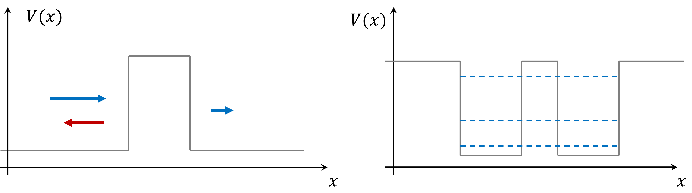
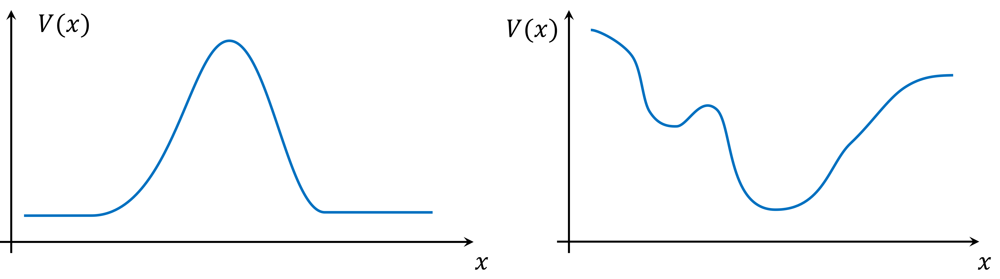
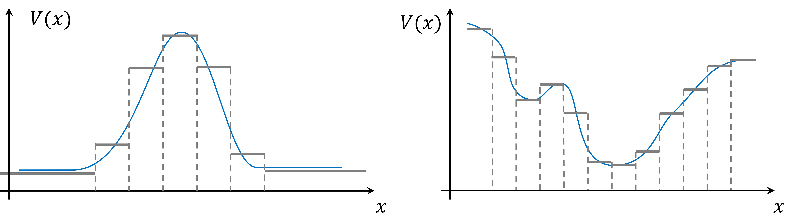
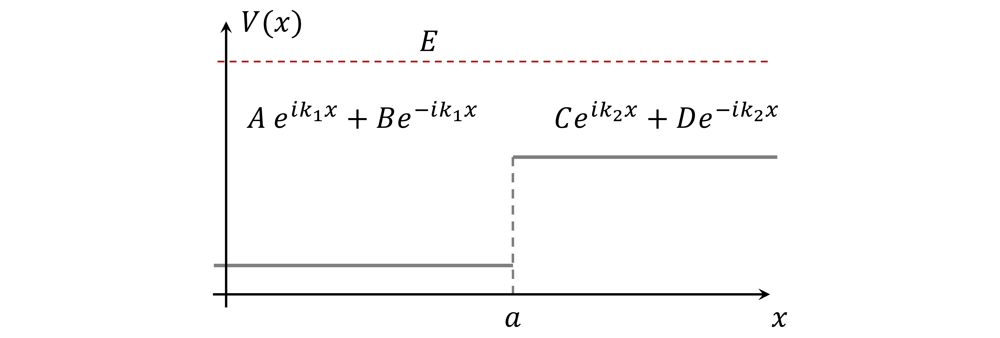
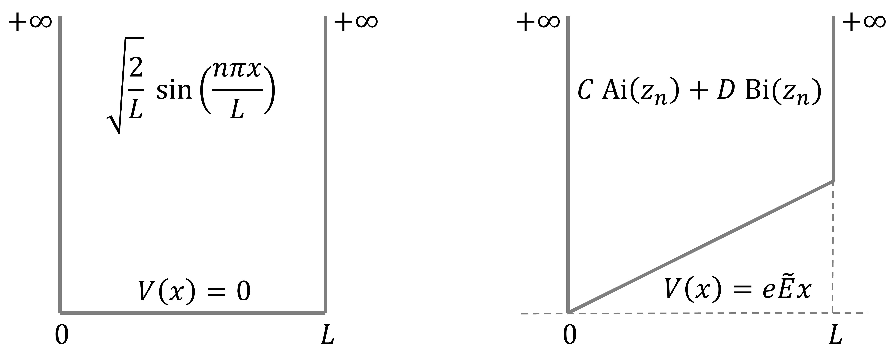
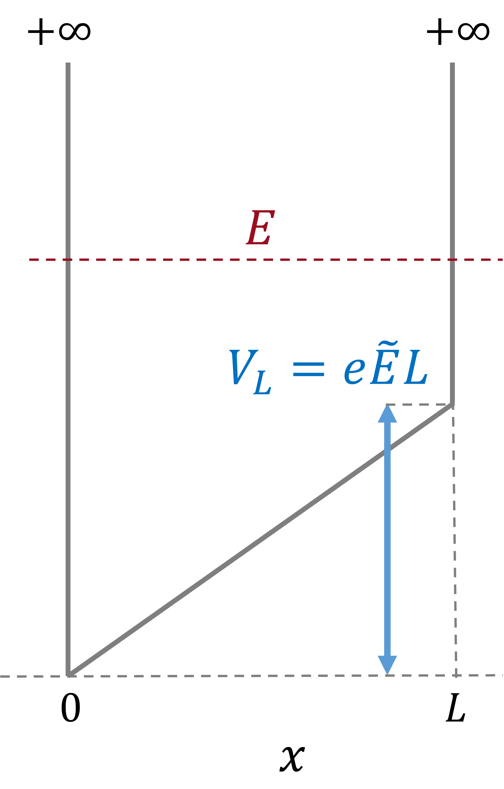
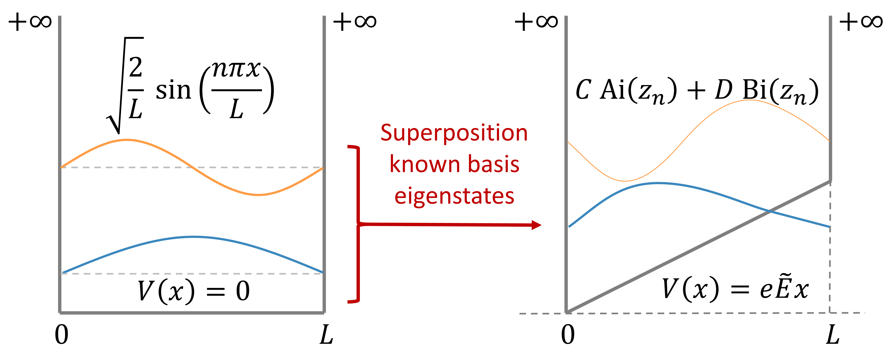
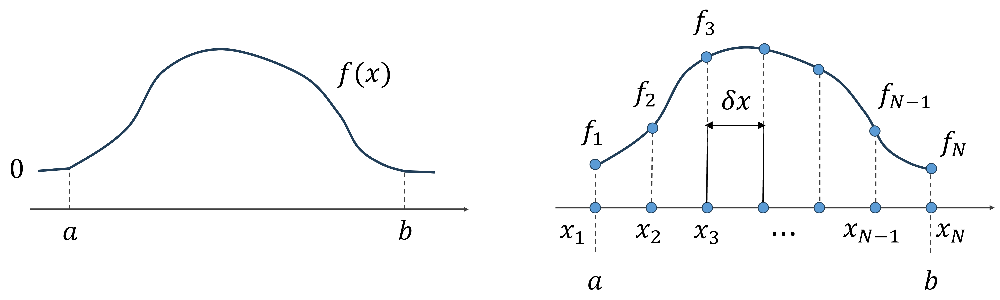
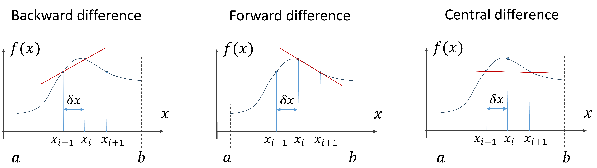
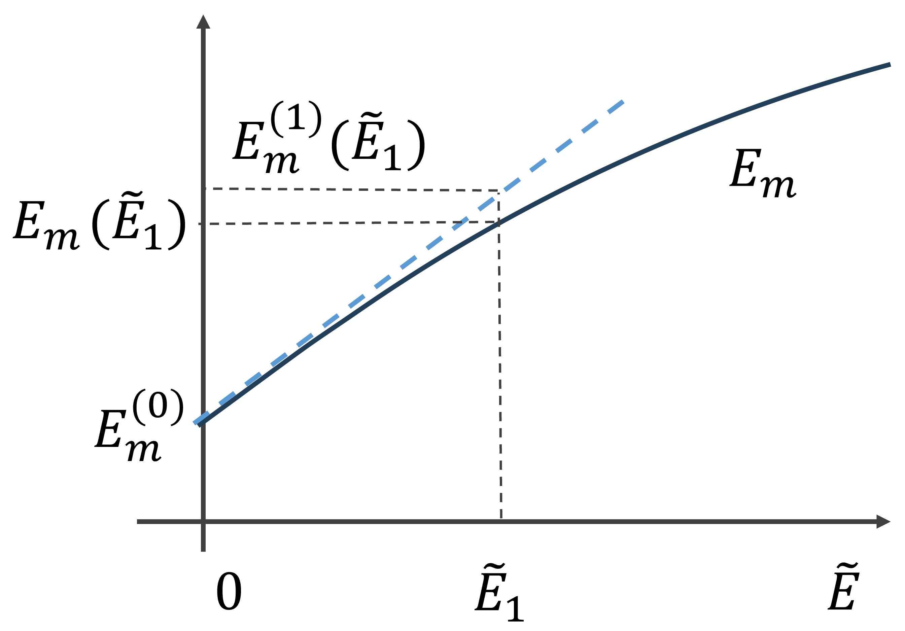

## Overview


# Introduction to different approximations

## Approximations

|  | Method | Approximates? |
|:-:|:--------------|:-------------------|
| 1 | Transfer matrix method   | piece-wise constant $V(x)$ |
| 2 | Finite basis method      | limited $\psi_n$, $E_n$: Matrix-formalism |
| 3 | Finite difference method | discretizes wave function |
| 4 | Perturbation theory (stat.) | small perturbation known solutions |
| 5 | Time-dependent perturbation | small perturbation known solutions | 
| 6 | Tight-binding approx. | electrons strongly bound (covalent) |
| 7 | Variational method | finding energy minima |

::: fragment

Usage of simple examples to compare over approximations 

  - Infinite square well with E-field (David Miller's book)
  - Harmonic oscilator
  - Transmission: Smoothed finite barrier

:::


# Transfer matrix method in 1D

## Intro: transfer matrix method

- For 1D potential energy functions $V(x)$  (here assume 1D systems)
- Approximation of potential energy $V(x)$ by piece-wise constant $V_i$
- Transmission or bound states

\



## Intro: transfer matrix method

- For 1D potential energy functions $V(x)$  (here assume 1D systems)
- Approximation of potential energy $V(x)$ by piece-wise constant $V_i$
- Transmission or bound states

\




## Intro: transfer matrix method

- For 1D potential energy functions $V(x)$  (here assume 1D systems)
- Approximation of potential energy $V(x)$ by piece-wise constant $V_i$
- Transmission or bound states

\




## Intro: transfer matrix method

- For 1D potential energy functions $V(x)$  (here assume 1D systems)
- Approximation of potential energy $V(x)$ by piece-wise constant $V_i$
- Schrodinger equation for constant $V(x) = V$

$$
\frac{d^2 \psi(x)}{dx^2} = -\frac{2m}{\hbar^2} (E - V) \psi(x)
$$

::: fragment

- Solution depends on value of $E - V$:
- If energy is **larger than** the potential energy $E > V$, then we have propagating waves

$$
\psi(x) = A e^{i k x} + B e^{-i k x} \qquad k^2 = \frac{2m}{\hbar ^2} (E - V)
$$

:::

## Intro: transfer matrix method

- For 1D potential energy functions $V(x)$  (here assume 1D systems)
- Approximation of potential energy $V(x)$ by piece-wise constant $V_i$
- Schrodinger equation for constant $V(x) = V$

$$
\frac{d^2 \psi(x)}{dx^2} = -\frac{2m}{\hbar^2} (E - V) \psi(x)
$$

- Solution depends on value of $E - V$:
- If energy is **less than** the potential $E < V$, then we have evanescent waves:

$$
\psi(x) = A e^{- \kappa x} + B e^{\kappa x} \qquad \kappa^2 = \frac{2m}{\hbar ^2} (V - E)
$$

## Intro: transfer matrix method

- For 1D potential energy functions $V(x)$  (here assume 1D systems)
- Approximation of potential energy $V(x)$ by piece-wise constant $V_i$
- Schrodinger equation for constant $V(x) = V$

$$
\frac{d^2 \psi(x)}{dx^2} = -\frac{2m}{\hbar^2} (E - V) \psi(x)
$$

- Solution depends on value of $E - V$:
- If energy is the **same** as the potential energy $E = V$, then:

$$
\psi(x) = A + B \, x
$$


## Intro: transfer matrix method

- For 1D potential energy functions $V(x)$  (here assume 1D systems)
- Approximation of potential energy $V(x)$ by piece-wise constant $V_i$
- Schrodinger equation for constant $V(x) = V$

$$
\frac{d^2 \psi(x)}{dx^2} = -\frac{2m}{\hbar^2} (E - V) \psi(x)
$$

- Solution depends on value of $E - V$:

| case | solutions | eigenvalue of $\hat{p}$ | parameter |
|:----:|:----:|:----:|:----:|
| $E > V$ | $e^{\pm i k x}$ | $\pm \hbar k$ | $k^2 = \frac{2m}{\hbar ^2} (E - V)$ |
| $E = V$ | $1$, $x$ | $0$, no e.v. | $E = V$ |
| $E < V$ | $e^{\mp \kappa x}$ | $\pm i \hbar \kappa$ | $\kappa^2 = \frac{2m}{\hbar ^2} (V - E)$ |


## Boundary conditions across a step in V(x)

- Suppose there is a step in the potential in $x = a$.
- **Boundary conditions**: Continuity of wave function $\psi(x)$ and derivative $\frac{d\psi(x)}{dx}$:

$$
\begin{aligned}
\psi_I(a) &= \psi_{II}(a) \qquad & A e^{i k_1 a} + B e^{-i k_1 a} &= C e^{i k_2 a} + D e^{-i k_2 a}\\
\frac{d\psi_I(a)}{dx} &= \frac{d\psi_{II}(a)}{dx} \qquad & i k_1 A e^{i k_1 a} -i k_1 B e^{-i k_1 a} &= i k_2 C e^{i k_2 a} -i k_2 D e^{-i k_2 a}\\
\end{aligned}
$$



## Boundary conditions across a step in V(x)

$$
\begin{aligned}
\psi_I(a) &= \psi_{II}(a) \qquad & A e^{i k_1 a} + B e^{-i k_1 a} &= C e^{i k_2 a} + D e^{-i k_2 a}\\
\frac{d\psi_I(a)}{dx} &= \frac{d\psi_{II}(a)}{dx} \qquad & i k_1 A e^{i k_1 a} -i k_1 B e^{-i k_1 a} &= i k_2 C e^{i k_2 a} -i k_2 D e^{-i k_2 a}\\
\end{aligned}
$$

\

$$
\pmatrix{1 & 1 \\ i k_1 & - i k_1}
\pmatrix{e^{i k_1 a} & 0 \\ 0 & e^{-i k_1 a}}
\pmatrix{A\\ B}
=
\pmatrix{1 & 1 \\ i k_2 & - i k_2}
\pmatrix{e^{i k_2 a} & 0 \\ 0 & e^{-i k_2 a}}
\pmatrix{C\\ D}
$$


## Boundary conditions across a step in V(x)

$$
\pmatrix{1 & 1 \\ i k_1 & - i k_1}
\pmatrix{e^{i k_1 a} & 0 \\ 0 & e^{-i k_1 a}}
\pmatrix{A\\ B}
=
\pmatrix{1 & 1 \\ i k_2 & - i k_2}
\pmatrix{e^{i k_2 a} & 0 \\ 0 & e^{-i k_2 a}}
\pmatrix{C\\ D}
$$

Express coefficient $A$, $B$ in $C$, $D$:

$$
\pmatrix{A\\ B}
=
\pmatrix{e^{i k_1 a} & 0 \\ 0 & e^{-i k_1 a}}^{-1}
\pmatrix{1 & 1 \\ i k_1 & - i k_1}^{-1} \\
\qquad \qquad \qquad \qquad \qquad \qquad \times\pmatrix{1 & 1 \\ i k_2 & - i k_2}
\pmatrix{e^{i k_2 a} & 0 \\ 0 & e^{-i k_2 a}}
\pmatrix{C\\ D}
$$

Rename the matrices as function of $V$ and $a$:

$$
\pmatrix{A\\ B}
= 
E_1^{-1}(a)
K_1^{-1}
K_2
E_2(a)
\pmatrix{C\\ D} 
$$

## Transfer matrix for a single step

$$
E_j(a) = \pmatrix{e^{i k_j a} & 0 \\ 0 & e^{-i k_j a}}
, \qquad
K_j \pmatrix{1 & 1 \\ i k_j & - i k_j}
$$

$$
\pmatrix{A_1\\ B_1}
= 
E_1^{-1}(a)
K_1^{-1}
K_2
E_2(a)
\pmatrix{A_2\\ B_2}
$$

We can define the transfer matrix for a single step:

$$
T_{12} = E_1^{-1}(a)
K_1^{-1}
K_2
E_2(a)
$$

Connection between coefficient before/after step:

$$
\pmatrix{A_1\\ B_1}
= T_{12} \,
\pmatrix{A_2\\ B_2}
$$

## Multiple potential steps

Extending the relation over multiple steps:

$$
\pmatrix{A_1\\ B_1}
= T_{12} \,
\pmatrix{A_2\\ B_2} = T_{12} \,
T_{23} \,
\pmatrix{A_3\\ B_3} 
$$

In general, after N steps we obtain: 

$$
\pmatrix{A_0\\ B_0}
= T \pmatrix{A_{N+1}\\ B_{N+1}} = T_{01} \, T_{12} \, \dots \, T_{N,N+1}
\pmatrix{A_{N+1}\\ B_{N+1}} 
$$

Or renaming the indices on the left and right:

$$
\pmatrix{A_L\\ B_L}
= \pmatrix{t_{11} & t_{12}\\ t_{21} & t_{22}}
\pmatrix{A_R\\ B_R} 
$$


## Scattering and Bound states

**Scattering**: $B_R = 0$

$$
\pmatrix{A_L\\ B_L}
= \pmatrix{t_{11} & t_{12}\\ t_{21} & t_{22}}
\pmatrix{A_R\\ 0} 
$$

Therefore the transmission and reflection coefficients become:

$$
\begin{aligned}
\textrm{Transmission}\quad  & T(E) = |A_R/A_L|^2 = 1\,/\,|t_{11}(E)|^2\\
\textrm{Reflection}\quad  & R(E) = |B_L/A_L|^2 = |t_{21}(E)|^2\,/\,|t_{11}(E)|^2\\
\end{aligned}
$$


## Scattering and Bound states

**Bound states**: $A_L = 0, \quad B_R = 0$

$$
\pmatrix{0\\ B_L}
= \pmatrix{t_{11} & t_{12}\\ t_{21} & t_{22}}
\pmatrix{A_R\\ 0} 
\Longrightarrow
\begin{aligned}
A_L = t_{11}(E) \,A_R\\
B_L = t_{21}(E) \,A_R\\
\end{aligned}
$$

- Bound states are given by zeros of $t_{11}$
- The total wave function is defined upon the coefficients $B_L$ and $A_R$. We can obtain these unknowns by 
  - first using the second equation: $B_L = t_{21}(E) \,A_R$ to obtain $B_L$, and then 
  - applying normalization to the whole wave function to fix $A_R$.


``` {python}
#| echo: False
#| label: analytic-cell
import matplotlib.pyplot as plt
import numpy as np
from scipy.special import airy

vL = 5.0
plt.rcParams.update({"font.size": 18})

ee = np.linspace(0, 15, 1000)
zL = (np.pi/vL) ** (2.0/3.0) * (vL - ee)
z0 = - (np.pi/vL) ** (2.0/3.0) * ee
AiL, aip, BiL, bip = airy(zL)
Ai0, aip, Bi0, bip = airy(z0)

det = Ai0 * BiL - AiL * Bi0
ee0 = ee[np.abs(det) < 0.0005]
ee0 = [3.24324324, 6.56156156, 11.54654655]
ee0 = ee0[0:3]
#print(ee0)

fig, axs = plt.subplots(1, 2, figsize=(11, 5))
plt.subplots_adjust(wspace=0.4)

ax = axs[0]
ax.plot(ee, det, color="red")
ax.hlines(0.0, 0, 15, color="black", linestyle="dashed", linewidth=1) 
ax.scatter(ee0, [0, 0, 0], color="blue")
ax.set_ylim([-0.5,3])
ax.set_xlim([0,15])
ax.set_xlabel(r"$\varepsilon$ (in $\nu_L$)")
ax.set_ylabel(r"Determinant")
#ax.legend(["Ai(z)", "Bi(z)"])
#ax.vlines([0], -1.0, 4.0, colors="gray", linestyles="dashed")

ax = axs[1]
for e0 in ee0:
  zLn = (np.pi/vL) ** (2.0/3.0) * (vL - e0)
  z0n = - (np.pi/vL) ** (2.0/3.0) * e0
  AiL, aip, BiL, bip = airy(zLn)
  Ai0, aip, Bi0, bip = airy(z0n)
  C = 1.0
  D = - Ai0 / Bi0
  x = np.linspace(0.0, 1.0, 100)
  zx = (np.pi/vL) ** (2.0/3.0) * (x*vL - e0)
  Ain, aip, Bin, bip = airy(zx)
  psi = C * Ain + D * Bin
  psi = psi / np.average(np.abs(psi))
  ax.plot(x, e0 + psi)

ax.hlines(ee0, 0, 1, linestyle="dashed", color="black", linewidth=1)
ax.plot(x, vL*x, color="gray")
ax.set_xlim([0, 1])
ax.set_ylabel(r"$\varepsilon$ (in $\nu_L$)")
ax.set_xlabel(r"$x$ (in $L$)")

plt.show()


```


``` {python}
#| echo: false
#| output: false
#| label: finite-basis-cell

# Import libraries
import matplotlib.pyplot as plt
import numpy as np
from numpy import pi, sin, sqrt, transpose
from scipy.sparse.linalg import eigsh
from scipy.linalg import eigh

# Parameters
f = 3
N = 3
nx = 100
x = np.linspace(0, 1, nx)

# Calculation
def create_Hmat_fb(f, N):
  Hmat_fb = np.zeros((N,N))
  for m in range(1,N+1):
    for n in range(1,N+1):
      if n != m:
        overlap = 2 * f*(2*m*n*((-1)**(m + n) - 1))/(pi**2*(m**2 - n**2)**2)
      else:
        overlap = n**2
      Hmat_fb[m-1,n-1] = overlap
  return Hmat_fb


for vv in np.linspace(1,3,2):
  eigenvalues, eigenvectors = eigh(create_Hmat_fb(vv, N))
  #print(eigenvalues[0:3])

psis = np.array([sqrt(2) * sin(n*pi*x) for n in range(1, N+1)])

psis_sum = [ np.sum(np.atleast_2d(eigenvectors[:, j]).T * psis, axis=0) for j in range(N)]

# Plot
for j in range(N):
  plt.plot(x, psis_sum[j])
ax = plt.gca()
ax.grid(True)
plt.show()

```


``` {python}
#| echo: false
#| label: analytical-vs-finite-basis-cell
import matplotlib.pyplot as plt
import numpy as np
from scipy.special import airy

vL = 5.0
plt.rcParams.update({"font.size": 18})
colors = ["blue", "green", "orange"]

# Parameters
N = 3
nx = 100
x = np.linspace(0, 1, nx)

# Calculation
def create_Hmat_fb(f, N):
  Hmat_fb = np.zeros((N,N))
  for m in range(1,N+1):
    for n in range(1,N+1):
      if n != m:
        overlap = 2 * f*(2*m*n*((-1)**(m + n) - 1))/(pi**2*(m**2 - n**2)**2)
      else:
        overlap = n**2
      Hmat_fb[m-1,n-1] = overlap
  return Hmat_fb


eigenvalues, eigenvectors = eigh(create_Hmat_fb(vL, N))
psis = np.array([sqrt(2) * sin(n*pi*x) for n in range(1, N+1)])
psis_sum = [ np.sum(np.atleast_2d(eigenvectors[:, j]).T * psis, axis=0) for j in range(N)]
psis_sum_norm = [1.0 / sqrt(np.average(psis_sum[j] ** 2)) for j in range(len(psis_sum))]
for j in range(len(psis_sum)):
  psis_sum[j] = psis_sum[j] * psis_sum_norm[j]

ee = np.linspace(0, 15, 1000)
zL = (np.pi/vL) ** (2.0/3.0) * (vL - ee)
z0 = - (np.pi/vL) ** (2.0/3.0) * ee
AiL, aip, BiL, bip = airy(zL)
Ai0, aip, Bi0, bip = airy(z0)

det = Ai0 * BiL - AiL * Bi0
ee0 = ee[np.abs(det) < 0.0005]
ee0 = [3.24324324, 6.56156156, 11.54654655]
ee0 = ee0[0:3]

fig, axs = plt.subplots(1, 3, figsize=(13, 5))
plt.subplots_adjust(wspace=0.2)

# Finite basis
for j, e0 in enumerate(ee0):
  zLn = (np.pi/vL) ** (2.0/3.0) * (vL - e0)
  z0n = - (np.pi/vL) ** (2.0/3.0) * e0
  AiL, aip, BiL, bip = airy(zLn)
  Ai0, aip, Bi0, bip = airy(z0n)
  C = 1.0
  D = - Ai0 / Bi0
  x = np.linspace(0.0, 1.0, 100)
  zx = (np.pi/vL) ** (2.0/3.0) * (x*vL - e0)
  Ain, aip, Bin, bip = airy(zx)
  psi = C * Ain + D * Bin
  psi = psi / np.sqrt(np.average(np.abs(psi)**2))
  ax = axs[j]
  ax.plot(x, psi, '--', color="gray", linewidth=3)
  if np.sum(psi * psis_sum[j]) < 0:
    ax.plot(x, -psis_sum[j], color=colors[j])
  else:
    ax.plot(x, psis_sum[j], color=colors[j])
  if j == 0:
    ax.plot(x, x + 100, color=colors[1])
    ax.plot(x, x + 100, color=colors[2])
    ax.set_ylabel(r"Eigenstates $\psi_n(x)$")
    ax.legend(["Analytic", r"Finite basis: $\psi_1$", r"Finite basis: $\psi_2$", r"Finite basis: $\psi_3$"])
  else:
    ax.set_yticklabels([])
    ax.set_yticklabels([], minor=True)
  ax.set_ylim([-1.6, 1.6])
  ax.set_xlabel(r"$x$ (in $L$)")


#ax.hlines(ee0, 0, 1, linestyle="dashed", color="black", linewidth=1)
#ax.plot(x, vL*x, color="gray")
#ax.set_xlim([0, 1])

plt.show()
```

``` {python}
#| echo: false
#| label: finite-difference-cell

# Import libraries
import numpy as np
import scipy as sp
from numpy import pi
from scipy.sparse import coo_array, bsr_array, csc_array, csr_array
#from scipy.sparse import diags_array
from scipy.sparse.linalg import eigsh, LaplacianNd
import matplotlib.pyplot as plt
from scipy.special import airy

# Parameters
vL = 5.0
plt.rcParams.update({"font.size": 18})
colors = ["blue", "green", "orange"]

# Parameters
n = 500
L = 1.0
x = np.linspace(0, L, n)
dx = L/(n-1)
V = 1 * (x - L/2.0)

# Calculate E_n, Psi_n
grid_shape = (n, )
lap = LaplacianNd(grid_shape, boundary_conditions='dirichlet').tosparse().astype(np.float64)
Vmat = bsr_array([V], offsets=[0]).toarray()
eigenvalues, eigenvectors = eigsh(-lap/(np.pi*dx)**2 + vL * Vmat, k=6, which="SM")

psis_sum = [n * np.sqrt(dx) * eigenvectors[:, j] for j in range(3)]

ee = np.linspace(0, 15, 1000)
zL = (np.pi/vL) ** (2.0/3.0) * (vL - ee)
z0 = - (np.pi/vL) ** (2.0/3.0) * ee
AiL, aip, BiL, bip = airy(zL)
Ai0, aip, Bi0, bip = airy(z0)

det = Ai0 * BiL - AiL * Bi0
ee0 = ee[np.abs(det) < 0.0005]
ee0 = [3.24324324, 6.56156156, 11.54654655]
ee0 = ee0[0:3]

fig, axs = plt.subplots(1, 3, figsize=(13, 5))
plt.subplots_adjust(wspace=0.2)

# Finite basis
for j, e0 in enumerate(ee0):
  zLn = (np.pi/vL) ** (2.0/3.0) * (vL - e0)
  z0n = - (np.pi/vL) ** (2.0/3.0) * e0
  AiL, aip, BiL, bip = airy(zLn)
  Ai0, aip, Bi0, bip = airy(z0n)
  C = 1.0
  D = - Ai0 / Bi0
  #x = np.linspace(0.0, 1.0, 500)
  zx = (np.pi/vL) ** (2.0/3.0) * (x*vL - e0)
  Ain, aip, Bin, bip = airy(zx)
  psi = C * Ain + D * Bin
  psi = psi / np.sqrt(np.average(np.abs(psi)**2))
  ax = axs[j]
  ax.plot(x, psi, '--', color="gray", linewidth=3)
  if np.sum(psi * psis_sum[j]) < 0:
    ax.plot(x, -psis_sum[j], color=colors[j])
  else:
    ax.plot(x, psis_sum[j], color=colors[j])
  if j == 0:
    ax.plot(x, x + 100, color=colors[1])
    ax.plot(x, x + 100, color=colors[2])
    ax.set_ylabel(r"Eigenstates $\psi_n(x)$")
    ax.legend(["Analytic", r"FDM: $\psi_1$", r"FDM: $\psi_2$", r"FDM: $\psi_3$"])
  else:
    ax.set_yticklabels([])
    ax.set_yticklabels([], minor=True)
  ax.set_ylim([-1.6, 1.6])
  ax.set_xlabel(r"$x$ (in $L$)")

plt.show()
```

``` {python}
#| echo: false
#| label: perturbation-cell

# Import libraries
import numpy as np
import scipy as sp
from numpy import pi
import matplotlib.pyplot as plt
from scipy.special import airy

# Parameters
vL = 5.0
plt.rcParams.update({"font.size": 18})
colors = ["blue", "green", "orange"]

# Parameters
n = 500
L = 1.0
x = np.linspace(0, L, n)
dx = L/(n-1)
V = 1 * (x - L/2.0)

# Calculate E_n, Psi_n from perturbation theory
E_n = [n**2 for n in range(1,4)]
psis_sum = []
for m in range(1, 4):
  ns = [n for n in range(1,10) if ((n + m) % 2 == 1)]
  #print(ns)
  pert = [8*n*m*vL*np.sqrt(2)/(np.pi ** 2 * (m**2 - n**2)**3) * np.sin(n*np.pi*x) for n in ns]
  tmp = np.sqrt(2) * np.sin(m*np.pi*x) - np.sum(pert, axis=0)
  psis_sum.append(tmp)

ee = np.linspace(0, 15, 1000)
zL = (np.pi/vL) ** (2.0/3.0) * (vL - ee)
z0 = - (np.pi/vL) ** (2.0/3.0) * ee
AiL, aip, BiL, bip = airy(zL)
Ai0, aip, Bi0, bip = airy(z0)

det = Ai0 * BiL - AiL * Bi0
ee0 = ee[np.abs(det) < 0.0005]
ee0 = [3.24324324, 6.56156156, 11.54654655]
ee0 = ee0[0:3]

fig, axs = plt.subplots(1, 3, figsize=(13, 5))
plt.subplots_adjust(wspace=0.2)

# Finite basis
for j, e0 in enumerate(ee0):
  zLn = (np.pi/vL) ** (2.0/3.0) * (vL - e0)
  z0n = - (np.pi/vL) ** (2.0/3.0) * e0
  AiL, aip, BiL, bip = airy(zLn)
  Ai0, aip, Bi0, bip = airy(z0n)
  C = 1.0
  D = - Ai0 / Bi0
  #x = np.linspace(0.0, 1.0, 500)
  zx = (np.pi/vL) ** (2.0/3.0) * (x*vL - e0)
  Ain, aip, Bin, bip = airy(zx)
  psi = C * Ain + D * Bin
  psi = psi / np.sqrt(np.average(np.abs(psi)**2))
  ax = axs[j]
  ax.plot(x, psi, '--', color="gray", linewidth=3)
  if np.sum(psi * psis_sum[j]) < 0:
    ax.plot(x, -psis_sum[j], color=colors[j])
  else:
    ax.plot(x, psis_sum[j], color=colors[j])
  if j == 0:
    ax.plot(x, x + 100, color=colors[1])
    ax.plot(x, x + 100, color=colors[2])
    ax.set_ylabel(r"Eigenstates $\psi_n(x)$")
    ax.legend(["Analytic", r"Perturbed: $\psi_1$", r"Perturbed: $\psi_2$", r"Perturbed: $\psi_3$"])
  else:
    ax.set_yticklabels([])
    ax.set_yticklabels([], minor=True)
  ax.set_ylim([-1.6, 1.6])
  ax.set_xlabel(r"$x$ (in $L$)")

plt.show()
```


## Approximations

|  | Method | Approximates? |
|:-:|:--------------|:-------------------|
| 1 | Transfer matrix method   | piece-wise constant $V(x)$ |
| 2 | Finite basis method      | limited $\psi_n$, $E_n$: Matrix-formalism |
| 3 | Finite difference method | discretizes wave function |
| 4 | Perturbation theory (stat.) | small perturbation known solutions |
| 5 | Time-dependent perturbation | small perturbation known solutions | 
| 6 | Tight-binding approx. | electrons strongly bound (covalent) |
| 7 | Variational method | finding energy minima |

::: fragment

Usage of simple examples to compare over approximations 

  - Infinite square well with E-field (David Miller's book section 2.11)
  - More on approximation methods: see Chapter 6 of David Miller's book
  - Analytic solution vs. **perturbation** vs. **finite basis method** vs. **Finite difference**

:::

# Infinite well with E-field

## A constant electric field

- The potential for a constant electric field: $V(x) = e \tilde{E} \, x$
- The time-independent Schrodinger equation:

$$
-\frac{\hbar^2}{2m} \frac{d^2 \psi(x)}{dx^2} + e\tilde{E}x \psi(x) = E \psi(x)
$$




## A constant electric field

$$
-\frac{\hbar^2}{2m} \frac{d^2 \psi(x)}{dx^2} + e\tilde{E}x \psi(x) = E \psi(x)
$$

Rewrite the equation to clarify its form:

$$
\begin{aligned}
\frac{d^2 \psi(x)}{dx^2} &= \frac{2m e\tilde{E}}{\hbar^2} (x-\frac{E}{e\tilde{E}}) \psi(x)\\
&= c\,(x - d) \psi(x)
\end{aligned}
$$

Where $c = \frac{2m e\tilde{E}}{\hbar^2}$ and $d = \frac{E}{e\tilde{E}}$.

This looks very much like the (solvable) Airy equation:

$$
\frac{d^2 f(z)}{dz^2} = z f(z)
$$

$\longrightarrow$ we need to find a suitable substitution for $z$

## Suitable substitution for z(x)

Assume a linear form for $z = \alpha x + \beta$ and rewrite the Airy equation

$$
\frac{d^2 \psi(x)}{dx^2} = \frac{d^2 f(z)}{dz^2} \left( \frac{dz}{dx} \right)^2 = \alpha^2 z f(z) = (\alpha^3 x + \beta \alpha^2) f(z)
$$

::: fragment

But we have also:

$$
\frac{d^2 \psi(x)}{dx^2} = -\frac{2m}{\hbar^2} (E - e\tilde{E}x) \psi(x) = c (x - d)
$$

$$
\Longrightarrow c (x - d) = (\alpha^3 x + \beta \alpha^2)\\
\Longrightarrow \alpha = c^{1/3} \qquad \beta = - c^{1/3} d\\
$$

$$
\Longrightarrow z = \alpha x + \beta = c^{1/3}(x - d) = \left( \frac{2 m e\tilde{E}}{\hbar^2} \right)^{1/3} \left(x - \frac{E}{e\tilde{E}}\right)
$$

:::

## Airy equation solutions

$$
\frac{d^2 f(z)}{dz^2} = z \, f(z), \qquad \quad \psi(x) = f(z) = C \, \mathrm{Ai}(z) + D \, \mathrm{Bi}(z)
$$

$$
\begin{aligned}
\mathrm{Ai}(z) &= \frac{1}{\pi} \int_0^\infty \cos\left(\frac{t^3}{3} + zt\right) dt\\
\mathrm{Bi}(z) &= \frac{1}{\pi} \int_0^\infty \left[\exp\left(-\frac{t^3}{3} + zt\right) + \sin\left(\frac{t^3}{3} + zt\right)\right] dt\\
\end{aligned}
$$

``` {python}
#| echo: False
import matplotlib.pyplot as plt
import numpy as np
from scipy.special import airy

x = np.linspace(-18, 3, 1000)
y_Ai, aip, y_Bi, bip = airy(x)

fig, ax = plt.subplots(figsize=(10, 3))
ax.plot(x, y_Ai)
ax.plot(x, y_Bi)
ax.set_ylim([-1,2])
ax.set_xlim([-18,3])
ax.set_xlabel("z")
ax.legend(["Ai(z)", "Bi(z)"])
ax.vlines([0], -1.0, 4.0, colors="gray", linestyles="dashed")
plt.show()

```

## Boundary conditions

$$
\frac{d^2 f(z)}{dz^2} = z \, f(z), \qquad \quad \psi(x) = f(z) = C \, \mathrm{Ai}(z) + D \, \mathrm{Bi}(z)
$$

$$
\begin{aligned}
&x = 0 \longrightarrow z_0 = -c^{1/3} d    &\qquad C \, \mathrm{Ai}(z_0) + D \, \mathrm{Bi}(z_0) = 0\\
&x = L \longrightarrow z_L = c^{1/3}(L-d)  &\qquad C \, \mathrm{Ai}(z_L) + D \, \mathrm{Bi}(z_L) = 0\\
\end{aligned}
$$

$$
\begin{pmatrix}
\mathrm{Ai}(z_0) & \mathrm{Bi}(z_0)\\
\mathrm{Ai}(z_L) & \mathrm{Bi}(z_L)\\
\end{pmatrix}
\pmatrix{C \\ D}
=
\pmatrix{0 \\ 0}
$$

Inverse cannot exist $\longrightarrow$ determinant is zero:

$$
\det
\begin{pmatrix}
\mathrm{Ai}(z_0) & \mathrm{Bi}(z_0)\\
\mathrm{Ai}(z_L) & \mathrm{Bi}(z_L)\\
\end{pmatrix}
= \mathrm{Ai}(z_0) \, \mathrm{Bi}(z_L) - \mathrm{Ai}(z_L) \, \mathrm{Bi}(z_0) = 0\\
$$

$\longrightarrow$ Numerically solutions $z_0(E)$, $z_L(E)$

## Dimensionless units

:::: columns

::: {.column width=65%}

Simplify formula and units 

$$
\left\{
\begin{aligned}
z_0 &= -c^{1/3} d = - \left(\frac{2m e \tilde{E}}{\hbar^2}\right)^{1/3} \, \frac{E}{e\tilde{E}} \\
z_L &= c^{1/3}(L-d) = \left(\frac{2m e \tilde{E}}{\hbar^2}\right)^{1/3} \, \left(L - \frac{E}{e\tilde{E}}\right)\\
\end{aligned}
\right.
$$

::: fragment

In units of $E_1^\infty = \frac{\hbar^2 \pi^2}{2 m L^2}$, 

$$
\boxed{E \longrightarrow \varepsilon = \frac{E}{E_1^{\infty}}}
\qquad\boxed{V_L \longrightarrow \nu_L = \frac{V_L}{E_1^{\infty}} = \frac{e\tilde{E}L}{E_1^{\infty}}}
$$

$$
\Rightarrow
\boxed{z_0 = - \left(\frac{\pi}{\nu_L}\right)^{\frac{2}{3}} \varepsilon, \qquad
z_L = \left(\frac{\pi}{\nu_L}\right)^{\frac{2}{3}} \left(\nu_L - \varepsilon\right)}
$$

:::

:::

::: {.column width=35%}



:::

::::

## Choice of units

:::: columns

::: {.column width=65%}

For comparison with the infinite well: energy unit $\,\,E_1^\infty$

$$
z_0 = - \left(\frac{\pi}{\nu_L}\right)^{\frac{2}{3}} \varepsilon, \qquad
z_L = \left(\frac{\pi}{\nu_L}\right)^{\frac{2}{3}} \left(\nu_L - \varepsilon\right)
$$

Alternative: energy unit $\,\,\nu_L$

$$
z_0 = - \pi^\frac{2}{3} \tilde{\varepsilon}, \qquad z_L = \pi^\frac{2}{3} \left(1 - \tilde{\varepsilon}\right)
$$

\

::: fragment

**eigenenergies**: Solve determinant equation

**eigenstates**: Fill in eigenenergies in boundary conditions (constants $C$, $D$)

:::

:::

::: {.column width=35%}


:::

::::

## Eigenenergies & eigenstates

1. Numerically solve determinant equation for eigenenergies $E_n$, 
1. Use $E_n$ in boundary conditions to obtain $\psi_n(x)$
1. Normalize by $\int_0^L |\psi(x)|^2 dx = 1$


$$
\begin{aligned}
&\textrm{Eigenenergies} \, \,E_n: \qquad \qquad\qquad\mathrm{Ai}(z_0) \, \mathrm{Bi}(z_L) - \mathrm{Ai}(z_L) \, \mathrm{Bi}(z_0) = 0\\
&\\
&\textrm{Eigenstates} \, \,\psi_n(x) = C \,\mathrm{Ai}(z) + D \,\mathrm{Bi}(z): \qquad\frac{D}{C} = -\frac{\mathrm{Bi(z_0)}}{\mathrm{Ai(z_0)}}
\end{aligned}
$$

Remember that $z$ scales with energy

$$
z = c^{1/3}(x - d) = \left( \frac{2 m e\tilde{E}}{\hbar^2} \right)^{1/3} \left(x - \frac{E}{e\tilde{E}}\right) = \left(\frac{\pi}{\nu_L}\right)^{\frac{2}{3}} \left(\frac{x}{L}\nu_L - \varepsilon\right)
$$

## Final solution



- Eigenenergies $\varepsilon_n$ have zero determinant: find roots
- Fill in $\varepsilon_n$ to get eigenstates $\psi_n(x)$ 

# Finite basis approximation

## Finite basis approximation

Steps to reach to the solutions:

1. Expand the solution in a known basis
1. Limit the amount of energy levels $\longrightarrow$ matrix algebra 
1. Solve the eigenvalue equations for **eigenenergies** & **eigenstates**




## Dimensionless Hamiltonian

The dimensionless Hamiltonian for infinite well is obtained by:

- $z = x/L$, $E \longrightarrow E/E^\infty_1$, 
- electric field $\nu_L$ in units of $V_L/E^\infty_1$

$$
\hat{H} = -\frac{1}{\pi^2}\frac{d^2}{dz^2} + \nu_L \, (z - 1/2) \quad \textrm{ with } \quad \hat{H}_0 = -\frac{1}{\pi^2}\frac{d^2}{dz^2} 
$$

Compute the elements of the Hamiltonian (matrix)

$$
H_{mn} = 
-\frac{1}{\pi^2} \int \psi_m(z) \frac{d^2}{dz^2} \psi_n(z) dz \,\, +  \,\,\int \nu_L \, (z - 1/2) \psi_m(z) \psi_n(z) dz,
$$

With $\,\psi_n(z) = \sqrt{2} \sin(n \pi z)$

## Hamiltonian: overlap integrals

$$
H_{mn} = \langle \psi_m | \hat{H} | \psi_n \rangle = 
-\frac{1}{\pi^2}  \int \psi_m(z) \frac{d^2}{dz^2} \psi_n(z) dz \,\, +  \,\,\int \nu_L \, (z - \frac{1}{2}) \psi_m(z) \psi_n(z) dz,
$$

With the eigenstates $\psi_n(z) = \sqrt{2}\sin(n\pi z)$

$$
\begin{aligned}
H_{mn} &= 
-\frac{1}{\pi^2} \int_0^1 \psi_m(z) \frac{d^2}{dz^2} \psi_n(z) dz \,\, +  \,\,\int_0^1 \nu_L \, (z - 1/2) \psi_m(z) \psi_n(z) dz,\\
&= 
n^2\delta_{mn} \,\, +  \,\,\nu_L \int_0^1 \, (z-1/2) \sin(m\pi z) \sin(n\pi z) dz,\\
\end{aligned}
$$

The second integral can be calculated:

$$
\int_0^1 \, (z-1/2) \sin(m\pi z) \sin(n\pi z) dz = 
\left\{\,\,\begin{aligned}
\frac{4nm}{\pi^2(m^2-n^2)^2} & \qquad \textrm{if }\,\, m+n \,\,\textrm{ is odd}  \\
& \\
0 & \qquad \textrm{if } \,\,m+n\,\, \textrm{ is even}
\end{aligned}\right.
$$


```{python}
#| echo: false
#| output: false
from sympy import *
from sympy import ask, Q, pi

z, E = symbols('z E')
m = Symbol('m', real=True, negative=False, zero=False) 
n = Symbol('n', real=True, negative=False, zero=False)

f = (z-1/2) * sin(m*pi*z) * sin(n*pi*z)
print(f)
Integral(f, (z, 0, 1))
I = integrate(f, (z, 0, 1))
simplify(I)

```

## Hamiltonian: overlap integrals

We see that the integral has two different contributions:

- Diagonal elements $\,H_{nn}\,$ are defined by $\,\hat{H}_0\,$ with $\,\,E_n = n^2\, E_1^\infty$
- Other elements $\,H_{n, m \neq n}\,$ determined by perturbing potential $\,\,\hat{H}_p = \hat{H} - \hat{H}_0$

$$
H_{nn} = n^2 \qquad
\left\{\,\,
\begin{aligned}
H_{mn} &= - \nu_L \, \frac{4nm}{\pi^2(m^2-n^2)^2} & \quad \textrm{if }\,\,n = m \pm 1, m \pm 3, \dots \\
& & \\
H_{mn} &= 0 & \quad \textrm{if }\,\, n = m \pm 2, m \pm 4, \dots\\
\end{aligned}
\right.
$$

- The Hamiltonian gives contributions of eigenstates $\,\,\psi_n(z) = \sqrt{2}\sin(n\pi z)$
- Eigenenergies $\,E_n$ and potential $\,\nu_L$ are in units of $\,\,E_1^\infty = \frac{\hbar^2\pi^2}{2mL^2}$

## Solving the eigenvalue equation

The eigenvalue equation is:

$$
\hat{H} \psi_n(z) = E_n \psi_n(z)
$$

If we numerically calculate the overlap integrals:

$$
H_{mn} = \pmatrix{
  1 & -0.54 & 0\\
  -0.54 & 4 & -0.584\\
  0 & -0.584 & 9\\
}
$$

When comparing resulting eigenvalues:

| Eigenvalues | $E_1$ | $E_2$ | $E_3$ |
| ------------------------- |:-----:|:-----:|:-----:|
| Finite basis approx. | $0.90437$ | $4.0279$ | $9.068$ |
| Analytical solution | $0.90419$ | $4.0275$ | $9.017$ |

## Comparing Eigenstates



::: callout-note
## From the plot

Finite basis method gives good results for lower eigenenergies/eigenstates

:::


# Finite difference approximation

## Finite difference approximation

Steps to reach to the solutions:

1. Discretize the wave function (finite basis)
1. Finite Difference Method to discretize the Schr\"odinger equation
1. Limited discrete points $\longrightarrow$ matrix algebra (Requires finite **box**)
1. Solve the eigenvalue equations for **eigenenergies** & **eigenstates**


## Discretizing a function

- A function on a computer as a vector:

$$
f(x) = \pmatrix{f(x_1) \\ f(x_2) \\ \vdots \\ f(x_N)} \longrightarrow \pmatrix{f_1 \\ f_2 \\ \vdots \\ f_N}
$$




## A normalized state

- A normalized state requires: $\langle f |f \rangle = 1$
- If we define the normalized state as ket and bra: 

$$
|f \rangle = |f(x_j) \sqrt{\delta x}\rangle = \pmatrix{f(x_1) \\ f(x_2) \\ \vdots \\ f(x_N)} \longrightarrow \pmatrix{f_1 \\ f_2 \\ \vdots \\ f_N}
$$

$$
\langle f | = \langle f^*(x_j) \sqrt{\delta x}| \longrightarrow \pmatrix{f_1^* \sqrt{\delta x} & f_2^* \sqrt{\delta x} & \cdots & f_N^* \sqrt{\delta x}}
$$

And the inner product is:

$$
\langle f | f \rangle = \langle f(x) | f(x)\rangle \delta x = \sum_{j=1}^N |f_j|^2 \delta x \quad\longleftrightarrow\quad
\int_a^b |f(x)|^2 dx
$$

## Finite differences

- Hamiltonian contains second derivative
- Derivative of a discrete function?

$$
\textrm{Central difference scheme: } \quad \frac{df(x)}{dx} \longrightarrow
\frac{\delta f(x)}{\delta x} = \frac{f_{i+1} - f(i-1)}{2\delta x}
$$




## Second derivative

- Hamiltonian contains second derivative
- Derivative of a discrete function?

$$
\textrm{Central difference scheme: } \quad \frac{df(x)}{dx} \longrightarrow
\frac{\delta f(x)}{\delta x} = \frac{f_{i+1} - f(i-1)}{2\delta x}
$$

- Second derivative by using central difference scheme with $\delta/2$

$$
\frac{d^2 f(x)}{dx^2} \longrightarrow
\frac{\frac{f_{i+1} - f_{i}}{\delta x} - \frac{f_{i} - f_{i-1}}{\delta x}}{\delta x} 
= \frac{f_{i+1} + f_{i-1} - 2 f_i}{\delta x^2}
$$

::: fragment

- Discrete potential function $V_i = V(x_i)$

$$
\hat{H} = -\frac{\hbar^2}{2m} \frac{d^2}{dx^2} + V(x) \quad \longrightarrow \quad 
-\frac{\hbar^2}{2m} \frac{f_{i+1} + f_{i-1} - 2 f_i}{\delta x^2} + V_i 
$$

:::

## Matrix form

$$
\hat{H} = -\frac{\hbar^2}{2m} \frac{d^2}{dx^2} + V(x) \quad \longrightarrow \quad 
-\frac{\hbar^2}{2m} \frac{f_{i+1} + f_{i-1} - 2 f_i}{\delta x^2} + V_i 
$$

- The Hamiltonian can be written as a matrix operator

$$
\hat{H} = -\frac{\hbar^2}{2m\,\delta x^2} \pmatrix{
    1 & 0 & & &  &  & \\
    1 & -2 & 1 & &  & & \\
    & 1 & -2 & 1 & &  & \\
    &  & \ddots & \ddots & \ddots &  & \\
    &  &  & 1 & -2 & 1 &  \\
    &  &  &  & 1 & -2 & 1 \\
    &  &  &  &  &  0 & 1 \\
} + V(x) \mathbb{1}
$$

## Matrix form (dimensionless)

$$
\hat{H} = -\frac{1}{\pi^2} \frac{d^2}{dx^2} + V(x) \quad \longrightarrow \quad 
-\frac{1}{\pi^2} \frac{f_{i+1} + f_{i-1} - 2 f_i}{\delta x^2} \,+\, \nu_L \left(\frac{i}{N}-\frac{1}{2}\right) 
$$

- The Hamiltonian can be written as a matrix operator ($E$, $\nu_L$ in units of $E_1^\infty$)

$$
-\frac{1}{\pi^2\,\delta x^2} \pmatrix{
    1 & 0 & & &  \\
    1 & -2 & 1 & & \\
    & \ddots & \ddots & \ddots & \\
    &  & 1 & -2 & 1 \\
    &  &   &  0 & 1 \\
} + 
\pmatrix{
    V_1 & & & &  \\
    & V_2 & & & \\
    & & \ddots & & \\
    &  & & V_{N-1} &  \\
    &  & &  & V_{N} \\
}
$$

## Matrix form (dimensionless)

$$
\hat{H} = -\frac{1}{\pi^2} \frac{d^2}{dx^2} + V(x) \quad \longrightarrow \quad 
-\frac{1}{\pi^2} \frac{f_{i+1} + f_{i-1} - 2 f_i}{\delta x^2} \,+\, \nu_L \left(\frac{i}{N}-\frac{1}{2}\right) 
$$

- The Hamiltonian can be written as a matrix operator ($E$, $\nu_L$ in units of $E_1^\infty$)

$$
-\frac{1}{\pi^2\,\delta x^2} \pmatrix{
    1 & 0 & & &  \\
    1 & -2 & 1 & & \\
    & \ddots & \ddots & \ddots & \\
    &  & 1 & -2 & 1 \\
    &  &   &  0 & 1 \\
} + \frac{\nu_L}{2N}
\pmatrix{
    -N & & & &  \\
    & -N+2 & & & \\
    & & \ddots & & \\
    &  & & N-2 & \\
    &  &   &  & N \\
}
$$

\

$\longrightarrow$ Solve the eigenvalue equation: $\,\,\hat{H} |\psi_n\rangle = E_n |\psi_n$

## Solving Large matrix equations

``` {python}
import numpy as np
from scipy.sparse import diags_array
from scipy.sparse.linalg import eigsh, LaplacianNd

# Parameters
n = 500; L = 1.0; dx = L/(n-1)
x = np.linspace(0, L, n)
V = 5 * (x - L/2)

# Calculate E_n, Psi_n
lap = LaplacianNd(
  grid_shape=(n, ), boundary_conditions='dirichlet'
).tosparse().astype(np.float64)
Vmat = diags_array([V], offsets=[0]).toarray()
E_n, Psi_n = eigsh(-lap/np.pi**2/dx**2 + Vmat, k=3, which="SM")
print("Eigenvalues E1, E2, E3:\n\t\t" + str(np.round(E_n, 3))) 

```

## Infinite well with electric field

$$
\hat{H} = -\frac{1}{\pi^2}\frac{d^2}{dz^2} + \nu_L \, (z - 1/2) \quad \textrm{ with } \quad \hat{H}_0 = -\frac{1}{\pi^2}\frac{d^2}{dz^2} 
$$

\

| Eigenvalues | $E_1$ | $E_2$ | $E_3$ |
| ------------------------- |:-----:|:-----:|:-----:|
| Finite difference | $0.7293$ | $4.0382$ | $8.976$ |
| Finite basis approx. | $0.9044$ | $4.0279$ | $9.068$ |
| Analytical solution | $0.9042$ | $4.0275$ | $9.017$ |

\

- Choosing initial basis functions not necessary
- Accurate potential $V(x)$ ($\delta x$ dependent)
- *BAD* eigenenergies accuracy? Wave function accuracy *GOOD*?

## Wave function comparison




# Time-independent perturbation theory

## Perturbation theory

Steps to reach to the solutions:

1. $\hat{H} = \hat{H}_0 + \gamma\hat{H}_p$ Assume the perturbation to be small 
1. Expand both the **eigenenergies** & **eigenstates** into power series in $\gamma$
1. Recursive relations for **eigenenergies** & **eigenstates**


## Example of standard perturbation

- Putting on a "small" electric field
- Approximating the effect of $V(x) = e \tilde{E} (x - L/2) \equiv \varepsilon z$ by power series:

$$
E_m = E^{(0)}_m + \alpha_1 \varepsilon +  \alpha_2 \varepsilon^2 + \dots
$$

::: fragment

:::: columns

::: {.column width=50%}

- Eigenstates $|\psi_m\rangle$ extracted from $E_m$
- $\varepsilon \ll 1 \, \longrightarrow$ higher orders zero
- Can we generalize perturbations?

:::

::: {.column width=50%}



:::

::::

:::

## Perturbation part of Hamiltonian

- Independent of the actual perturbation form
- Known solutions for the unperturbed part $\hat{H}_0$

$$
\hat{H}_0 |\psi_n\rangle = E_n |\psi_n\rangle
$$

- Perturbation of $\hat{H}_0$ by "small" perturbing part $\hat{H}_p$:

$$
\hat{H} = \hat{H}_0 + \gamma\hat{H}_p
$$

::: fragment

- We can express the eigenenergies $E$ and eigenstates $|\phi\rangle$:

$$
\hat{H}|\phi\rangle = (\hat{H}_0 + \gamma\hat{H}_p) |\phi\rangle = E |\phi\rangle
$$

:::

## Power series expansion

$$
\hat{H}|\phi\rangle = (\hat{H}_0 + \gamma\hat{H}_p) |\phi\rangle = E |\phi\rangle
$$

Expand $E$ and $|\phi\rangle$ as power series in $\gamma$:

$$
E = E^{(0)} + \gamma E^{(1)}  + \gamma^2 E^{(2)} + \gamma^3 E^{(3)} + \gamma^4 E^{(4)} + \dots  
$$

$$
|\phi\rangle = |\phi^{(0)}\rangle + \gamma |\phi^{(1)}\rangle  + \gamma^2 |\phi^{(2)}\rangle + \gamma^3 |\phi^{(3)}\rangle + \gamma^4 |\phi^{(4)}\rangle + \dots  
$$

::: fragment

Schrodinger equation becomes:

$$
\begin{aligned}
&(\hat{H}_0 + \gamma\hat{H}_p) \left( |\phi^{(0)}\rangle + \gamma |\phi^{(1)}\rangle  + \gamma^2 |\phi^{(2)}\rangle + \dots \right) = \\ 
& \qquad\left(E^{(0)} + \gamma E^{(1)}  + \gamma^2 E^{(2)} + \dots \right) \left( |\phi^{(0)}\rangle + \gamma |\phi^{(1)}\rangle  + \gamma^2 |\phi^{(2)}\rangle + \dots \right)
\end{aligned}
$$

$\longrightarrow$ Equate coefficients of same order in $\gamma$

:::

## Zeroth order perturbation

$$
\begin{aligned}
&(\hat{H}_0 + \gamma\hat{H}_p) \left( |\phi^{(0)}\rangle + \gamma |\phi^{(1)}\rangle  + \gamma^2 |\phi^{(2)}\rangle + \dots \right) = \\ 
& \qquad\left(E^{(0)} + \gamma E^{(1)}  + \gamma^2 E^{(2)} + \dots \right) \left( |\phi^{(0)}\rangle + \gamma |\phi^{(1)}\rangle  + \gamma^2 |\phi^{(2)}\rangle + \dots \right)
\end{aligned}
$$

::: fragment

- zeroth order in $\gamma$:

$$
\hat{H}_0 |\phi^{(0)}\rangle = E^{(0)} |\phi^{(0)}\rangle \quad \longrightarrow \quad |\psi_m\rangle \equiv |\phi^{(0)}\rangle, \quad E_m \equiv E^{(0)}
$$

- These are the solutions of the unperturbed Hamiltonian

:::

## Matching orders

$$
\begin{aligned}
&(\hat{H}_0 + \gamma\hat{H}_p) \left( |\psi_m \rangle + \gamma |\phi^{(1)} \rangle  + \gamma^2 |\phi^{(2)}\rangle + \dots \right) = \\ 
& \qquad\left(E_m + \gamma E^{(1)}  + \gamma^2 E^{(2)} + \dots \right) \left( |\psi_m \rangle + \gamma |\phi^{(1)} \rangle  + \gamma^2 |\phi^{(2)}\rangle + \dots \right)
\end{aligned}
$$

Matching orders in $\gamma$

$$
\begin{aligned}
\hat{H}_0 |\psi_m \rangle &= E_m |\psi_m \rangle\\
&\\
\hat{H}_0 |\phi^{(1)}\rangle + \hat{H}_p|\psi_m \rangle &= E_m |\phi^{(1)}\rangle + E^{(1)} |\psi_m \rangle\\
&\\
\hat{H}_0 |\phi^{(2)}\rangle + \hat{H}_p|\phi^{(1)}\rangle &= E_m |\phi^{(2)}\rangle + E^{(1)} |\phi^{(1)}\rangle + E^{(2)} |\psi_m\rangle\\
\end{aligned}
$$

## Matching orders CTU'd

$$
\begin{aligned}
\hat{H}_0 |\psi_m \rangle &= E_m |\psi_m \rangle\\
\hat{H}_0 |\phi^{(1)}\rangle + \hat{H}_p|\psi_m \rangle &= E_m |\phi^{(1)}\rangle + E^{(1)} |\psi_m \rangle\\
\hat{H}_0 |\phi^{(2)}\rangle + \hat{H}_p|\phi^{(1)}\rangle &= E_m |\phi^{(2)}\rangle + E^{(1)} |\phi^{(1)}\rangle + E^{(2)} |\psi_m\rangle\\
\end{aligned}
$$

Rewrite highest order state to the left-hand-side:

$$
\begin{aligned}
(\hat{H}_0 - E_m) |\psi_m \rangle &= 0\\
(\hat{H}_0 - E_m)|\phi^{(1)}\rangle &= (E^{(1)} - \hat{H}_p)|\psi_m \rangle\\
(\hat{H}_0 - E_m)|\phi^{(2)}\rangle &= (E^{(1)} - \hat{H}_p) |\phi^{(1)}\rangle + E^{(2)} |\psi_m\rangle\\
\end{aligned}
$$


## First order perturbation theory

$$
\begin{aligned}
(\hat{H}_0 - E_m) |\psi_m \rangle &= 0\\
(\hat{H}_0 - E_m)|\phi^{(1)}\rangle &= (E^{(1)} - \hat{H}_p)|\psi_m \rangle\\
(\hat{H}_0 - E_m)|\phi^{(2)}\rangle &= (E^{(1)} - \hat{H}_p) |\phi^{(1)}\rangle + E^{(2)} |\psi_m\rangle\\
\end{aligned}
$$

Left-multiply by the bra $\langle \psi_m |$

$$
\begin{aligned}
\textrm{left-hand-side:}\quad \langle \psi_m |(\hat{H}_0 - E_m)|\phi^{(1)}\rangle &= \langle \psi_m |(E_m - E_m)|\phi^{(1)}\rangle = 0\\
\textrm{right-hand-side:}\quad \langle \psi_m |(E^{(1)} - \hat{H}_p)|\psi_m \rangle &= E^{(1)} - \langle\psi_m | \hat{H}_p|\psi_m\rangle\\
&\\
\Longrightarrow E^{(1)} = \langle\psi_m | \hat{H}_p|\psi_m\rangle
\end{aligned}
$$

- First order correction to the eigenenergy: $E_m + E^{(1)}$

## First order eigenstate

- Expand first order correction eigenstate: $|\phi^{(1)}\rangle = \sum_n a_n^{(1)} \, | \psi_n \rangle$ 

- Filling in: 

$$
\begin{aligned}
(\hat{H}_0 - E_m) |\phi^{(1)}\rangle &= (E^{(1)} - \hat{H}_p)|\psi_m \rangle\\
\end{aligned}
$$


$$
\begin{aligned}
\textrm{left-hand-side:}\quad \langle \psi_i |(\hat{H}_0 - E_m)|\phi^{(1)}\rangle &= (E_i - E_m)\langle \psi_i | \phi^{(1)}\rangle = (E_i - E_m) a_i^{(1)}\\
\textrm{right-hand-side:}\quad \langle \psi_i |(E^{(1)} - \hat{H}_p)|\psi_m \rangle &= E^{(1)} \langle\psi_i | \psi_m \rangle - \langle \psi_i | \hat{H}_p |\psi_m \rangle\\
&\\
\Longrightarrow \qquad \,\,\,\,\, a_i^{(1)} &= \frac{\langle \psi_i | \hat{H}_p |\psi_m \rangle}{E_m - E_i}\\
&\\
\Longrightarrow \qquad |\phi^{(1)}\rangle &= \sum_{n \neq m} \frac{\langle \psi_n | \hat{H}_p |\psi_m \rangle}{E_m - E_n} |\psi_n \rangle
\end{aligned}
$$

## Electric field as perturbation

Up to first order we have:

$$
\begin{aligned}
|\psi_m \rangle \longrightarrow |\psi_m \rangle + |\phi^{(1)}_m\rangle &= |\psi_m \rangle + \sum_{n \neq m} \frac{\langle \psi_n | \hat{H}_p |\psi_m \rangle}{E_m - E_n} |\psi_n \rangle\\
E_m \longrightarrow \quad\,\,\, E_m + E^{(1)} &= E_m + \langle\psi_m | \hat{H}_p|\psi_m\rangle
\end{aligned}
$$

The Hamiltonian in dimensionless units:

$$
\hat{H} = -\frac{1}{\pi^2}\frac{d^2}{dz^2} + \nu_L \, (z - 1/2) \quad \textrm{ with } \quad \hat{H}_0 = -\frac{1}{\pi^2}\frac{d^2}{dz^2} 
$$

- The Hamiltonian gives contributions of eigenstates $\,\,\psi_n(z) = \sqrt{2}\sin(n\pi z)$
- Eigenenergies $\,E_n$ and potential $\,\nu_L$ are in units of $\,\,E_1^\infty = \frac{\hbar^2\pi^2}{2mL^2}$

## First order correction

The correction in the energies is zero (no change):

$$
\begin{aligned}
E_m + E^{(1)}_m &= E_m + \langle\psi_m | \hat{H}_p|\psi_m\rangle\\
&= m^2 \,\, + \,\,\nu_L \int_0^1 \, (z-1/2) \sin^2(m\pi z) dz,\\
&= m^2 + 0 = m^2
\end{aligned}
$$

$$
\begin{aligned}
|\psi_m \rangle + |\phi^{(1)}_m \rangle &= |\psi_m \rangle + \sum_{n \neq m} \frac{\langle \psi_n | \hat{H}_p |\psi_m \rangle}{E_m - E_n} |\psi_n \rangle\\
&= |\psi_m \rangle \,\, -  \sum_{n \neq m} \frac{2\nu_L}{m^2 - n^2} \,\, \int_0^1 \, (z-1/2) \sin(m\pi z) \sin(n\pi z) dz \,\, |\psi_n \rangle\\
&= |\psi_m \rangle \,\, -  \sum_{n = m \pm 1, \pm 3, \dots} \frac{2\nu_L}{m^2 - n^2} \,\, \frac{4nm}{\pi^2(m^2-n^2)^2} \,\, |\psi_n \rangle\\
\end{aligned}
$$

## First order correction CTU'd

Where the second integral was obtained from:

$$
\int_0^1 \, (z-1/2) \sin(m\pi z) \sin(n\pi z) dz = 
\left\{\,\,\begin{aligned}
\frac{4nm}{\pi^2(m^2-n^2)^2} & \qquad \textrm{if }\,\, m+n \,\,\textrm{ is odd}  \\
& \\
0 & \qquad \textrm{if } \,\,m+n\,\, \textrm{ is even}
\end{aligned}\right.
$$

\

So we have for eigenenergies and eigenstates:

$$
\begin{aligned}
E_m + E^{(1)}_m &= m^2\\
| \psi_m \rangle + | \psi^{(1)}_m \rangle &= \sqrt{2}\sin(m\pi z) \,\, +  \sum_{n = m \pm 1, \pm 3, \dots} \frac{8nm \nu_L\sqrt{2}}{\pi^2(m^2-n^2)^3} \,\, \sin(n\pi z)\\
\end{aligned}
$$

## Wave function comparison



\

For 2nd order perturbation theory: see Chapter 6 of David Miller's book
