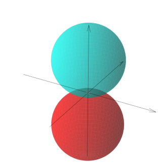
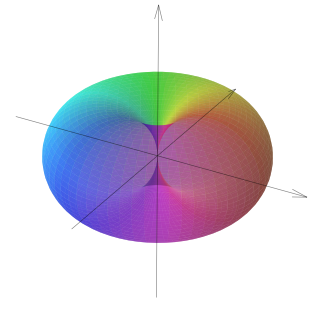
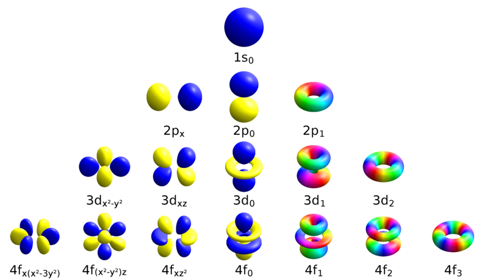
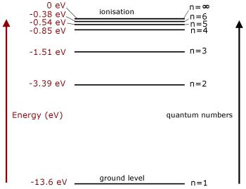

``` {python}
# | echo: False
# | label: harmonics-cell
import matplotlib.pyplot as plt
from matplotlib import cm
import numpy as np
from numpy import linspace, sqrt, exp, sin, cos, pi, abs
from math import factorial
from scipy.special import legendre, sph_harm


def add_axis(ax, xlims, ylims, zlims, alpha):
    # Make a 3D quiver plot
    x, y, z = np.array([[xlims[0], 0, 0], [0, ylims[0], 0], [0, 0, zlims[0]]])
    u, v, w = np.array(
        [
            [xlims[1] - xlims[0], 0, 0],
            [0, ylims[1] - ylims[0], 0],
            [0, 0, zlims[1] - zlims[0]],
        ]
    )
    ax.quiver(x, y, z, u, v, w, arrow_length_ratio=0.05, color="black", alpha=alpha)
    ax.grid(False)
    ax.set_xlabel("X")
    ax.set_ylabel("Y")
    ax.set_zlabel("Z")

    return ax


def spherical_harmonic(l, m, tt, pp):
    """Spherical Harmonics:
    TODO current definition has an issue, I don't see the donut shape appearing.

    Args:
        l (int): Azimuthal quantum number: l >= 0
        m (int): Magnetic quantum number: -l <= m <= l
        tt (ndarray): meshgrid array: theta
        pp (ndarray): meshgrid array: phi

    Returns:
        ndarray: spherical harmonic function (complex) values
    """
    A = np.sqrt((2 * l + 1) / (4 * pi) * factorial(l - m) / factorial(l + m))
    Ylm = A * (-1) ** (m) * legendre(l, m)(cos(tt)) * exp(1j * m * pp)
    return Ylm


# Parameters
plt.rcParams.update({"font.size": 18})
theta = np.linspace(0.0001, 0.9999 * pi, 100)
phi = np.linspace(0.0001, 1.9999 * pi, 100)
[tt, pp] = np.meshgrid(theta, phi)
l_max = 2

fig, axs = plt.subplots(
    l_max + 1, 2 * l_max + 1, figsize=(11, 7), subplot_kw={"projection": "3d"}
)
plt.subplots_adjust(wspace=0.4)

for l in range(l_max + 1):
    for m in range(-l_max, l_max + 1):
        if abs(m) > l:
            ax = axs[l, m + l_max]
            ax.axis(False)

for l in range(l_max + 1):
    for m in range(-l, l + 1):

        if 1 == 1:  # and m == 1:
            u = phi
            v = theta
            # Ylm = spherical_harmonic(l, m, tt, pp)
            if m != 0:
                Ylm = 1 / 2 * sph_harm(m, l, pp, tt, out=None) + m/abs(m) * sph_harm(
                    -m, l, pp, tt, out=None
                )
            else:
                Ylm = sph_harm(m, l, pp, tt, out=None)

            # psi = (-1) ** (m) * Ylm
            psi = Ylm
            psinorm = abs(psi)
            prob = psinorm**2
            phase = np.angle(psi)
            x = psinorm * np.outer(np.cos(u), np.sin(v))
            y = psinorm * np.outer(np.sin(u), np.sin(v))
            z = psinorm * np.outer(np.ones(np.size(u)), np.cos(v))
            colors = cm.hsv((phase + pi) / (2 * pi))
            # Plot the wave function
            ax = axs[l, m + l_max]
            ax_xy = 0.5
            ax_z = 0.5
            ax = add_axis(
                ax,
                xlims=[-ax_xy, ax_xy],
                ylims=[-ax_xy, ax_xy],
                zlims=[-ax_z, ax_z],
                alpha=0.5,
            )
            ax.axis(False)
            ax.plot_surface(
                x,
                y,
                z,
                rstride=1,
                cstride=1,
                facecolors=colors,
                edgecolor=None,
                alpha=0.5,
            )
            # Set an equal aspect ratio
            ax.set_aspect("equal");

plt.show();
q = 1;

```

``` {python}
# | echo: False
# | label: p-orbitals-cell
import matplotlib.pyplot as plt
from matplotlib import cm
import numpy as np
from numpy import linspace, sqrt, exp, sin, cos, pi, abs
from math import factorial
from scipy.special import legendre, sph_harm


def add_axis(ax, xlims, ylims, zlims, alpha):
    # Make a 3D quiver plot
    x, y, z = np.array([[xlims[0], 0, 0], [0, ylims[0], 0], [0, 0, zlims[0]]])
    u, v, w = np.array(
        [
            [xlims[1] - xlims[0], 0, 0],
            [0, ylims[1] - ylims[0], 0],
            [0, 0, zlims[1] - zlims[0]],
        ]
    )
    ax.quiver(x, y, z, u, v, w, arrow_length_ratio=0.05, color="black", alpha=alpha)
    ax.grid(False)
    ax.set_xlabel("X")
    ax.set_ylabel("Y")
    ax.set_zlabel("Z")

    return ax


# Parameters
plt.rcParams.update({"font.size": 18})
theta = np.linspace(0.0001, 0.9999 * pi, 100)
phi = np.linspace(0.0001, 1.9999 * pi, 100)
[tt, pp] = np.meshgrid(theta, phi)
l = 1

fig, axs = plt.subplots(
    2, 3, figsize=(11, 7), subplot_kw={"projection": "3d"}
);
plt.subplots_adjust(wspace=0.4)

for q, basis in enumerate(["donut_basis", "sym_basis"]):
    for m in range(-1, 2):
        u = phi
        v = theta
        if basis == "sym_basis":
            Ylm = 1 / 2 * (sph_harm(m, l, pp, tt, out=None) + (m+0.5)/abs(m+0.5) * sph_harm(
                -m, l, pp, tt, out=None
            ))
        else:
            Ylm = sph_harm(m, l, pp, tt, out=None)

        # psi = (-1) ** (m) * Ylm
        psi = Ylm
        psinorm = abs(psi)
        prob = psinorm**2
        phase = np.angle(psi)
        x = psinorm * np.outer(np.cos(u), np.sin(v))
        y = psinorm * np.outer(np.sin(u), np.sin(v))
        z = psinorm * np.outer(np.ones(np.size(u)), np.cos(v))
        colors = cm.hsv((phase + pi) / (2 * pi))
        # Plot the wave function
        ax = axs[q, m+1]
        ax_xy = 0.5
        ax_z = 0.5
        ax = add_axis(
            ax,
            xlims=[-ax_xy, ax_xy],
            ylims=[-ax_xy, ax_xy],
            zlims=[-ax_z, ax_z],
            alpha=0.5,
        )
        ax.axis(False)
        ax.plot_surface(
            x,
            y,
            z,
            rstride=1,
            cstride=1,
            facecolors=colors,
            edgecolor=None,
            alpha=0.5,
        )
        # Set an equal aspect ratio
        ax.set_aspect("equal")

plt.show();
q = 1

```

``` {python}
# | echo: False
# | label: p-donut-cell
import matplotlib.pyplot as plt
from matplotlib import cm
import numpy as np
from numpy import linspace, sqrt, exp, sin, cos, pi, abs
from math import factorial
from scipy.special import legendre, sph_harm


def add_axis(ax, xlims, ylims, zlims, alpha):
    # Make a 3D quiver plot
    x, y, z = np.array([[xlims[0], 0, 0], [0, ylims[0], 0], [0, 0, zlims[0]]])
    u, v, w = np.array(
        [
            [xlims[1] - xlims[0], 0, 0],
            [0, ylims[1] - ylims[0], 0],
            [0, 0, zlims[1] - zlims[0]],
        ]
    )
    ax.quiver(x, y, z, u, v, w, arrow_length_ratio=0.05, color="black", alpha=alpha)
    ax.grid(False)
    ax.set_xlabel("X")
    ax.set_ylabel("Y")
    ax.set_zlabel("Z")

    return ax


# Parameters
plt.rcParams.update({"font.size": 18})
theta = np.linspace(0.0001, 0.9999 * pi, 100)
phi = np.linspace(0.0001, 1.9999 * pi, 100)
[tt, pp] = np.meshgrid(theta, phi)
l = 1

fig, axs = plt.subplots(
    1, 2, figsize=(11, 7), subplot_kw={"projection": "3d"}
);
plt.subplots_adjust(wspace=0.4)

for m in range(0, 2):
    u = phi
    v = theta
    Ylm = sph_harm(m, l, pp, tt, out=None)

    psi = Ylm
    psinorm = abs(psi)
    prob = psinorm**2
    phase = np.angle(psi)
    x = psinorm * np.outer(np.cos(u), np.sin(v))
    y = psinorm * np.outer(np.sin(u), np.sin(v))
    z = psinorm * np.outer(np.ones(np.size(u)), np.cos(v))
    colors = cm.hsv((phase + pi) / (2 * pi))
    # Plot the wave function
    ax = axs[m]
    ax_xy = 0.5
    ax_z = 0.5
    ax = add_axis(
        ax,
        xlims=[-ax_xy, ax_xy],
        ylims=[-ax_xy, ax_xy],
        zlims=[-ax_z, ax_z],
        alpha=0.5,
    )
    ax.axis(False)
    ax.plot_surface(
        x,
        y,
        z,
        rstride=1,
        cstride=1,
        facecolors=colors,
        edgecolor=None,
        alpha=0.5,
    )
    # Set an equal aspect ratio
    ax.set_aspect("equal")

plt.show();
q = 1

```

``` {python}
# | echo: False
# | label: harmonics-prob-cell
import matplotlib.pyplot as plt
from matplotlib import cm
import numpy as np
from numpy import linspace, sqrt, exp, sin, cos, pi, abs
from math import factorial
from scipy.special import legendre, sph_harm

# Parameters
plt.rcParams.update({"font.size": 18})
theta = np.linspace(0.0001, 0.9999 * pi, 100)
phi = np.linspace(0.0001, 1.9999 * pi, 100)
[tt, pp] = np.meshgrid(theta, phi)
l_max = 2

figprob, axs = plt.subplots(
    l_max + 1, 2 * l_max + 1, figsize=(11, 7), subplot_kw={"projection": "3d"}
)
plt.subplots_adjust(wspace=0.4)

for l in range(l_max + 1):
    for m in range(-l_max, l_max + 1):
        if abs(m) > l:
            ax = axs[l, m + l_max]
            ax.axis(False)

for l in range(l_max + 1):
    for m in range(-l, l + 1):

        if 1 == 1:  # and m == 1:
            u = phi
            v = theta
            # Ylm = spherical_harmonic(l, m, tt, pp)
            if m != 0:
                Ylm = 1 / 2 * sph_harm(m, l, pp, tt, out=None) + m/abs(m) * sph_harm(
                    -m, l, pp, tt, out=None
                )
            else:
                Ylm = sph_harm(m, l, pp, tt, out=None)

            # psi = (-1) ** (m) * Ylm
            psi = Ylm
            psinorm = abs(psi)
            prob = psinorm**2
            phase = np.angle(psi)
            x = psinorm * np.outer(np.cos(u), np.sin(v))
            y = psinorm * np.outer(np.sin(u), np.sin(v))
            z = psinorm * np.outer(np.ones(np.size(u)), np.cos(v))
            colors = cm.hsv((phase + pi) / (2 * pi))

            # Plot the probability
            ax = axs[l, m + l_max]
            ax_xy = 0.25
            ax_z = 0.25
            ax = add_axis(
                ax,
                xlims=[-ax_xy, ax_xy],
                ylims=[-ax_xy, ax_xy],
                zlims=[-ax_z, ax_z],
                alpha=0.5,
            )
            ax.axis(False)
            x = prob * np.outer(np.cos(u), np.sin(v))
            y = prob * np.outer(np.sin(u), np.sin(v))
            z = prob * np.outer(np.ones(np.size(u)), np.cos(v))
            ax.plot_surface(x, y, z, alpha=0.5)
            # Set an equal aspect ratio
            ax.set_aspect("equal")

plt.show()
q = 1

```

``` {python}
# | echo: False
# | label: radial-cell
import matplotlib.pyplot as plt
import numpy as np
from numpy import linspace, sqrt, exp, sin, cos, pi, abs
from math import factorial
from scipy.special import laguerre
from scipy.special import genlaguerre

# Parameters
plt.rcParams.update({"font.size": 18})
vL = 5.0
a0 = 1.0
r_max = 20
r = np.linspace(0.1, r_max, 1000) * a0
n_max = 3

psi = 1
prob = 1

fig, axs = plt.subplots(n_max, n_max, figsize=(11, 5))
plt.subplots_adjust(wspace=0.4)
for n in range(1, n_max + 1):
    s = 2 * r / (n * a0)
    for l in range(n, n_max):
        axs[n - 1, l].axis(False)
    for l in range(n):
        A = np.sqrt(
            factorial(n - l - 1) / (2 * n * factorial(n + l)) * (2 / (n * a0)) ** 2
        )
        Rn = A * s**l * genlaguerre(n - l - 1, 2 * l + 1)(s) * exp(-s / 2)

        ax = axs[n - 1, l]
        ax.spines["top"].set_visible(False)
        ax.spines["right"].set_visible(False)

        if l > 0:
            ax.get_yaxis().set_visible(False)
        if n < n_max:
            ax.get_xaxis().set_visible(False)
            ax.spines["bottom"].set_visible(False)
        else:
            ax.set_xlabel(r"r (in $a_0$)")

        ax.fill_between(
            r,
            Rn,
        )
        ax.plot(r, Rn, color="red")
        ax.set_ylim([-0.1, 1 / 2 / n])

        # ax = axs[n - 1, 1]
        # ax.fill_between(r, abs(Rn) ** 2)
        # ax.set_ylim([-0.01 / n**2, 1 / 8 / n**2])

plt.show()
q = 1
```

``` {python}
# | echo: False
# | label: radial-prob-cell
import matplotlib.pyplot as plt
import numpy as np
from numpy import linspace, sqrt, exp, sin, cos, pi, abs
from math import factorial
from scipy.special import laguerre
from scipy.special import genlaguerre

# Parameters
plt.rcParams.update({"font.size": 18})
vL = 5.0
a0 = 1.0
r_max = 20
r = np.linspace(0.1, r_max, 1000) * a0
n_max = 3

psi = 1
prob = 1

fig, axs = plt.subplots(n_max, n_max, figsize=(11, 5))
plt.subplots_adjust(wspace=0.4)
for n in range(1, n_max + 1):
    s = 2 * r / (n * a0)
    for l in range(n, n_max):
        axs[n - 1, l].axis(False)
    for l in range(n):
        A = np.sqrt(
            factorial(n - l - 1) / (2 * n * factorial(n + l)) * (2 / (n * a0)) ** 2
        )
        Rn = A * s**l * genlaguerre(n - l - 1, 2 * l + 1)(s) * exp(-s / 2)

        ax = axs[n - 1, l]
        ax.spines["top"].set_visible(False)
        ax.spines["right"].set_visible(False)

        if l > 0:
            ax.get_yaxis().set_visible(False)
        if n < n_max:
            ax.get_xaxis().set_visible(False)
            ax.spines["bottom"].set_visible(False)
        else:
            ax.set_xlabel(r"r (in $a_0$)")

        #ax.fill_between(
        #    r,
        #    Rn,
        #)
        #ax.plot(r, Rn, color="red")
        #ax.set_ylim([-0.1, 1 / 2 / n])

        ax.fill_between(r, abs(Rn) ** 2)
        ax.plot(r, abs(Rn) ** 2, color="red")
        ax.set_ylim([-0.01 / n**2, 1 / 8 / n**2])

plt.show()
q = 1
```


```{python}
#| echo: false 
# | label: zeeman-cell
import matplotlib.pyplot as plt
import numpy as np

Ry = 13.6
x1 = np.linspace(2, 3, 2)
x10 = np.linspace(4, 4.8, 2)
x = [x10, x10 + 1, x10+2]
y = np.array([1, 1])
muB = 5.8 * 1e-5
B = 15
Bshift = muB * B

plt.rcParams.update({"font.size": 13})
fig, axs = plt.subplots(1, 2, figsize=(12, 4))
plt.subplots_adjust(wspace=0.4)

ax = axs[0]
xx = 0.8 * x1
xxt = xx[0]
ax.plot(xx, -Ry / 1 ** 2 * y, color="black")
# 2s
ax.plot(xx, -Ry / 2 ** 2 * y, color="black")
# 2p
ax.plot(xx + 2, -Ry / 2 ** 2 * y, color="black")
ax.plot(xx + 3, -Ry / 2 ** 2 * y, color="black")
ax.plot(xx + 4, -Ry / 2 ** 2 * y, color="black")
ax.text(xxt + 2 + 0.1, -Ry / 2 ** 2 + 0.4, "-1")
ax.text(xxt + 3 + 0.2, -Ry / 2 ** 2 + 0.4, "0")
ax.text(xxt + 4 + 0.2, -Ry / 2 ** 2 + 0.4, "1")
# 3s
ax.plot(xx, -Ry / 3 ** 2 * y, color="black")
# 3p
ax.plot(xx + 2, -Ry / 3 ** 2 * y, color="black")
ax.plot(xx + 3, -Ry / 3 ** 2 * y, color="black")
ax.plot(xx + 4, -Ry / 3 ** 2 * y, color="black")
ax.text(xxt + 2 + 0.1, -Ry / 3 ** 2 + 0.4, "-1")
ax.text(xxt + 3 + 0.2, -Ry / 3 ** 2 + 0.4, "0")
ax.text(xxt + 4 + 0.2, -Ry / 3 ** 2 + 0.4, "1")
# 3d
ax.plot(xx + 6, -Ry / 3 ** 2 * y, color="black")
ax.plot(xx + 7, -Ry / 3 ** 2 * y, color="black")
ax.plot(xx + 8, -Ry / 3 ** 2 * y, color="black")
ax.plot(xx + 9, -Ry / 3 ** 2 * y, color="black")
ax.plot(xx + 10, -Ry / 3 ** 2 * y, color="black")
ax.text(xxt + 6 + 0.1, -Ry / 3 ** 2 + 0.4, "-2")
ax.text(xxt + 7 + 0.1, -Ry / 3 ** 2 + 0.4, "-1")
ax.text(xxt + 8 + 0.2, -Ry / 3 ** 2 + 0.4, "0")
ax.text(xxt + 9 + 0.2, -Ry / 3 ** 2 + 0.4, "1")
ax.text(xxt + 10 + 0.2, -Ry / 3 ** 2 + 0.4, "2")
ax.get_xaxis().set_visible(False)
ax.set_ylim([-Ry - 1, 1])
ax.set_ylabel("E (in eV)")

ax = axs[1]
n = 2
ax.plot(x1, -Ry / n ** 2 * y, color="black")
ax.text(np.average(x1) - 0.7, -Ry / n ** 2 + 0.1*Bshift, r"$\uparrow\downarrow$, m = 0", color="black")
for j, m in enumerate(range(-n+1, n)):
    ax.plot(x[j], -Ry / n ** 2 * y + Bshift*(m+1), color="blue")
    ax.text(np.average(x[j]) - 0.7, -Ry / n ** 2 + Bshift*(m+1) + 0.1*Bshift, r"$\downarrow$, m = " + str(m), color="blue")
    ax.plot(x[j], -Ry / n ** 2 * y + Bshift*(m-1), color="red")
    ax.text(np.average(x[j]) - 0.7, -Ry / n ** 2 + Bshift*(m-1) + 0.1*Bshift, r"$\uparrow$, m = " + str(m), color="red")
ax.set_ylim(-Ry / n ** 2 + 2.5*Bshift * np.array([-1,1]))
ax.get_xaxis().set_visible(False)
ax.set_ylabel("E (in eV)")

plt.show()

```


# Towards spherical symmetric systems

## Diatomic molecule: Hamiltonian

- Two atoms with rigid bond (approximation, ignore stretching)
- Center of mass:

$$
\vec{R} = \frac{m_1 \vec{r_1} + m_2 \vec{r}_2}{m_1 + m_2}, \qquad \vec{r} = \vec{r}_2 - \vec{r}_1, \qquad M = 
m_1 + m_2, \qquad \mu = \frac{m_1 m_2}{m_1 + m_2}
$$

- Hamiltonian contains linear momentum: center of mass moving
- and *internal* angular momentum with inertia $I = \mu r^2$ 

$$
\hat{H} = \frac{\hat{P}^2}{2M} + \frac{\hat{L}^2}{2I}
$$

## Diatomic molecule: Eigenenergies

$$
\hat{H} = \frac{\hat{P}^2}{2M} + \frac{\hat{L}^2}{2I}
$$

- Center of mass $\vec{R}$, and orientation $\vec{r}$ are **independent**
- Separation of variables: $\quad\psi(\vec{R}, \vec{r}) = e^{i\vec{K}\cdot\vec{R}} \, Y(\theta, \phi)$
- Eigenenergies:

$$
E_{\vec{K}, l} = \frac{\hbar K^2}{2m} + \frac{\hbar^2 l(l+1)}{2I}.
$$

- (2l + 1) Degeneracy in magnetic quantum number $m \equiv m_s$


# Angular momentum

## Angular momentum: commutators

- Definition of angular momentum $\hat{L} = \hat{r} \times \hat{p}$
- position/momentum commutator relations in 3D: $[\hat{p}_i, r_j] = -i\hbar \delta_{ij}$

$$
[\hat{L}_x, \hat{L}_y] = i\hbar \hat{L}_z, \qquad 
[\hat{L}_y, \hat{L}_z] = i\hbar \hat{L}_x, \qquad 
[\hat{L}_z, \hat{L}_x] = i\hbar \hat{L}_y, \qquad 
$$

- Traditionally written using the Levi-Civita symbol $\epsilon_{ijk}$:
  - $\epsilon_{ijk} = -1$ for odd permutations $(1,2,3)$ = $132$, $213$, $321$ 
  - $\epsilon_{ijk} = 1$ for even permutations $(1,2,3)$ = $123$, $312$, $231$ 
  - $\epsilon_{ijk} = 0$ for any same indices appearing $(1,2,3)$ = $223$, $311$, $333$, etc. 

$$
[\hat{L}_i, \hat{L}_j] = i\hbar \sum_k \epsilon_{ijk} \hat{L}_k
$$

## Angular momentum: eigenvalues

- $\hat{\bf L} = (\hat{L_x}, \hat{L_y}, \hat{L_z})$ is a vector with a **magnitude** $\|\hat{L}\|$ and **direction**,
- $\hat{L_x}$, $\hat{L_y}$, $\hat{L_z}$ don't commute: no common eigenstate basis,
- Magnitude (squared) of the momentum is $\hat{\bf L}^2$
- Magnitude does commute with each vector component\
$\longrightarrow$ Use eigenstates basis ($| a, b \rangle$) of $\hat{\bf L}^2$ and one component $\hat{L_z}$. 

$$
\hat{\bf L}^2 | a,b \rangle = a | a,b \rangle \, \qquad \hat{L_z} | a,b \rangle = b | a,b \rangle 
$$

## Algebraic solution: ladder operators

$$
\hat{\bf L}^2\, | a,\,b \rangle = a\, | a,\,b \rangle \, \qquad \hat{L_z}\, | a,\,b \rangle = b\, | a,\,b \rangle 
$$

- Define ladder operators $\quad \hat{L_\pm} = \hat{L}_x \pm i\hat{L}_y$
- Is $\hat{L_\pm} | a,\,b \rangle$ an eigenstate?
- Yes, since $[\hat{\bf L}^2, \hat{L}_i] = 0$:

$$
\hat{\bf L}^2 \left(\hat{L}_\pm \, | a,\,b \rangle \right) = \hat{L}_\pm \hat{\bf L}^2 \, | a,\,b \rangle = a \left(\hat{L}_\pm \, | a,\,b \rangle \right)
$$

- So $\hat{L}_\pm \, | a,\,b \rangle$ is eigenstate of $\hat{\bf L}^2$ (or the zero state) with eigenvalue $a$.
- What about $\hat{L}_z$?

## Algebraic solution: ladder operators

- The ladder operators $\hat{L}_\pm$ do not commute with $\hat{L}_z$:

$$
[\hat{L}_z, \hat{L}_\pm] = \pm \hbar \hat{L}_\pm
$$

- We use this relation to extract the impact on the eigenstates 

$$
\hat{L}_z \hat{L}_\pm \, | a,\,b \rangle  
= \hat{L}_\pm \hat{L}_z \, | a,\,b \rangle
+ [\hat{L}_z \hat{L}_\pm] \, | a,\,b \rangle
= (b \pm \hbar) \hat{L}_\pm \, | a,\,b \rangle
$$

- So $\hat{L}_\pm \, | a,\,b \rangle$ is eigenstate of $\hat{L}_z$ (or the zero state) with eigenvalue $b \pm \hbar$:

$$
\hat{L}_\pm \, | a,\,b \rangle  
= C_\pm(a,b) | a,\,b \pm \hbar \rangle
$$

With $C_\pm(a,b)$ a normalization factor (*still unknown*)

## Eigenvalue ranges

- Procedure is similar to the one for finding the zeroth eigenstate of the harmonic oscillator. An upper/lower bound leads to *discrete ladder*
- We use $\langle a, b | a, b \rangle = 1$ and express that the norm 

$$
\|\hat{L}_\pm | a, b \rangle\|^2 = \langle a, b | \hat{L}^\dagger_\pm \hat{L}_\pm | a, b \rangle \geq 0
$$

We can rewrite $\hat{L}^\dagger_\pm \hat{L}_\pm = \hat{L}_\mp \hat{L}_\pm$ as:

$$
\hat{L}_\mp \hat{L}_\pm = (\hat{L}_x \mp i\hat{L}_y)(\hat{L}_x \pm i\hat{L}_y) = \hat{L}^2_x + \hat{L}^2_y \pm i[\hat{L}_x, \hat{L}_y] = \hat{\bf L}^2 - \hat{L}_z^2 \mp \hbar \hat{L}_z
$$

This lead to a relation between the eigenvalues 

$$
\langle a, b | \hat{L}^\dagger_\pm \hat{L}_\pm | a, b \rangle = \langle a, b | \hat{\bf L}^2 - \hat{L}_z^2 \mp \hbar \hat{L}_z | a, b \rangle = (a - b^2 \mp \hbar b) \langle a, b | a, b \rangle \geq 0
$$

We will use $a \geq 0$ and $b \in \Re$ to find $b$ and $a$ values

## Eigenvalue range: m 

- $a \geq 0$ and $b \in \Re$ 
- Smallest eigenvalue $a = 0$ gives limits on $b$:

$$
\begin{aligned}
\langle a, b_\textrm{max} | \hat{L}^\dagger_+ \hat{L}_+ | a, b_\textrm{max} \rangle &= a - b_\textrm{max}^2 - \hbar b_\textrm{max} = 0\\
\langle a, b_\textrm{min} | \hat{L}^\dagger_- \hat{L}_- | a, b_\textrm{min} \rangle &= a - b_\textrm{min}^2 + \hbar b_\textrm{min} = 0
\end{aligned}
$$

This both determines $a$:

$$
\begin{aligned}
a &= b_\textrm{max}^2 + \hbar b_\textrm{max}\\
a &= b_\textrm{min}^2 - \hbar b_\textrm{min}
\end{aligned}
$$

- Resulting in $b_\textrm{min} = - b_\textrm{max}$

- For any $a$: starting from $| a, b_\textrm{min}\rangle$ and move up the ladder with $\hat{L}_+$ until $| a, b_\textrm{max} \rangle$:

$$
b_\textrm{min}, \quad b_\textrm{min} + \hbar, \quad b_\textrm{min} + 2\hbar, \quad\dots\quad, \quad b_\textrm{min} + n\hbar = b_\textrm{max}
$$

## Eigenvalue range: l and m 

- Since also $b_\textrm{max} = - b_\textrm{min}$, the eigenvalue range $-(n - 1)\hbar/2, \dots , (n - 1)\hbar/2$ or $-n\hbar/2, \dots, n\hbar/2$
- Eigenvalues of $\hat{L}_z$ are $b = m\hbar$ with $m_\textrm{max} = -m_\textrm{min} = l$ 
- Eigenvalues $a$ of $\hat{\bf L}^2$ are given by 

$$
a = m_\textrm{max}\hbar (m_\textrm{max}\hbar + \hbar) = l(l+1)\hbar^2
$$

- In summary:

$$
\boxed{\hat{\bf L}^2|l, m\rangle = l(l+1)\hbar^2|l, m\rangle} \qquad \qquad \boxed{\hat{L}_z |l, m\rangle = m \hbar|l, m\rangle}
$$

- $l$ and $m$ either even integer or odd half-integers with integer steps

## Normalization

$$
\boxed{\hat{\bf L}^2|l, m\rangle = l(l+1)\hbar^2|l, m\rangle,  \qquad \qquad \hat{L}_z |l, m\rangle = m \hbar|l, m\rangle}
$$

Using the previous definition of the ladder operator

$$
\begin{aligned}
1 = \langle l, m | \hat{L}^\dagger_\pm \hat{L}_\pm | l, m \rangle &= \langle l, m | \hat{\bf L}^2 - \hat{L}_z^2 \pm \hbar \hat{L}_z | l, m \rangle\\
\end{aligned}
$$

Taking the square root of the norm results in:

$$
\boxed{\begin{aligned}
\hat{L}_+ | l, m \rangle &= \sqrt{l(l+1) - m(m+1)} \hbar | l, m+1 \rangle\\
\hat{L}_- | l, m \rangle &= \sqrt{l(l+1) - m(m-1)} \hbar | l, m-1 \rangle\\
\end{aligned}}
$$

## Corresponding eigenfunctions

- Constructing the eigenstate functions: Spherical harmonics $\quad Y_{lm}(\theta, \phi) = \langle \theta, \phi| l, m \rangle$

**Expressing** the operators: $\hat{\bf L}^2$, $\hat{L}_z$, and $\hat{L}_\pm$ with $\hat{\bf L} = {\bf r} \times \hat{\bf p} = -i\hbar{\bf r} \times \nabla$

The gradient $\nabla$ in spherical coordinates:

$$
\nabla = \vec{e}_r\frac{\partial}{\partial r} + \vec{e}_\theta\frac{1}{r}\frac{\partial}{\partial \theta} + \vec{e}_\phi\frac{1}{r \sin\theta} \frac{\partial}{\partial \phi}
$$

$$
\Longrightarrow\boxed{\begin{aligned}
\hat{L}_z & = - i \hbar \frac{\partial}{\partial\phi}, \quad \hat{L}_\pm = \hbar e^{\pm i\phi} \left[\pm \frac{\partial}{\partial \theta} + i \cot \theta \frac{\partial}{\partial \phi}\right]\\
&\\
\hat{\bf L}^2 &= -\hbar^2 \left[ \frac{1}{\sin\theta} \frac{\partial \sin \theta \frac{\partial}{\partial \theta}}{\partial \theta} + \frac{1}{\sin^2\theta} \frac{\partial^2}{\partial \phi^2}\right]
\end{aligned}}
$$

## The $\phi$ - component

$$
\boxed{\begin{aligned}
\hat{L}_z & = - i \hbar \frac{\partial}{\partial\phi}, \quad \hat{L}_\pm = \hbar e^{\pm i\phi} \left[\pm \frac{\partial}{\partial \theta} + i \cot \theta \frac{\partial}{\partial \phi}\right]\\
\end{aligned}}
$$

- Apply $\hat{L}_z$ to proposed solution $Y_{lm}(\theta, \phi)$

$$
\begin{aligned}
\hat{L}_z Y_{lm}(\theta, \phi) = - i \hbar \frac{\partial}{\partial\phi}Y_{lm}(\theta, \phi) = m\hbar Y_{lm}(\theta, \phi)
\end{aligned}
$$

Separation of the variables:

$$
Y_{lm}(\theta, \phi) = F(\theta) \, e^{im\phi}, \quad \textrm{with} -l \leq m \leq l
$$

- If $l$ is an integer, the requirement $e^{im\phi} = e^{im(\phi + 2\pi)}$ is satisfied

## The $\theta$ - component

$$
\boxed{\begin{aligned}
\hat{L}_z & = - i \hbar \frac{\partial}{\partial\phi}, \quad \hat{L}_\pm = \hbar e^{\pm i\phi} \left[\pm \frac{\partial}{\partial \theta} + i \cot \theta \frac{\partial}{\partial \phi}\right]\\
\end{aligned}}
$$

- Apply $\hat{L}_\pm$ to proposed solution $F(\theta)$
- Use the fact that $m_\textrm{max}$ is $\,l$: $\,\,\hat{L}_+ | l, l \rangle = 0$:

$$
\begin{aligned}
0 = \langle \theta, \phi | \hat{L}_+ | l,l\rangle &= \hbar e^{i\phi} \left[\frac{\partial}{\partial \theta} + i \cot \theta \frac{\partial}{\partial \phi}\right] e^{il\phi} F(\theta)\\
& = \hbar e^{i(l+1)\phi} \left[\frac{\partial}{\partial \theta} - l \cot \theta\right] F(\theta)\\
\end{aligned}
$$

$$
\Rightarrow \frac{\partial }{\partial \theta}F(\theta) = l \cot \theta F(\theta)\quad \Rightarrow \quad F(\theta) = C \sin^l(\theta)
$$

## Spherical Harmonics

The lower states with $m < l$ are generated by applying $\hat{L}_-$


$$
\begin{aligned}
Y_{lm}(\theta, \phi) = C  \hat{L}_-^{(l-m)} \left[\sin^l \theta e^{il\phi}\right]  = C \left[\frac{\partial}{\partial \theta} + i \cot \theta \frac{\partial}{\partial \phi}\right] \left[\sin^l \theta e^{il\phi}\right]
\end{aligned}
$$

The solutions are the spherical harmonics:

$$
\begin{aligned}
Y_{lm}(\theta, \phi) = (-1)^{m+|m|} \left[ \frac{2l + 1}{4\pi} \,\frac{(l - |m|)!}{(l + |m|)!} \right]^{1/2} P^{|m|}_l(\cos\theta) e^{im\phi}
\end{aligned}
$$

with the **associated Legendre polynomials**

$$
P^{m}_l(x) = \frac{(1-x^2)^m/2}{2^l l!} \frac{d^{m+l}}{dx^{m+l}}(x^2 - 1)^l
$$

## Summary angular momentum

Common basis of eigenstates of angular momentum:

$$
\boxed{\hat{\bf L}^2|l, m\rangle = l(l+1)\hbar^2|l, m\rangle} \qquad \qquad \boxed{\hat{L}_z |l, m\rangle = m \hbar|l, m\rangle}
$$

- $l$ and $m = -l, \dots, -1, 0, 1,\dots, l$ integers to get single-valued $Y(\theta, \phi) = \Theta(\theta)\Phi(\phi) = \Theta(\theta) e^{im\phi}$
- The solutions are the spherical harmonics $Y(\theta, \phi)$:

$$
\begin{aligned}
Y_{lm}(\theta, \phi) = (-1)^{m+|m|} \left[ \frac{2l + 1}{4\pi} \,\frac{(l - |m|)!}{(l + |m|)!} \right]^{1/2} P^{|m|}_l(\cos\theta) e^{im\phi}
\end{aligned}
$$

with the **associated Legendre polynomials**

$$
P^{m}_l(x) = \frac{(1-x^2)^m/2}{2^l l!} \frac{d^{m+l}}{dx^{m+l}}(x^2 - 1)^l
$$

## Summary angular momentum

$$
\begin{aligned}
Y_{lm}(\theta, \phi) = (-1)^{m+|m|} \left[ \frac{2l + 1}{4\pi} \,\frac{(l - |m|)!}{(l + |m|)!} \right]^{1/2} P^{|m|}_l(\cos\theta) e^{im\phi}
\end{aligned}
$$

$$
P^{m}_l(x) = \frac{(1-x^2)^m/2}{2^l l!} \frac{d^{m+l}}{dx^{m+l}}(x^2 - 1)^l
$$

\

Lower order $P^{m}_l(z)$ polynomials:

| $l$ | $m=-2$ | $m=-1$ | $m=0$ | $m=1$ | $m=2$ |
|:---:|:-----:|:-----:|:-----:|:-----:|:-----:|
| 0 |  |  | $1$ |  |  |
| 1 |  | $-\frac{1}{2}(1-x^2)^{1/2}$ | $x$ | $(1-x^2)^{1/2}$ |  |
| 2 | $\frac{1}{8}(1 - x^2)$ | $-\frac{1}{2}x(1 - x^2)^{1/2}$ | $\frac{1}{2}(3x^2 - 1)$ | $3x(1 - x^2)^{1/2}$ | $3(1 - x^2)$ |


## Lower order eigenfunctions

$$
\begin{aligned}
Y_{lm}(\theta, \phi) = (-1)^{m+|m|} \left[ \frac{2l + 1}{4\pi} \,\frac{(l - |m|)!}{(l + |m|)!} \right]^{1/2} P^{|m|}_l(\cos\theta) e^{im\phi}
\end{aligned}
$$

Angular momentum eigenfunction in spherical and carthesian coordinates 

$$
\begin{aligned}
Y_{l,m} & \qquad Y_{l,m}(\theta, \phi) & Y_{l,m}(x, y, z) \\
Y_{0,0} & \qquad \frac{1}{\sqrt{4\pi}} \qquad & \frac{1}{\sqrt{4\pi}}\\
& & \\
Y_{1,-1}  & \qquad \sqrt{\frac{3}{8\pi}}\, \sin\theta \, e^{-i\phi} & \sqrt{\frac{3}{8\pi}}\,\frac{x - iy}{r}\\
Y_{1,0} & \qquad \frac{1}{\sqrt{4\pi}}\, \cos\theta \qquad & \frac{1}{\sqrt{4\pi}}\frac{z}{r}\\
Y_{1,1}  & \qquad \sqrt{\frac{3}{8\pi}}\, \sin\theta \, e^{i\phi} & -\sqrt{\frac{3}{8\pi}}\,\frac{x + iy}{r}\\
\end{aligned}
$$


## Visual representation



- The $l = 1$ and $\,\,m = \pm 1$ eigenstates have a torus (donut) shape
- Specific basis connected to z-axis via $\hat{L}_z$, 
- Other choices $\hat{L}_x$ or $\hat{L}_y$ possible, correspond to other bases
- The magnetic quantum numbers $\,m_l\,$ are eigenvalues of $\hat{L}_z$


## Spherical Harmonics: real basis

- Rotating the basis using spherical symmetry
- Superposition of eigenstates ($\hat{L}_z$), start from the solutions:

$$
\begin{aligned}
Y_{lm}(\theta, \phi) = (-1)^{m+|m|} \left[ \frac{2l + 1}{4\pi} \,\frac{(l - |m|)!}{(l + |m|)!} \right]^{1/2} P^{|m|}_l(\cos\theta) e^{im\phi}
\end{aligned}
$$

Use the identities $\,\,\cos(m\phi) = \frac{e^{im\phi} + e^{-im\phi}}{2}\,\,$ and $\,\,\sin(m\phi) = \frac{e^{im\phi} - e^{-im\phi}}{2i}\,$:

$$
\left\{
\begin{aligned}
Y_x(\theta, \phi) &= \Re\{Y_{lm}\} = (-1)^{m+|m|} \left[ \frac{2l + 1}{4\pi} \,\frac{(l - |m|)!}{(l + |m|)!} \right]^{1/2} P^{|m|}_l(\cos\theta)\, \cos(m\phi)\\
Y_y(\theta, \phi) &= \Im\{Y_{lm}\} = (-1)^{m+|m|} \left[ \frac{2l + 1}{4\pi} \,\frac{(l - |m|)!}{(l + |m|)!} \right]^{1/2} P^{|m|}_l(\cos\theta)\, \sin(m\phi)
\end{aligned}
\right.
$$

## Spherical Harmonics: real basis

- Rotating the basis using spherical symmetry
- Superposition of eigenstates ($\hat{L}_z$), start from the solutions
- For $l = 1$ the carthesian formula shows this very clear:

$$
\begin{aligned}
Y_{l,m} & \qquad Y_{l,m}(\theta, \phi) & Y_{l,m}(x, y, z) \\
Y_{0,0} & \qquad \frac{1}{\sqrt{4\pi}} \qquad & \frac{1}{\sqrt{4\pi}}\\
& & \\
Y_{1,-1}  & \qquad \sqrt{\frac{3}{8\pi}}\, \sin\theta \, e^{-i\phi} & \sqrt{\frac{3}{8\pi}}\,\frac{x - iy}{r}\\
Y_{1,0} & \qquad \frac{1}{\sqrt{4\pi}}\, \cos\theta \qquad & \frac{1}{\sqrt{4\pi}}\frac{z}{r}\\
Y_{1,1}  & \qquad \sqrt{\frac{3}{8\pi}}\, \sin\theta \, e^{i\phi} & -\sqrt{\frac{3}{8\pi}}\,\frac{x + iy}{r}\\
\end{aligned}
$$


## Different basis for Y

- Different eigenstate basis: **Symmetric dumbells** vs. **donuts in xy-plane**
- Superposition of a $Y_x$ and a $Y_y$ (p-orbitals) gives a torus(donut) and vice versa.




## Spherical Harmonics wave function

- Appropriate real-valued orthonormal basis, superposition of orbitals



## Spherical Harmonics Probability

- Appropriate real-valued orthonormal basis, superposition of orbitals



## Superposition

- Electrons can be in a superposition of orbital states.
- We used a specific basis, other bases are possible
- The electron magnetic quantum number $m_l$ is an eigenvalue of the *donut* basis of eigenstates



## Evolution in time

- Phase factor $\,\,e^{i m \phi + i E_{nl} t/\hbar}$ over time
    - $Y_{10}$ ($p_0$-orbital): Phase changes in time, phase difference of $\pi$
    - $Y_{11}$ ($p_1$-orbital): Phase rotates

:::: {.columns}

::: {.column}



:::

::: {.column}



:::

::::


# Hamiltonians of 3D systems

## Diatomic molecule: Hamiltonian

- Two atoms with rigid bond (approximation, ignore stretching)
- Center of mass:

$$
\vec{R} = \frac{m_1 \vec{r_1} + m_2 \vec{r}_2}{m_1 + m_2}, \qquad \vec{r} = \vec{r}_2 - \vec{r}_1, \qquad M = 
m_1 + m_2, \qquad \mu = \frac{m_1 m_2}{m_1 + m_2}
$$

- Hamiltonian contains linear momentum: center of mass moving
- and *internal* angular momentum with inertia $I = \mu r^2$ 

$$
\hat{H} = \frac{\hat{P}^2}{2M} + \frac{\hat{L}^2}{2I}
$$

## Diatomic molecule: Eigenenergies

$$
\hat{H} = \frac{\hat{P}^2}{2M} + \frac{\hat{L}^2}{2I}
$$

- Center of mass $\vec{R}$, and orientation $\vec{r}$ are **independent**
- Separation of variables: $\quad\psi(\vec{R}, \vec{r}) = e^{i\vec{K}\cdot\vec{R}} \, Y(\theta, \phi)$
- Eigenenergies:

$$
E_{\vec{K}, l} = \frac{\hbar K^2}{2m} + \frac{\hbar^2 l(l+1)}{2I}.
$$

- (2l + 1) Degeneracy in magnetic quantum number $m \equiv m_s$


## Central potential: Hamiltonian

$$
\hat{H} = \frac{\hat{p}^2}{2m} + V(r)
$$

- Central potential $\longrightarrow$ go to spherical coordinates
- We need $\hat{p}^2 = -\hbar^2 \nabla^2$ in spherical coordinates with:

$$
\nabla = \vec{e}_r\frac{\partial}{\partial r} + \vec{e}_\theta\frac{1}{r}\frac{\partial}{\partial \theta} + \vec{e}_\phi\frac{1}{r \sin\theta} \frac{\partial}{\partial \phi}
$$

$$
\nabla^2 = \frac{1}{r^2}\frac{\partial}{\partial r} r^2 \frac{\partial}{\partial r} + \frac{1}{r^2} \left[\frac{1}{\sin\theta}\frac{\partial}{\partial \theta}\left(\sin\theta \frac{\partial}{\partial \theta}\right) + \frac{1}{\sin^2\theta} \frac{\partial^2}{\partial \phi^2}\right]
$$

$$
\nabla^2 = \frac{1}{r^2}\frac{\partial}{\partial r} r^2 \frac{\partial}{\partial r} - \frac{\hat{L}^2}{r^2\hbar^2}
$$

## Central potential: Hamiltonian

$$
\hat{H} = \frac{\hat{p}^2}{2m} + V(r)
$$

- Central potential $\longrightarrow$ go to spherical coordinates
- We need $\hat{p}^2 = -\hbar^2 \nabla^2$ in spherical coordinates with:

$$
\boxed{\quad\hat{H} = \left[-\frac{\hbar^2}{2m} \left(\frac{\partial^2}{\partial r^2} + \frac{2}{r}\frac{\partial}{\partial r}\right) + \frac{\hat{L}^2}{2m r^2} + V(r)\right] \psi(\vec{r}) = E \psi(\vec{r})\quad}
$$


## Central potential: solutions

$$
\boxed{\left[-\frac{\hbar^2}{2m} \left(\frac{\partial^2}{\partial r^2} + \frac{2}{r}\frac{\partial}{\partial r}\right) + \frac{\hat{L}^2}{2m r^2} + V(r)\right] \psi(\vec{r}) = E \psi(\vec{r})\quad}
$$

Separation of variables $\psi(\vec{r}) = R(r) Y(\theta, \phi)$

$$
\left[-\frac{\hbar^2}{2m} \left(\frac{\partial^2}{\partial r^2} + \frac{2}{r}\frac{\partial}{\partial r}\right) + \frac{\hat{L}^2}{2m r^2} + V(r)\right] R(r) Y(\theta, \phi) = E R(r) Y(\theta, \phi)
$$

$$
\Longrightarrow \quad \left[-\frac{\hbar^2}{2m} \left(\frac{\partial^2}{\partial r^2} + \frac{2}{r}\frac{\partial}{\partial r}\right) + \frac{l(l+1)\hbar^2}{2m r^2} + V(r)\right] R(r) = E R(r)
$$

Simplifying by substituting $R(r) = \chi(r)/r$ and defining a new effective potential $V_e(r)$:

$$
\left[-\frac{\hbar^2}{2m} \frac{\partial^2}{\partial r^2} + V_{e}(r)\right] \chi(r) = E\chi(r) \quad\textrm{ with}\quad V_e(r) = \frac{l(l+1)\hbar^2}{2m r^2} + V(r)
$$

## Boundary conditions

$$
\left[-\frac{\hbar^2}{2m} \frac{\partial^2}{\partial r^2} + V_{e}(r)\right] \chi(r) = E\chi(r) \quad\textrm{ with}\quad V_e(r) = \frac{l(l+1)\hbar^2}{2m r^2} + V(r)
$$

- To find $\psi(\vec{r}) = \chi(r)/r Y(\theta, \phi)$ we need to find $\chi(r)$
- Because $R(r) = \chi(r)/r$ we require $\chi(0) = 0$
- Normalization

$$
\int_\Omega |\psi(\vec{r})|^2 d\vec{r} = \int_0^\infty |R(r)|^2 r^2 dr = \int_0^\infty |\chi(r)|^2 dr = 1
$$

A valid bound state requires $\chi(r)$ to decrease *fast enough*: $\quad\lim_{r\longrightarrow\infty}\chi(r) \le \frac{1}{\sqrt{r}}$

\

For a solution we need to know the potential $V(r)$

# Hydrogen atom

## The Hydrogen atom: Hamiltonian

- Hamiltonian for two particles, electron and proton
- Electron and proton interact via Coulomb potential

$$
\hat{H} = -\frac{\hbar^2}{2m_e}\nabla_e^2 -\frac{\hbar^2}{2m_p}\nabla_p^2 + V(|\vec{r}_e - \vec{r}_p|),  \quad\textrm{ with}\quad V(r) = -\frac{e^2}{4\pi \varepsilon_0 |\vec{r}_e - \vec{r}_p|}.
$$

- Schrodinger equation with $\psi(\vec{r}_e, \vec{r}_p)$ having 6 degrees of freedom:

$$
\left[-\frac{\hbar^2}{2m_e}\nabla_e^2 -\frac{\hbar^2}{2m_p}\nabla_p^2 + V(|\vec{r}_e - \vec{r}_p|)\right] \psi(\vec{r}_e, \vec{r}_p)= \psi(\vec{r}_e, \vec{r}_p).
$$

- Go over to relative coordinates and center of mass

## Hydrogen atom: Relative coordinates

- Two particles, electron and proton, use center of mass $\vec{R}$ and relative coordinates:

$$
\vec{R} = \frac{m_e \vec{r_e} + m_p \vec{r}_p}{m_e + m_p}, \qquad \vec{r} = \vec{r}_e - \vec{r}_p, \qquad M = m_e + m_p, \qquad \mu = \frac{m_e m_p}{m_e + m_p}
$$

- The Schrodinger equation becomes:

$$
\left[-\frac{\hbar^2}{2M} \nabla_R^2 - \frac{\hbar^2}{2\mu} \nabla_r^2 + V(r)\right] \psi(\vec{R}, \vec{r}) = E \psi(\vec{R}, \vec{r})
$$

- Separation of variable $-\frac{\hbar^2}{2M} \nabla_R^2$ leads to a factor $e^{i\vec{K}\cdot\vec{R}}$ with $E_R = \frac{K^2\hbar^2}{2M}$

$$
\left[- \frac{\hbar^2}{2\mu} \nabla^2 + V(r)\right] \psi(\vec{R}, \vec{r}) = E \psi(\vec{R}, \vec{r})
$$

## Hydrogen atom: TISE

$$
\left[- \frac{\hbar^2}{2\mu} \nabla^2 + V(r)\right] \psi(\vec{R}, \vec{r}) = E \psi(\vec{R}, \vec{r})
$$

**Similar**: Separation of variables $\psi(\vec{r}) = R(r) Y(\theta, \phi)$ and using $Y_{lm}(\theta, \phi)$ as solutions for the angular part:

$$
\left[-\frac{\hbar^2}{2\mu} \left(\frac{\partial^2}{\partial r^2} + \frac{2}{r}\frac{\partial}{\partial r}\right) + \frac{\hat{L}^2}{2\mu r^2} + V(r)\right] R(r) Y(\theta, \phi) = E R(r) Y(\theta, \phi)
$$

$$
\Longrightarrow \quad \left[-\frac{\hbar^2}{2\mu} \left(\frac{d^2}{d r^2} + \frac{2}{r}\frac{d}{d r}\right) + \frac{l(l+1)\hbar^2}{2\mu r^2} + V(r)\right] R(r) = E R(r)
$$

Simplifying by substituting $R(r) = \chi(r)/r$ and defining a new effective potential $V_e(r)$:

$$
\left[-\frac{\hbar^2}{2\mu} \frac{d^2}{d r^2} + V_{e}(r)\right] \chi(r) = E\chi(r) \quad\textrm{ with}\quad V_e(r) = \frac{l(l+1)\hbar^2}{2\mu r^2} + V(r)
$$


## Solution radial equation

$$
\left[-\frac{\hbar^2}{2\mu} \frac{d^2}{d r^2} + V_{e}(r)\right] \chi(r) = E\chi(r) \quad\textrm{ with}\quad V_e(r) = \frac{l(l+1)\hbar^2}{2\mu r^2} + V(r)
$$

Define energy $\,\,E = -\frac{\mathrm{Ry}}{n^2}\,$ with $\,n \in \mathbb{R}\,$ and radial coordinate $\,\,s = \frac{2\,r}{n\,a_0}\,$, where:

- **Bohr radius**: *radius of Hydrogen atom*: $\,\,a_0 = \frac{4\pi\varepsilon_0\hbar^2}{e^2\mu} = 0.529\, \overset{\lower.5em\circ}{\mathrm{A}}$
- **Rydberg energy**: $\mathrm{Ry} = \frac{\hbar^2}{2\mu a_0^2} = \frac{\mu}{2}\left(\frac{e^2}{4\pi\varepsilon_0\hbar}\right)^2 = 13.6$ eV

This simplifies the radial equation:

$$
\Longrightarrow \quad \frac{d^2 \chi(s)}{d s^2} - \left[\frac{l(l+1)}{s^2} - \frac{n}{s} + \frac{1}{4}\right] \chi(s) = 0
$$

## Solution radial equation CTU'd

$$
\Longrightarrow \quad \frac{d^2 \chi(s)}{d s^2} - \left[\frac{l(l+1)}{s^2} - \frac{n}{s} + \frac{1}{4}\right] \chi(s) = 0
$$

- Propose a solution $\chi(s) \propto \exp(-s/2)$ to remove the $\frac{1}{4}$ (and decaying)
- To remove the $\frac{l(l+1)}{s^2}$ term we further require $\chi(s) \propto s^{l+1}$
- We obtain proposed solution of the form (with $\,f(s)\,$ *unknown*):

$$
\chi(s) = f(s) s^{l+1} \exp(-s/2)
$$

- Substitution leads to a differential equation for $f(s)$:

$$
\quad s \, \frac{d^2 f(s)}{d s^2} - [s - 2\,(l+1)] \frac{d f(s)}{d s} + [n - (l+1)]\, f(s) = 0
$$

## Solution radial equation CTU'd

$$
\quad s \, \frac{d^2 f(s)}{d s^2} - [s - 2\,(l+1)] \frac{d f(s)}{d s} + [n - (l+1)]\, f(s) = 0
$$

- Solve by expanding $f(s)$ as a power series $f(s) = \sum_{j=0}^\infty a_j s^j$
- Solution demands that the power series is finite: 
    - $n$ must be an integer, and
    - $n > l+1$
- $f(s)$ is then given by the **associated Laguerre polynomials**:

$$
L^{2l+1}_{n-l-1} = \sum_{q=0}^{n-l-1}(-1)^q \frac{(n+l)!}{(n-l-1-q)!\,(2l+1+q)!} \, s^q
$$


## Solutions

Total solutions together with the associated Laguerre polynomials

$$
\chi(s) = s^{l+1} L_{n-l-1}^{2l+1}(s) e^{-s/2}, \qquad s = \frac{2r}{na_0}
$$

Normalization factor for $R(r) = \chi(s)/r$:

$$
1 = \int^\infty_0 R^2(r) \, r^2\, dr = \int^\infty_0 s^{2l} \left( L^{2l+1}_{n-l-1}(s) \right) \, e^{-s} \, s^2\, ds = \frac{2\,n\,(n+l)!}{(n - l - 1)!}
$$

The normalized radial solutions: 

$$
\boxed{\quad R_{nl}(s) = \left[ \frac{(n - l - 1)!}{2\,n\,(n+l)!} \left(\frac{2}{n\,a_0}\right)^3 \right]^{1/2} s^l \, L^{2l+1}_{n-l-1}(s) \, e^{-s/2}\quad}
$$

And the eigenenergies are given by $E_n = -\frac{\mathrm{Ry}}{n^2} = -\frac{13.6}{n^2}$ eV

## Radial part: wave function

- Radial wave function $R(r)$ has $\,\,n - l - 1$ zeros



## Radial part: probability

- Electron localization: 
    - **S-orbitals** large probability in zero 
    - **P-orbital** zero probability in zero



## Orbitals: Radial + Angular parts

The wave function $\,\,\psi(\vec{r}) = R_{nl}(r) Y_{lm}(\theta, \phi)$

$$
\boxed{\begin{aligned}
& \\
\quad Y_{lm}(\theta, \phi) &= (-1)^{m+|m|} \left[ \frac{2l + 1}{4\pi} \,\frac{(l - |m|)!}{(l + |m|)!} \right]^{1/2} P^{|m|}_l(\cos\theta) e^{im\phi} \quad\\
& \\
R_{nl}(s) &= \left[ \frac{(n - l - 1)!}{2\,n\,(n+l)!} \left(\frac{2}{n\,a_0}\right)^3 \right]^{1/2} s^l \, L^{2l+1}_{n-l-1}(s) \, e^{-s/2}\\
& \\
\end{aligned}}
$$


with $s = \frac{2\,r}{n\,a_0}\,$, **associated Legendre** and **associated Laguerre** polynomials

$$
P^{m}_l(z) = \frac{(1-z^2)^m/2}{2^l l!} \frac{d^{m+l}}{dz^{m+l}}(z^2 - 1)^l, \qquad L_k^{\alpha}(z) = \sum_{j = 0}^{k}(-1)^j \begin{pmatrix}k+\alpha\\ k - j\end{pmatrix} \frac{x^j}{j!}
$$


## Comparison of s-p-d-f orbitals

- Overview of all orbitals:




## Orbitals of the Hydrogen atom

- **Orbital** eigenstates are $\,\,| n, l, m_l, m_s \rangle$
- Electron eigenstates in the Hydrogen atom are structured in:
    - **Shells**: Different **principal** quantum number $n$
    - **Sub-shells**: Different **azimuthal** quantum number $l$
        - Named **s, p, d, f orbitals** 
        - Historical names: Sharp, Principal, Diffuse, and Fundamental coming from appearance of atomic spectral lines
    - Specific **orbitals**: **magnetic** quantum number $m$ (also called $m_l$)
    - **Spin** of the electron: **spin** quantum number $m_s$ *(we will see spin afterwards)*

## Energy diagram of s-p-d-f orbitals

- Hydrogen has only 1 electron: energy depends on $n$ only (shell): $E_n = \frac{\mathrm{Ry}}{n^2}$ 
- Other atoms: Multiple electrons and different sub-shells have different energies
    - electron-electron interactions
    - different sub-shell result in different electron distances (interaction-energies)




